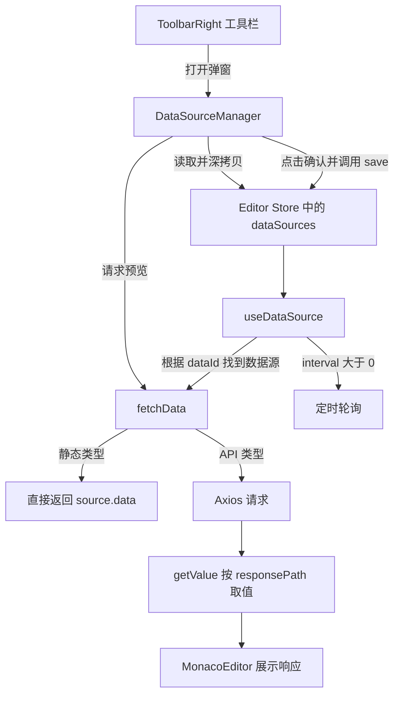

# 2026-07-26 代码整理：数据源管理与编辑器联动

> 对应课程：第 27 节「数据源管理界面」｜第 28 节「API 数据源调试」

## 一、今日代码目标

今天的代码主要完善了大屏编辑器中的“数据源管理”能力，使用户可以在工具栏中统一维护静态数据源和 API 数据源，并在保存前预览接口响应。

本次一共涉及 10 个文件，新增约 285 行代码。核心工作可以概括为四部分：

1. 定义数据源的请求方式和响应路径。
2. 新增数据源管理弹窗，支持新增、删除、编辑和请求预览。
3. 抽离统一的数据请求函数，供配置预览和组件运行时共同使用。
4. 修复 Monaco 编辑器外部值同步和画布选框更新问题。

## 二、整体代码逻辑



整个功能分为两个阶段：

- 配置阶段：用户在 `DataSourceManager` 中编辑临时副本，预览接口，确认后才写入 Pinia。
- 使用阶段：业务组件通过 `useDataSource(dataId)` 找到对应数据源，并调用 `fetchData()` 获取最终数据。

这样处理的好处是：打开弹窗后随意修改或取消，不会立刻污染全局页面数据。

## 三、数据结构设计

### 1. `src/composables/enum.ts`

新增 `HttpMethod` 联合类型：

```ts
export type HttpMethod = 'GET' | 'POST' | 'PUT' | 'DELETE'
```

它把请求方法限制在固定范围内，避免在其他文件中重复写字符串类型，也能让 TypeScript 在填写错误方法时及时提示。

### 2. `src/schema/page.ts`

`DataSourceSchema` 新增两个 API 配置字段：

```ts
method?: HttpMethod
responsePath?: string
```

- `method`：接口请求方法。
- `responsePath`：从接口响应中提取业务数据的路径，支持 `data.list` 形式的点语法。

例如接口返回：

```json
{
  "code": 200,
  "data": {
    "list": [{ "name": "A", "value": 10 }]
  }
}
```

配置 `responsePath: "data.list"` 后，组件最终拿到的是数组，而不是整个响应对象。

### 3. `src/stores/editor.ts`

示例 API 数据源增加：

```ts
method: 'GET'
```

编辑器的 `page.dataSources` 是数据源的唯一正式存储位置。数据源管理器保存后修改这里，画布组件再通过 store 中的数据源消费数据。

## 四、统一的数据请求逻辑

### `src/composables/useDataSource.ts`

本次把原来写在 `loadData()` 内部的 Axios 请求抽离成独立的 `fetchData(source)` 函数。

### 1. `fetchData()` 的执行步骤

1. 判断数据源类型。
2. 静态数据源直接返回 `source.data`。
3. API 数据源读取当前页面 URL 查询参数。
4. 合并数据源参数和页面查询参数。
5. 根据请求方法决定参数放在 `params` 还是 `data` 中。
6. 使用 Axios 发起请求。
7. 使用 `getValue()` 按 `responsePath` 提取最终结果。

请求参数位置的判断：

```ts
const paramsKey = source.method === 'GET' ? 'params' : 'data'
```

- `GET`：参数进入 URL 查询字符串。
- 其他方法：参数进入请求体。

参数合并顺序如下：

```ts
const queryParams = {
  ...source.params,
  ...pageParams,
}
```

后展开的页面参数优先级更高，因此同名字段会覆盖数据源中预设的字段。

### 2. `useDataSource()` 的职责

`useDataSource(dataId)` 负责组件运行时的数据消费：

- 从依赖注入的 `dataSources` 中按 `dataId` 查找数据源。
- 监听数据源变化并立即执行 `loadData()`。
- API 类型调用 `fetchData()`。
- 静态类型直接读取数据。
- 配置 `interval` 时，通过 `setTimeout` 继续轮询。
- 组件卸载时清理定时器，防止无效请求和内存泄漏。

抽离 `fetchData()` 后，请求预览与组件运行时使用同一套逻辑，减少了行为不一致的可能。

## 五、数据源管理界面

### 1. `src/editor/toolbar/ToolbarRight.vue`

工具栏新增数据库图标作为数据源配置入口，并新增一个宽度为 800 的对话框承载 `DataSourceManager`。

关键状态：

```ts
const dataSourceVisible = ref(false)
const dataSourceManagerRef = useTemplateRef('dataSourceManagerRef')
```

确认保存时，父组件调用子组件暴露的 `save()`：

```ts
dataSourceManagerRef.value.save()
dataSourceVisible.value = false
ElMessage.success('保存成功')
```

JSON 抽屉和数据源弹窗都添加了 `destroy-on-close`。关闭后销毁内部组件，再次打开时会根据最新 store 数据重新初始化，避免残留上一次未保存的编辑状态。

### 2. `src/editor/toolbar/components/DataSourceManager.vue`

这是今天功能的主体组件，界面分为左右两栏：

- 左侧：数据源列表、新增按钮、删除操作。
- 右侧：当前数据源的编辑表单。

#### 临时副本

组件初始化时深拷贝全局数据源：

```ts
const data = ref(deepClone(dataSources.value).map(...))
```

这里不能直接编辑 `dataSources`，否则用户即使点击“关闭”，修改也已经写入 Pinia。使用副本后，只有点击确认才提交。

#### JSON 数据与表单字符串转换

Monaco 编辑器通过字符串编辑 JSON，而 store 中保存的是对象或数组，因此需要双向转换：

- 打开弹窗：`JSON.stringify()`，把 `data` 和 `params` 转为格式化字符串。
- 保存弹窗：`JSON.parse()`，把字符串还原为对象或数组。

#### 新增与删除

新增数据源使用 `crypto.randomUUID()` 生成唯一 ID，并默认创建静态数据源。删除时通过 ID 查找索引；如果删除的是当前选中项，同时清空 `activeSource`。

#### 动态表单

表单根据 `activeSource.type` 切换字段：

- 静态数据源：显示数据 JSON 编辑器。
- API 数据源：显示 URL、请求方式、轮询周期、请求参数、响应路径和响应预览。

#### 请求预览

`onRequest()` 先解析参数 JSON，再调用公共的 `fetchData()`。返回结果经过格式化后写入 `responseText`，由 Monaco 编辑器展示。

#### 保存机制

组件通过 `defineExpose()` 向父组件暴露 `save()`。保存时解析 JSON 字符串、重新深拷贝，然后整体赋值给：

```ts
editorStore.page.dataSources
```

## 六、通用工具与编辑器同步

### 1. `src/utils/index.ts`

#### `getValue()`

新增空路径处理：

```ts
if (!key) return target
```

有 `responsePath` 时按路径提取数据；没有配置时直接返回整个接口响应。

#### `deepClone()`

新增基于 JSON 序列化的深拷贝工具，主要用于隔离数据源弹窗的临时编辑数据与 Pinia 全局数据。

它适用于当前由普通对象、数组、字符串和数字组成的数据源配置，但不能完整复制 `Date`、`Map`、`Set`、函数或循环引用对象。

### 2. `src/components/MonacoEditor/index.vue`

Monaco 实例从 `onMounted()` 的局部变量改为组件级变量，并新增对 `modelValue` 的监听：

```ts
watch(modelValue, (newVal) => {
  if (instance.getValue() !== newVal) {
    instance.setValue(newVal)
  }
})
```

之前只有 Monaco 内容变化时更新 Vue 数据，是单向同步。现在外部切换数据源或更新响应结果时，也能反向更新 Monaco 内容，形成双向同步。

`instance.getValue() !== newVal` 的判断可以避免重复设置内容引发不必要的更新循环。

### 3. `components.d.ts`

自动补充了本次模板中新使用的 Element Plus 全局组件类型，包括：

- `ElDialog`
- `ElInput`
- `ElRadioButton`
- `ElRadioGroup`

该文件主要为模板提供类型提示，一般由组件自动导入插件生成，不承载业务逻辑。

## 七、画布交互修正

### `src/editor/canvas/composables/useMoveable.ts`

新增对所有节点 `layout` 的监听。当布局被表单、撤销重做或其他非拖拽操作修改时，等待 DOM 更新后主动执行：

```ts
moveableRef.value.updateRect(undefined, true)
```

`flush: 'post'` 表示 watcher 在 Vue 完成 DOM 更新后执行。这样 Moveable 的选框才能读取到最新位置和尺寸，避免组件已经移动但选框仍停留在旧位置。

## 八、10 个文件的职责汇总

| 文件 | 类型 | 主要职责 |
| --- | --- | --- |
| `components.d.ts` | 类型声明 | 补充 Element Plus 自动导入组件类型 |
| `src/components/MonacoEditor/index.vue` | 通用组件 | 支持外部数据反向同步到 Monaco |
| `src/composables/enum.ts` | 类型定义 | 统一 HTTP 请求方法类型 |
| `src/composables/useDataSource.ts` | 组合式函数 | 统一请求、响应提取和轮询逻辑 |
| `src/editor/canvas/composables/useMoveable.ts` | 画布交互 | 布局改变后同步 Moveable 选框 |
| `src/editor/toolbar/ToolbarRight.vue` | 工具栏 | 提供数据源弹窗入口和保存动作 |
| `src/editor/toolbar/components/DataSourceManager.vue` | 业务组件 | 数据源增删改、表单编辑和请求预览 |
| `src/schema/page.ts` | 数据模型 | 定义请求方法和响应路径字段 |
| `src/stores/editor.ts` | 全局状态 | 保存页面级数据源及示例配置 |
| `src/utils/index.ts` | 工具函数 | 路径取值和深拷贝 |

## 九、值得记住的实现思路

### 1. 弹窗编辑复杂对象时先创建副本

对于需要“确认/取消”的弹窗，不要直接双向绑定全局状态。推荐流程是：

```text
打开弹窗 -> 深拷贝全局数据 -> 编辑副本 -> 确认后覆盖全局数据
```

### 2. 配置预览和实际运行共用底层函数

`DataSourceManager` 和 `useDataSource` 都调用 `fetchData()`，确保“预览看到的数据”和“组件实际使用的数据”遵循同一规则。

### 3. 服务端响应与组件数据之间增加适配层

`responsePath` 把各种接口响应结构统一成组件需要的数据。组件不需要知道接口外层是否存在 `data`、`result` 或 `list`。

### 4. 第三方编辑器通常需要手动处理双向同步

Monaco 不会天然理解 Vue 的 `v-model`。需要同时处理：

- Monaco 内容变化 -> 更新 `modelValue`。
- `modelValue` 外部变化 -> 调用 `instance.setValue()`。

### 5. 第三方选框依赖真实 DOM 尺寸

当布局变化来自拖拽以外的路径时，Moveable 不一定自动刷新。应在 DOM 更新后调用 `updateRect()`，这也是使用 `flush: 'post'` 的原因。

## 十、当前实现的注意事项

1. `JSON.parse()` 失败时目前没有错误提示，错误 JSON 会中断预览或保存流程。
2. 请求预览缺少加载中、失败提示和重复点击保护。
3. `getValue()` 遇到不存在的中间路径时会报错，可改为安全访问。
4. `fetchData()` 中未配置 `method` 时会把参数放进请求体，建议默认使用 `GET`。
5. 类型声明支持四种方法，但下拉选项目前只提供 `GET` 和 `POST`。
6. API 数据源切换或连续变化时，旧轮询定时器可能需要在重新加载前主动清理。
7. `deepClone()` 是 JSON 方案，只适合可序列化数据。
8. Monaco 的 watcher 最好判断实例已经创建，避免极端情况下在挂载前访问实例。

## 十一、最终数据流总结

```text
用户点击数据库图标
  -> 打开 DataSourceManager
  -> 深拷贝 page.dataSources
  -> 编辑静态数据或 API 配置
  -> fetchData 请求预览
  -> getValue 提取 responsePath
  -> 点击确认调用 save
  -> 写回 editorStore.page.dataSources
  -> 业务组件通过 useDataSource(dataId) 获取数据
  -> 数据源变化时重新加载
  -> 配置 interval 时持续轮询
```

本次代码的核心不是单个表单，而是建立了一套从“数据源定义、可视化配置、请求预览、全局保存到组件消费”的完整闭环。
