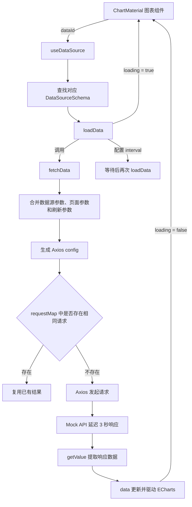

# 2026-07-27 代码整理：数据源请求状态与请求复用

> 本次内容：29节 「加载、刷新与请求复用」数据源加载状态、错误捕获、手动刷新、动态参数、相同请求复用，以及图表加载反馈

## 一、昨日代码目标

昨天的代码继续完善动态数据源能力，重点从“能够请求数据”推进到“能够管理请求过程”。

本次涉及 4 个文件，共新增约 62 行、删除约 10 行，主要完成以下工作：

1. 为数据源增加 `loading` 和 `error` 状态。
2. 暴露 `refresh()`，允许组件主动刷新并传入临时参数。
3. 尝试复用配置完全相同的进行中请求，避免重复访问接口。
4. 在图表上接入 Element Plus 的 `v-loading` 加载效果。
5. 为 Mock 接口增加 3 秒延迟，方便观察异步加载状态。

## 二、整体调用关系



这条链路把请求状态留在 `useDataSource` 中统一维护。图表组件只负责消费 `data` 和 `loading`，不需要自己重复编写请求过程。

## 三、`useDataSource.ts`：数据源请求状态

文件：`src/composables/useDataSource.ts`

### 1. 新增加载与错误状态

组合式函数新增两个响应式状态：

```ts
const loading = ref<boolean>(false)
const error = ref<string | null>(null)
```

API 请求开始前将 `loading` 设为 `true`，请求结束后在 `finally` 中恢复为 `false`：

```ts
try {
  loading.value = true
  const res = await fetchData(source.value, params)
  data.value = res || []
} catch (e) {
  error.value = e
} finally {
  loading.value = false
}
```

使用 `finally` 的意义是，无论请求成功还是失败，加载状态都能结束，页面不会一直停留在加载中。

### 2. `loadData()` 支持动态参数

`loadData` 新增可选参数：

```ts
async function loadData(params?: Record<string, any>)
```

这些参数会继续传给 `fetchData(source, params)`。因此组件除了使用数据源中预设的参数，还可以在某次刷新时传入临时条件。

例如：

```ts
refresh({ date: '2026-07-27', region: 'east' })
```

这适用于筛选表单、日期切换、区域切换等交互场景。

### 3. 请求前清理旧定时器

每次执行 `loadData()` 时先清理之前的计时器：

```ts
clearInterval(timer)
```

目的是避免数据源变化或手动刷新后，旧轮询仍然继续执行，最终形成多个并行轮询任务。

当前计时器由 `setTimeout()` 创建。浏览器中 `clearInterval()` 和 `clearTimeout()` 通常可以互相清理，但为了表达准确，建议统一使用 `clearTimeout(timer)`。

### 4. 监听数据源并立即加载

对 `source` 的监听改成显式回调：

```ts
watch(
  source,
  () => {
    loadData()
  },
  { immediate: true },
)
```

`immediate: true` 表示组合式函数初始化后立即加载一次。后续 `dataId` 或对应数据源变化时，也会重新执行加载。

### 5. 对外暴露统一能力

组合式函数现在返回：

```ts
return {
  data,
  loading,
  error,
  refresh: loadData,
}
```

各字段职责如下：

| 字段 | 作用 |
| --- | --- |
| `data` | 请求成功后的业务数据 |
| `loading` | 当前是否正在请求 |
| `error` | 最近一次请求错误 |
| `refresh` | 主动重新请求，并可传入临时参数 |

把 `loadData` 以 `refresh` 的名字暴露，可以让组件端代码更符合业务语义。

## 四、`fetchData()`：参数合并与请求复用

### 1. 三类参数的优先级

最终请求参数由三部分组成：

```ts
const queryParams = {
  ...source.params,
  ...pageParams,
  ...data,
}
```

由于对象展开后面的值会覆盖前面的同名字段，因此优先级为：

```text
本次 refresh 动态参数 > 当前页面 URL 参数 > 数据源预设参数
```

例如数据源预设 `date=2026-07-25`，页面地址中存在 `date=2026-07-26`，而本次刷新传入 `date=2026-07-27`，最终发送的是 `2026-07-27`。

### 2. 根据请求方法放置参数

```ts
const paramsKey = source.method === 'GET' ? 'params' : 'data'
```

- `GET` 请求把参数放入 Axios 的 `params`，最终拼接到 URL。
- 其他请求把参数放入 `data`，作为请求体发送。

随后将 URL、方法和参数组合成 Axios 配置：

```ts
const config = {
  url: source.url,
  method: source.method,
  [paramsKey]: queryParams,
}
```

### 3. 请求复用的设计意图

模块级 `requestMap` 用于保存正在进行的请求：

```ts
const requestMap = {}
const key = JSON.stringify(config)
```

同一个请求由 URL、请求方法和最终参数共同确定。将完整配置序列化后作为 key，可以区分不同请求。

理想执行过程是：

```text
第一个调用进入
  -> requestMap 中没有 key
  -> 创建 Promise 并立即保存
  -> 发起网络请求

第二个相同调用在请求结束前进入
  -> 找到相同 key
  -> 返回同一个 Promise
  -> 不再发起第二次网络请求

请求结束
  -> 从 requestMap 删除 key
```

这里复用的是“进行中的 Promise”，属于请求合并或并发去重，不是长期数据缓存。请求完成后删除记录，下次调用仍会重新访问接口。

### 4. 当前实现中的关键问题

当前代码写成了：

```ts
const promise = await axios.request(config).then(...).finally(...)
requestMap[key] = promise
```

由于创建变量时已经使用 `await`，程序会等接口完成后才执行 `requestMap[key] = promise`。这会产生两个问题：

1. 请求进行期间 `requestMap` 中没有记录，其他相同调用无法复用请求。
2. `finally` 先执行删除，随后又把已解析的数据写回 `requestMap`，记录反而不会按预期清除。

正确思路是先保存原始 Promise，再等待或直接返回：

```ts
const promise = axios
  .request(config)
  .then((res) => getValue(res.data, source.responsePath))
  .finally(() => {
    delete requestMap[key]
  })

requestMap[key] = promise
return promise
```

这样第二个相同请求才能在第一个请求完成之前取得同一个 Promise。

## 五、`component.vue`：图表加载反馈

文件：`src/materials/charts/component.vue`

图表组件从 `useDataSource()` 中额外取得请求状态和控制方法：

```ts
const { data, loading, error, refresh } = useDataSource(dataId)
```

模板将 `loading` 交给 Element Plus 指令：

```vue
<div
  v-loading="loading"
  class="chart-material w-full h-full"
  ref="chartRef"
></div>
```

请求期间图表容器会出现加载遮罩。请求完成或失败后，`finally` 将 `loading` 恢复为 `false`，遮罩自动关闭。

图表数据更新流程保持不变：

```text
fetchData 返回数据
  -> data.value 更新
  -> option 计算属性重新计算
  -> watch(option) 调用 chart.setOption
  -> ECharts 更新 dataset.source
```

目前 `error` 和 `refresh` 已经解构出来，但组件中还没有实际使用。后续可以增加失败提示、重试按钮，或者由图表筛选操作触发刷新。

## 六、`data.ts`：模拟慢速网络

文件：`src/mock/data.ts`

Mock.js 新增全局响应延迟：

```ts
Mock.setup({
  timeout: 3000,
})
```

接口会等待约 3 秒再返回数据。这样可以直观看到图表的加载遮罩，也能测试以下情况：

- 请求期间重复刷新。
- 多个图表同时请求相同接口。
- 数据源切换时旧请求是否仍在执行。
- 请求结束后加载状态是否正确关闭。

Mock 回调中增加了 `options` 日志，用于观察实际请求 URL 和参数：

```ts
console.log('options ===>', options)
```

这条日志适合开发调试，功能稳定后可以移除，避免控制台产生无关输出。

## 七、`components.d.ts`：全局指令类型

`components.d.ts` 是 `unplugin-vue-components` 自动生成的类型声明文件。

图表模板使用 `v-loading` 后，文件新增：

```ts
export interface GlobalDirectives {
  vLoading: typeof import('element-plus/es')['ElLoadingDirective']
}
```

这段声明让 Vue 模板和 TypeScript 能识别 Element Plus 的加载指令，避免编辑器把 `v-loading` 标记为未知指令。

该文件不包含业务逻辑，通常不需要手动维护，由自动导入插件根据模板使用情况更新。

## 八、4 个文件的职责汇总

| 文件 | 本次职责 |
| --- | --- |
| `src/composables/useDataSource.ts` | 管理数据、加载、错误、刷新、轮询和请求复用 |
| `src/materials/charts/component.vue` | 消费加载状态并显示图表加载遮罩 |
| `src/mock/data.ts` | 模拟 3 秒网络延迟，帮助验证异步交互 |
| `components.d.ts` | 补充 `v-loading` 的全局指令类型 |

## 九、值得记住的实现思路

### 1. 请求状态应与请求逻辑放在一起

由 `useDataSource` 统一维护 `data`、`loading` 和 `error`，可以保证所有使用数据源的物料都有一致行为，组件只负责展示。

### 2. `finally` 适合处理必须收尾的状态

无论请求成功还是失败，加载状态都必须关闭，轮询也需要重新安排。把这些逻辑放在 `finally` 中比在 `then` 和 `catch` 中分别处理更可靠。

### 3. 动态参数放在最后合并

一次性的交互参数应覆盖长期配置，因此 `refresh` 参数最后展开。参数合并顺序本身就是业务优先级。

### 4. 并发去重必须先缓存 Promise

请求发出后要立即把 Promise 放进 Map，才能覆盖请求尚未完成的时间窗口。如果先 `await`，并发调用就无法看到这条记录。

### 5. 延迟 Mock 不只是视觉测试

真实请求太快时，并发、轮询和加载状态问题很难暴露。人为增加延迟能够更容易验证异步流程是否正确。

## 十、当前实现的注意事项

1. 请求复用处的 `await` 位置需要调整，否则无法实现真正的并发去重。
2. `error` 声明为 `string | null`，但 `catch` 中的错误是 `unknown`，类型需要统一，并在新请求开始时清空旧错误。
3. `requestMap` 缺少明确类型，可声明为 `Record<string, Promise<unknown>>` 或使用 `Map`。
4. `loadData()` 使用 `setTimeout` 创建计时器，建议对应使用 `clearTimeout`。
5. `fetchData()` 中的局部变量 `url` 没有被使用，可以删除。
6. 图表组件暂未展示 `error`，也没有使用 `refresh`，当前解构会产生未使用变量。
7. Mock 中的 `console.log` 只适合开发阶段。
8. 数据源不存在时直接返回，但旧的 `loading`、`error` 和 `data` 是否需要重置，应根据产品行为明确。

## 十一、最终逻辑总结

```text
图表传入 dataId
  -> useDataSource 查找数据源并立即加载
  -> 清理旧轮询计时器
  -> loading 设为 true
  -> 合并预设参数、页面参数和动态参数
  -> 根据 Axios config 判断是否存在相同进行中请求
  -> 发起或复用请求
  -> Mock 延迟返回数据
  -> responsePath 提取业务数据
  -> 更新 data 并刷新 ECharts
  -> loading 设为 false
  -> 如配置 interval，则安排下一次加载
```

本次代码的核心，是把数据源从“返回一份数据”扩展为一套可观察、可刷新、可轮询、可控制并发的请求状态模型。
