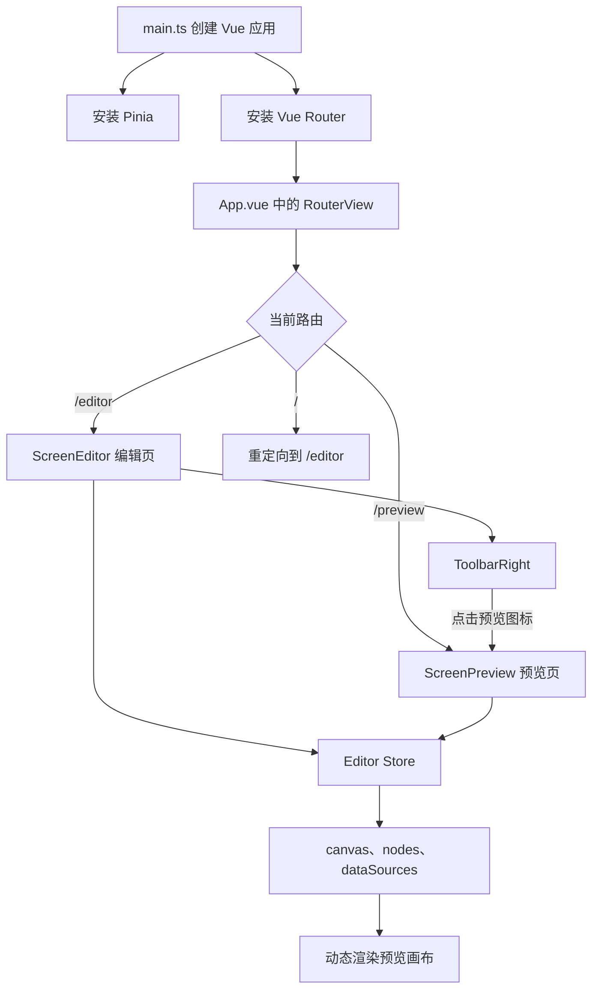

# 2026-07-28 代码整理：路由化预览与画布坐标修正

> 本次内容：「30 大屏自适应」Vue Router 页面切换、编辑器预览入口、预览画布自适应、动态物料渲染，以及缩放状态下的拖放坐标换算

## 一、今日代码目标

今天的代码为大屏编辑器增加了独立预览页面，并修复画布缩放后拖入组件位置不准确的问题。

本次涉及 5 个文件，共新增约 130 行、删除约 7 行，核心工作可以概括为：

1. 将 `App.vue` 从固定渲染编辑器改成路由出口。
2. 增加 `/editor` 和 `/preview` 两个页面路由。
3. 在右侧工具栏增加进入预览页的导航行为。
4. 新建预览页，根据 Pinia 中的页面 Schema 动态渲染物料。
5. 根据浏览器尺寸等比缩放并居中预览画布。
6. 修复编辑画布缩放后，拖入组件的坐标偏移。

## 二、整体页面关系



编辑页和预览页不再是两个独立的数据系统。它们都读取同一个 Pinia `editorStore`，所以从编辑页切换到预览页时，当前页面配置仍然保留在内存中。

## 三、5 个文件的职责

| 文件 | 本次职责 |
| --- | --- |
| `src/App.vue` | 将应用根组件改为路由承载容器 |
| `src/router/index.ts` | 定义编辑页、预览页和默认重定向 |
| `src/editor/toolbar/ToolbarRight.vue` | 从编辑器工具栏跳转到预览页 |
| `src/pages/preview/index.vue` | 渲染并自适应展示完整大屏 |
| `src/editor/canvas/index.vue` | 修正缩放画布下的组件拖放坐标 |

## 四、`App.vue`：从固定页面变为路由出口

### 1. 修改前

应用根组件直接导入并渲染编辑器：

```vue
<ScreenEditor />
```

这种写法只能显示一个固定页面。即使已经安装 Vue Router，路由也没有真正控制页面内容。

### 2. 修改后

根组件改为：

```vue
<router-view />
```

`RouterView` 是路由组件的挂载位置。当前地址发生变化时，Vue Router 会把对应页面组件渲染到这里。

现在 `App.vue` 的职责更加单一：

```text
App.vue
  -> 提供应用根容器
  -> 承载当前路由页面
```

编辑器和预览页由路由配置决定，不再由根组件写死。

## 五、`router/index.ts`：编辑与预览路由

### 1. 路由表

当前一共定义了三条规则：

```ts
routes: [
  {
    path: '/',
    redirect: '/editor',
  },
  {
    path: '/editor',
    component: ScreenEditor,
  },
  {
    path: '/preview',
    component: ScreenPreview,
  },
]
```

对应关系如下：

| 地址 | 页面 | 作用 |
| --- | --- | --- |
| `/` | 无独立页面 | 自动跳转到编辑器 |
| `/editor` | `ScreenEditor` | 编辑大屏页面 |
| `/preview` | `ScreenPreview` | 预览大屏页面 |

根路径使用重定向，可以保证用户第一次打开项目时进入编辑器，而不是看到空白页。

### 2. History 模式

项目继续使用：

```ts
createWebHistory(import.meta.env.BASE_URL)
```

这种模式生成 `/editor`、`/preview` 形式的正常 URL，没有 `#`。生产环境部署时，服务器需要把未知路径回退到 `index.html`，否则直接刷新 `/preview` 可能返回 404。

### 3. 页面组件加载方式

目前编辑页和预览页采用静态导入：

```ts
import ScreenEditor from '@/editor/index.vue'
import ScreenPreview from '@/pages/preview/index.vue'
```

因此两个页面都会进入首屏依赖。随着编辑器体积变大，可以改成路由懒加载：

```ts
component: () => import('@/pages/preview/index.vue')
```

懒加载不是当前功能成立的必要条件，适合在功能稳定后作为构建优化。

## 六、`ToolbarRight.vue`：预览入口

### 1. 获取路由实例

工具栏通过组合式 API 获取路由对象：

```ts
const router = useRouter()
```

`useRouter()` 只能在 Vue 组件的 `setup` 上下文中使用。当前组件采用 `<script setup lang="ts">`，符合 Vue 3 的标准写法。

### 2. 点击后跳转

新增预览方法：

```ts
function onPreview() {
  router.push('/preview')
}
```

并将方法绑定到预览图标：

```vue
<span @click="onPreview">
  <Icon icon="fluent:preview-link-16-filled" />
</span>
```

完整交互流程是：

```text
点击预览图标
  -> onPreview()
  -> router.push('/preview')
  -> 当前路由更新
  -> App.vue 的 RouterView 卸载编辑页
  -> 挂载 ScreenPreview
```

`router.push()` 会写入浏览器历史，因此用户可以通过浏览器后退返回编辑器。

### 3. 状态为什么没有丢失

路由切换会卸载 `ScreenEditor`，但 Pinia 实例由 `main.ts` 安装在应用级：

```ts
app.use(createPinia())
```

因此 `editorStore` 不会随着编辑页组件卸载而销毁。预览页重新调用 `useEditorStore()` 时，读取的是同一个 store 实例。

## 七、`preview/index.vue`：预览页主体

文件：`src/pages/preview/index.vue`

这个页面主要完成四件事：

1. 从 store 读取页面数据。
2. 为物料组件提供数据源。
3. 根据视口计算预览缩放和居中位置。
4. 遍历节点并动态渲染对应物料。

### 1. 从 Pinia 获取页面状态

```ts
const editorStore = useEditorStore()
const { page, nodes, canvas, dataSources } = storeToRefs(editorStore)
```

`storeToRefs()` 可以在解构 store 时保留响应性。

当前真正参与预览渲染的是：

- `canvas`：设计稿宽高和背景色。
- `nodes`：画布中的物料节点列表。
- `dataSources`：图表等物料所使用的数据源。

`page` 目前没有直接使用，可以保留用于后续整体导出，也可以删除未使用的解构。

### 2. 向物料提供数据源

预览页执行：

```ts
provide('dataSources', dataSources)
```

图表等深层物料可以通过 `inject('dataSources')` 获得数据源。编辑页入口中也有相同的 `provide`，所以物料在编辑态和预览态使用同一套数据获取逻辑。

数据流如下：

```text
editorStore.page.dataSources
  -> storeToRefs 得到 dataSources Ref
  -> Preview provide
  -> 物料内部 useDataSource inject
  -> 按 dataId 找到数据源
  -> 加载静态数据或 API 数据
```

### 3. 预览状态

页面维护三个响应式值：

```ts
const scale = ref(1)
const left = ref(0)
const top = ref(0)
```

- `scale`：设计画布相对浏览器视口的缩放比例。
- `left`：缩放后画布的水平偏移。
- `top`：缩放后画布的垂直偏移。

这三个值只属于预览页面的显示状态，不写入 store，也不会改变设计稿原始尺寸。

## 八、预览画布的等比缩放公式

### 1. 分别计算宽高缩放比例

```ts
const x = window.innerWidth / canvas.value.width
const y = window.innerHeight / canvas.value.height
```

假设设计稿是 `1920 × 1080`，浏览器视口是 `1366 × 768`：

```text
宽度比例 x = 1366 / 1920 ≈ 0.711
高度比例 y = 768 / 1080 ≈ 0.711
```

### 2. 取较小比例

```ts
scale.value = Math.min(x, y)
```

取较小值可以保证画布的宽和高都不会超出浏览器窗口，也就是常见的 `contain` 效果。

如果取较大值，虽然某个方向会填满视口，但另一个方向可能被裁切。

### 3. 计算居中偏移

```ts
left.value = (window.innerWidth - canvas.value.width * scale.value) / 2
top.value = (window.innerHeight - canvas.value.height * scale.value) / 2
```

计算逻辑是：

```text
剩余空间 = 视口尺寸 - 画布缩放后的尺寸
单侧偏移 = 剩余空间 / 2
```

例如画布缩放后宽度为 `1200px`，视口宽度为 `1366px`：

```text
left = (1366 - 1200) / 2 = 83px
```

### 4. 应用 transform

```ts
transform: `translate(${left.value}px, ${top.value}px) scale(${scale.value})`,
transformOrigin: 'left top',
```

`transformOrigin: 'left top'` 很关键。它规定缩放从左上角开始，使 `left` 和 `top` 的居中公式与实际渲染保持一致。

## 九、动态渲染物料节点

### 1. 遍历节点

```vue
<div
  v-for="(node, index) in nodes"
  :key="node.id"
  class="canvas-node"
  :style="getNodeStyle(node, index)"
>
```

`node.id` 是稳定 key，节点位置和尺寸来自 Schema，而不是写死在预览页中。

### 2. 节点样式

```ts
function getNodeStyle(node: MaterialSchema, index: number) {
  return {
    left: `${node.layout.x}px`,
    top: `${node.layout.y}px`,
    width: `${node.layout.width}px`,
    height: `${node.layout.height}px`,
    zIndex: index + 1,
  }
}
```

`.canvas-root` 使用相对定位，`.canvas-node` 使用绝对定位，所以每个节点都按照设计画布坐标摆放。

`zIndex` 根据数组顺序生成，数组越靠后的节点层级越高，与编辑器中的图层顺序保持一致。

### 3. 动态组件

```vue
<component
  :is="getMaterialComponent(node.type)"
  :schema="node"
/>
```

`getMaterialComponent(node.type)` 根据节点类型返回对应 Vue 组件，`schema` 则传入该节点的属性、布局和数据源 ID。

因此预览页不需要分别判断图表、文本或图片，只需要遵守统一的物料注册和 Schema 协议。

## 十、窗口变化时重新适配

页面挂载时先初始化，再监听窗口尺寸变化：

```ts
onMounted(() => {
  init()
  addEventListener('resize', init)

  onBeforeUnmount(() => {
    removeEventListener('resize', init)
  })
})
```

浏览器窗口变化后，`init()` 会重新计算 `scale`、`left` 和 `top`，画布始终保持完整显示和居中。

组件卸载时移除监听器，可以避免页面离开后仍然执行预览逻辑，也防止重复挂载产生多个事件监听器。

为了让依赖对象更明确，可以写成：

```ts
window.addEventListener('resize', init)
window.removeEventListener('resize', init)
```

## 十一、`canvas/index.vue`：缩放后的拖放坐标

### 1. 原来的计算方式

```ts
node.layout.x = e.clientX - stageRect.left - node.layout.width / 2
node.layout.y = e.clientY - stageRect.top - node.layout.height / 2
```

这个公式在缩放比例为 `1` 时正确，因为屏幕移动 `100px` 就等于画布坐标移动 `100px`。

当画布缩放为 `0.5` 时，屏幕上的 `100px` 实际对应设计画布中的 `200px`。如果不做换算，节点会被放到错误位置。

### 2. 修正后的公式

```ts
node.layout.x =
  (e.clientX - stageRect.left) / scale.value - node.layout.width / 2

node.layout.y =
  (e.clientY - stageRect.top) / scale.value - node.layout.height / 2
```

公式可以拆成三步：

```text
鼠标相对画布的屏幕坐标
  = 鼠标 client 坐标 - 画布边界起点

鼠标对应的设计坐标
  = 相对屏幕坐标 / 当前缩放比例

节点左上角坐标
  = 鼠标设计坐标 - 节点原始尺寸的一半
```

### 3. 计算示例

假设：

- 画布左边界位于屏幕 `100px`。
- 鼠标横坐标为 `500px`。
- 当前缩放比例为 `0.5`。
- 拖入节点原始宽度为 `200px`。

计算过程：

```text
鼠标相对画布屏幕坐标 = 500 - 100 = 400
鼠标对应设计坐标 = 400 / 0.5 = 800
节点左上角 x = 800 - 200 / 2 = 700
```

最终节点中心会落在鼠标对应的设计坐标 `800px` 上。

## 十二、编辑态与预览态的区别

| 能力 | 编辑页 | 预览页 |
| --- | --- | --- |
| 渲染节点 | 是 | 是 |
| 读取数据源 | 是 | 是 |
| 拖动和缩放节点 | 是 | 否 |
| 框选、多选、右键菜单 | 是 | 否 |
| 标尺和辅助线 | 是 | 否 |
| 自适应浏览器窗口 | 编辑器内部缩放 | 整体等比缩放并居中 |

两种页面复用了物料组件和页面 Schema，但交互层完全分开。预览页只负责展示，这使其结构比编辑画布更轻。

## 十三、值得记住的实现思路

### 1. 根组件应保持为页面组合入口

当应用出现编辑、预览、登录或管理等多个页面时，`App.vue` 适合只承载布局和 `RouterView`，具体功能交给路由页面。

### 2. 编辑态与预览态共用 Schema

编辑器保存结构化页面数据，预览器读取同一份数据进行渲染。这样预览效果天然跟随编辑结果，不需要维护两套组件结构。

### 3. 缩放只改变显示，不改变设计坐标

节点仍保存 `1920 × 1080` 设计稿中的逻辑坐标。预览缩放通过 CSS transform 完成，不回写节点布局，避免不同设备预览后污染设计数据。

### 4. 从屏幕坐标进入画布坐标必须除以缩放比例

鼠标事件提供的是浏览器屏幕坐标，而节点保存的是设计画布坐标。两套坐标系之间的核心换算是：

```text
设计坐标 = 屏幕相对坐标 / scale
```

### 5. 跨路由共享编辑数据适合使用 Pinia

编辑器页面卸载后，本地组件状态会销毁，而应用级 store 仍然存在。路由页面之间共享当前设计数据时，Pinia 比逐层传 props 更合适。

## 十四、当前实现的注意事项

1. 路由目前没有配置 `name`，后续可使用命名路由减少路径字符串散落。
2. 编辑页和预览页是静态导入，项目变大后可改为路由懒加载。
3. `historyIndex` 已声明但未使用，可以删除或补充明确用途。
4. 预览页中的 `page` 没有使用，会产生未使用变量提示。
5. 预览页依赖内存中的 Pinia 状态；直接打开或刷新 `/preview` 时，只能得到 store 默认数据，尚未恢复用户当前编辑内容。
6. 工具栏跳转会在当前标签页离开编辑器，目前没有页面内的“返回编辑”按钮。
7. 使用 History 模式部署时，服务端必须配置 SPA 路由回退。
8. `provide('dataSources')` 使用字符串 key，规模扩大后建议改成带类型的 `InjectionKey`。
9. 预览页可给根容器增加 `overflow: hidden`，避免极端尺寸或浏览器滚动条影响全屏效果。
10. `scale`、`left`、`top` 是原始数值状态，按照 Vue 响应式最佳实践可考虑使用 `shallowRef`。

## 十五、最终逻辑总结

```text
应用启动
  -> main.ts 安装 Pinia 和 Vue Router
  -> App.vue 渲染 RouterView
  -> 根路径重定向到 /editor

用户在编辑器点击预览
  -> ToolbarRight 调用 router.push('/preview')
  -> RouterView 切换为 ScreenPreview
  -> 预览页读取 editorStore 中的 canvas、nodes、dataSources
  -> 计算视口与设计稿的宽高比例
  -> 取较小比例保证画布完整显示
  -> 计算 left、top 让画布居中
  -> 遍历 nodes 动态渲染物料
  -> 浏览器 resize 时重新计算预览布局

用户在缩放后的编辑画布拖入组件
  -> 获取鼠标相对画布的屏幕坐标
  -> 除以 scale 换算成设计坐标
  -> 减去节点宽高的一半
  -> 保存节点左上角位置
```

本次代码建立了编辑器的“编辑页 → 独立预览页”闭环，同时明确区分了浏览器屏幕坐标、缩放后显示坐标和设计画布逻辑坐标。
