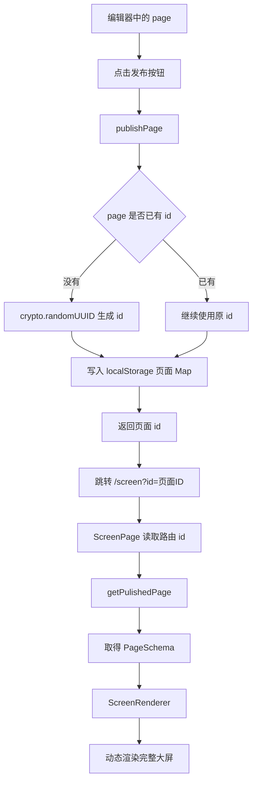
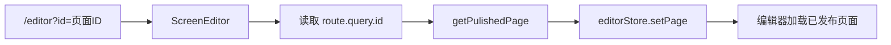
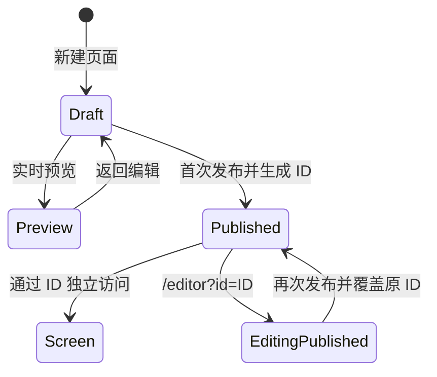
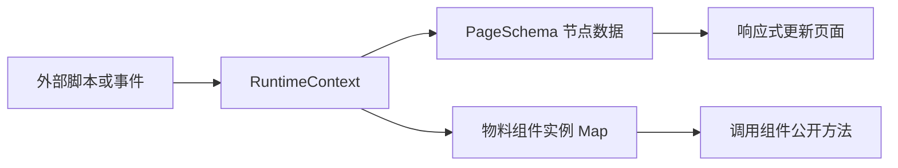
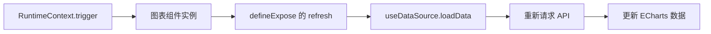
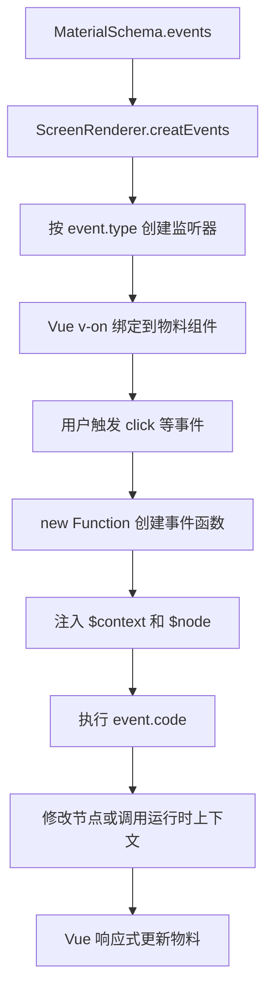
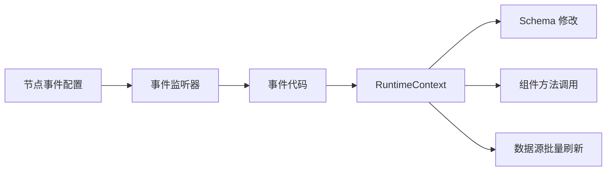
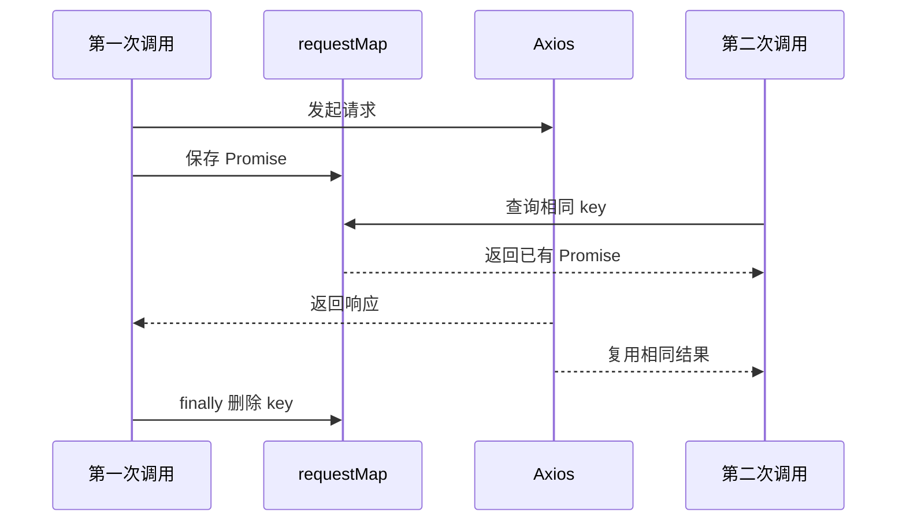

# 2026-07-29 代码整理

> 今日课程内容按节次分别记录。第 31、32、33 节使用同级标题，便于后续继续追加和独立复习。

## 31「页面持久化与独立访问」

### 31.1 本节目标

本节在已有预览功能的基础上，增加页面发布、持久化保存和通过独立地址访问大屏的能力。

本次涉及 9 个文件，共新增约 184 行、删除约 73 行，主要完成以下工作：

1. 为页面 Schema 增加唯一 ID。
2. 使用 `localStorage` 模拟已发布页面的持久化存储。
3. 抽取通用的 `ScreenRenderer` 大屏渲染组件。
4. 让实时预览页和已发布页面共用同一个渲染器。
5. 增加 `/screen?id=页面ID` 独立访问地址。
6. 在工具栏中接入发布按钮。
7. 支持通过 `/editor?id=页面ID` 重新加载已发布页面进行编辑。

### 31.2 9 个文件的职责

| 文件 | 本次职责 |
| --- | --- |
| `src/schema/page.ts` | 为页面结构增加可选 `id` |
| `src/utils/publish.ts` | 发布页面并按 ID 读取已发布页面 |
| `src/components/ScreenRenderer/index.vue` | 根据 `PageSchema` 统一渲染完整大屏 |
| `src/pages/preview/index.vue` | 读取编辑器内存数据并交给渲染器 |
| `src/pages/screen/index.vue` | 根据 URL 中的 ID 读取并展示已发布页面 |
| `src/router/index.ts` | 注册 `/screen` 独立访问路由 |
| `src/editor/toolbar/ToolbarRight.vue` | 提供页面发布入口和发布后跳转 |
| `src/editor/index.vue` | 根据 URL 中的 ID 加载已发布页面进行编辑 |
| `components.d.ts` | 补充 `ScreenRenderer` 全局组件类型 |

### 31.3 组件边界

这次重构把“页面从哪里来”和“页面如何渲染”拆成了不同职责：

| 模块 | 单一职责 | 输入 | 输出或副作用 |
| --- | --- | --- | --- |
| `ScreenRenderer` | 渲染一份页面 Schema | `page: PageSchema` | 完整大屏画面 |
| `ScreenPreview` | 获取当前编辑草稿 | Pinia `editorStore.page` | 把草稿传给渲染器 |
| `ScreenPage` | 获取已发布页面 | 路由查询参数 `id` | 把发布数据传给渲染器 |
| `ToolbarRight` | 发起发布操作 | 当前 `page` | 写入存储并导航 |
| `publish.ts` | 管理发布数据 | 页面或页面 ID | 读写 `localStorage` |

`ScreenRenderer` 只通过 prop 接收页面，不依赖编辑器 store，因此既可以渲染编辑中的页面，也可以渲染持久化后的页面。

### 31.4 整体业务流程



页面重新编辑的流程：



### 31.5 `PageSchema` 增加页面 ID

文件：`src/schema/page.ts`

页面结构增加：

```ts
export interface PageSchema {
  id?: string
  canvas: CanvasSchema
  nodes: MaterialSchema[]
  dataSources: DataSourceSchema[]
}
```

`id` 使用可选字段是因为新建页面尚未发布时没有持久化身份。第一次发布后生成 ID，并写回当前页面。

页面 ID 有两个作用：

- 作为已发布页面 Map 的 key。
- 作为 `/screen?id=...` 和 `/editor?id=...` 的查询参数。

同一页面再次发布时继续使用原 ID，因此会覆盖该 ID 对应的旧版本，而不是每次创建一条新记录。

### 31.6 `publish.ts`：发布存储工具

文件：`src/utils/publish.ts`

#### 31.6.1 存储结构

所有已发布页面保存在同一个 `localStorage` key 中：

```ts
const SCREEN_PUBLISH = 'screen-published'
```

序列化前的数据结构类似：

```ts
{
  'page-id-1': {
    id: 'page-id-1',
    canvas: {},
    nodes: [],
    dataSources: [],
  },
  'page-id-2': {
    id: 'page-id-2',
    canvas: {},
    nodes: [],
    dataSources: [],
  },
}
```

使用对象 Map 后，可以通过 ID 直接读取页面，不需要遍历数组。

#### 31.6.2 `publishPage()` 的执行步骤

```ts
export function publishPage(page: PageSchema) {
  let value = localStorage.getItem(SCREEN_PUBLISH)
  // 解析已有页面，或初始化空对象
  // 确定页面 ID
  // 按 ID 保存页面
  // 序列化写回 localStorage
  // 返回 ID
}
```

完整逻辑可以拆成五步：

1. 从 `localStorage` 读取已有发布数据。
2. 存在数据时使用 `JSON.parse()` 还原为对象。
3. 页面没有 ID 时通过 `crypto.randomUUID()` 生成。
4. 使用 `value[id] = page` 新增或覆盖页面。
5. 使用 `JSON.stringify()` 写回，并向调用方返回 ID。

关键代码：

```ts
const id = page.id || crypto.randomUUID()
value[id] = page
page.id = id
localStorage.setItem(SCREEN_PUBLISH, JSON.stringify(value))
return id
```

`value[id]` 和 `page` 指向同一个对象，所以后续执行 `page.id = id` 后，最终序列化的页面也会包含该 ID。

为了让执行顺序更直观，可以先设置 `page.id`，再写入 Map：

```ts
const id = page.id || crypto.randomUUID()
page.id = id
value[id] = page
```

#### 31.6.3 首次发布与再次发布

首次发布：

```text
page.id 不存在
  -> 生成新 ID
  -> 创建 Map 记录
  -> ID 写回当前 page
```

再次发布：

```text
page.id 已存在
  -> 复用原 ID
  -> 覆盖 Map 中同 ID 页面
  -> 独立访问地址保持不变
```

这相当于一个简化版的“新增或更新”操作。

#### 31.6.4 `getPulishedPage()` 的执行步骤

读取函数接收页面 ID：

```ts
export function getPulishedPage(id: string): PageSchema | null
```

执行过程：

1. 读取 `screen-published`。
2. 将 JSON 字符串解析成页面 Map。
3. 使用 `map[id]` 查找页面。
4. 找到时返回 `PageSchema`。
5. 找不到时抛出错误。

它模拟了真实项目中的“根据 ID 查询数据库页面”接口。

当前函数名中的 `Pulished` 少了字母 `b`，更准确的命名应为 `getPublishedPage`。

### 31.7 `ScreenRenderer`：通用大屏渲染器

文件：`src/components/ScreenRenderer/index.vue`

#### 31.7.1 为什么需要抽取

修改前，预览页同时负责：

- 从 store 获取页面。
- 计算画布缩放。
- 监听浏览器尺寸。
- 遍历节点。
- 动态渲染物料。
- 为物料提供数据源。

增加已发布页面后，如果在 `ScreenPage` 中复制这些代码，会产生两套几乎相同的渲染逻辑。

现在把通用部分抽到 `ScreenRenderer`：

```text
ScreenPreview ----┐
                  ├--> ScreenRenderer --> 大屏画面
ScreenPage -------┘
```

两个页面只负责准备不同来源的 `page`，渲染细节只有一份。

#### 31.7.2 Prop 契约

```ts
const props = defineProps<{ page: PageSchema }>()
```

`page` 是渲染器唯一的业务输入。组件不会直接修改 prop，也不依赖 Pinia，符合单向数据流：

```text
页面容器取得 PageSchema
  -> 通过 prop 向下传递
  -> ScreenRenderer 只负责读取和渲染
```

#### 31.7.3 派生数据

渲染器通过计算属性从页面中取得节点、画布和数据源：

```ts
const nodes = computed(() => props.page.nodes || [])

const canvas = computed(
  () => props.page.canvas || {
    width: 1920,
    height: 1080,
    backgroundColor: '#fff',
  },
)

const dataSources = computed(() => props.page.dataSources || [])
```

这些值都由 `page` 派生，不额外复制成本地状态。当父组件传入的页面发生变化时，渲染结果会跟随更新。

#### 31.7.4 数据源依赖注入

```ts
provide('dataSources', dataSources)
```

图表物料内部的 `useDataSource()` 可以继续注入数据源。渲染器不需要识别哪些物料需要 API，所有物料仍遵循统一协议。

#### 31.7.5 画布自适应

渲染器保留之前预览页中的缩放和居中逻辑：

```ts
const x = window.innerWidth / canvas.value.width
const y = window.innerHeight / canvas.value.height
scale.value = Math.min(x, y)

left.value =
  (window.innerWidth - canvas.value.width * scale.value) / 2

top.value =
  (window.innerHeight - canvas.value.height * scale.value) / 2
```

取宽高比例中的较小值，可以保证设计画布完整显示。剩余空间除以二后作为偏移，使画布水平和垂直居中。

#### 31.7.6 动态物料渲染

```vue
<div
  v-for="(node, index) in nodes"
  :key="node.id"
  class="canvas-node"
  :style="getNodeStyle(node, index)"
>
  <component
    :is="getMaterialComponent(node.type)"
    :schema="node"
  />
</div>
```

节点的 `layout` 决定位置和尺寸，`node.type` 决定使用哪一种物料组件。无论页面来自编辑器还是持久化存储，渲染规则都相同。

### 31.8 `preview/index.vue`：实时草稿预览

预览页从约 85 行缩减到约 20 行，只保留页面容器职责：

```ts
const editorStore = useEditorStore()
const { page } = storeToRefs(editorStore)
```

模板只负责传递数据：

```vue
<ScreenRenderer :page="page" />
```

实时预览的数据来源是当前 Pinia store，因此用户不需要先发布，就能查看当前编辑结果。

```text
编辑器当前 page
  -> Pinia 内存状态
  -> /preview
  -> ScreenRenderer
```

页面刷新后，Pinia 会重新初始化，所以未持久化的实时草稿可能丢失。

### 31.9 `screen/index.vue`：已发布页面

文件：`src/pages/screen/index.vue`

已发布页面读取路由查询参数：

```ts
const route = useRoute()
const page = getPulishedPage(route.query.id)
```

随后交给同一个渲染器：

```vue
<ScreenRenderer :page="page" />
```

访问形式为：

```text
/screen?id=页面ID
```

与 `/preview` 的区别是，`/screen` 不依赖编辑器当前内存状态，而是根据 ID 从 `localStorage` 读取已发布快照。因此在同一浏览器和同一站点下刷新该地址，页面仍然能够恢复。

### 31.10 `ToolbarRight.vue`：发布入口

工具栏中的发布图标绑定 `onPublish()`：

```ts
function onPublish() {
  const id = publishPage(page.value)
  router.push(`/screen?id=${id}`)
  ElMessage.success('发布成功')
}
```

执行顺序是：

```text
读取当前 page
  -> publishPage 持久化并返回 ID
  -> 跳转到 /screen?id=ID
  -> 提示发布成功
```

这里发布成功后会在当前标签页进入正式展示页。因为 `router.push()` 写入浏览器历史，用户可以使用浏览器后退返回编辑器。

更推荐使用对象形式构造路由，避免手动拼接查询字符串：

```ts
router.push({
  path: '/screen',
  query: { id },
})
```

### 31.11 `editor/index.vue`：加载已发布页面

编辑器入口读取查询参数：

```ts
const route = useRoute()
const pageId = route.query.id

if (pageId) {
  const page = getPulishedPage(pageId)
  editorStore.setPage(page)
}
```

带 ID 访问编辑器时：

```text
/editor?id=页面ID
  -> 从 localStorage 读取已发布页面
  -> editorStore.setPage(page)
  -> 编辑器各面板读取新的 page
  -> 用户继续编辑
  -> 再次发布时覆盖同 ID 页面
```

这是“已发布页面重新编辑”的基础流程。

### 31.12 `router/index.ts`：独立访问路由

新增页面组件和路由：

```ts
import ScreenPage from '@/pages/screen/index.vue'

{
  path: '/screen',
  component: ScreenPage,
}
```

当前三种主要地址的职责如下：

| 地址 | 数据来源 | 用途 |
| --- | --- | --- |
| `/editor` | Pinia 当前页面 | 编辑新页面 |
| `/editor?id=xxx` | `localStorage` 中的已发布页面 | 重新编辑指定页面 |
| `/preview` | Pinia 当前页面 | 实时预览未发布草稿 |
| `/screen?id=xxx` | `localStorage` 中的已发布页面 | 独立访问已发布大屏 |

### 31.13 `components.d.ts`：自动导入类型

新增全局组件声明：

```ts
ScreenRenderer:
  typeof import('./src/components/ScreenRenderer/index.vue')['default']
```

项目使用组件自动导入插件，因此页面模板中可以直接使用 `<ScreenRenderer />`，无需每个页面手动导入。

`components.d.ts` 是生成文件，主要为 Vue 模板和 TypeScript 提供组件类型，不承载业务逻辑。

### 31.14 预览、发布和独立访问的区别

| 对比项 | 实时预览 `/preview` | 已发布页面 `/screen?id=xxx` |
| --- | --- | --- |
| 数据来源 | 当前 Pinia store | `localStorage` 发布记录 |
| 是否需要先发布 | 否 | 是 |
| 是否包含最新未发布修改 | 是 | 否 |
| 当前页面刷新后是否可靠恢复 | 否 | 同一浏览器、同一站点下可以 |
| 是否适合作为正式地址 | 仅开发预览 | 当前原型阶段可以 |
| 是否能跨浏览器或设备访问 | 否 | 否 |

这里的“独立访问”是指页面能够通过自己的 URL 和 ID 重新读取已发布数据，不再依赖编辑器组件仍然挂载。

由于数据保存在浏览器本地，它还不是真正的线上发布：

- 换浏览器后没有数据。
- 换设备后没有数据。
- 清除站点数据后页面消失。
- 无法由其他用户访问发布者本机的数据。

真实生产环境应将 `publishPage()` 和 `getPublishedPage()` 替换为后端 API 与数据库存储。

### 31.15 页面数据生命周期



页面 ID 是草稿进入已发布状态后的持久化身份。后续重新编辑和再次发布都围绕这个 ID 展开。

### 31.16 当前实现的类型检查结果

执行：

```bash
pnpm type-check
```

检查未通过，共发现 5 个错误。其中 2 个与本节代码直接相关：

```text
src/editor/index.vue
route.query.id 的类型是 string | string[]，
不能直接传给只接收 string 的 getPulishedPage。

src/pages/screen/index.vue
存在相同的路由查询参数类型问题。
```

Vue Router 的查询参数可能是字符串、字符串数组或空值，因此需要先缩小类型：

```ts
const rawId = route.query.id
const pageId = Array.isArray(rawId) ? rawId[0] : rawId

if (!pageId) {
  throw new Error('缺少页面 ID')
}

const page = getPublishedPage(pageId)
```

另外 3 个错误来自已有的 `DataSourceManager.vue`，主要是表单中的 JSON 字符串与 `DataSourceSchema` 对象类型不一致，不是这 9 个文件新增的错误。

### 31.17 当前实现的注意事项

1. `getPulishedPage` 存在拼写错误，建议统一改为 `getPublishedPage`。
2. `route.query.id` 必须先处理 `string[]` 和空值，当前代码无法通过类型检查。
3. `localStorage` 为空时，`JSON.parse(value)` 得到 `null`，随后读取 `map[id]` 会报错。
4. 存储内容被破坏或不是合法 JSON 时，当前读取和发布过程没有异常处理。
5. `getPulishedPage()` 声明可能返回 `null`，但实际找不到时会抛错；返回契约应统一。
6. `/screen` 缺少 ID 或 ID 不存在时，当前页面没有友好的空状态或错误页。
7. `ScreenRenderer` 的 `page` prop 要求必传，但发布页读取失败时没有渲染保护。
8. `ScreenRenderer` 使用字符串 provide key，后续建议改为带类型的 `InjectionKey`。
9. `ScreenRenderer` 只在挂载和窗口 resize 时计算缩放；如果运行期间更换不同尺寸的 `page.canvas`，应重新执行 `init()`。
10. 从 `/editor?id=A` 导航到 `/editor?id=B` 时可能复用同一个组件实例，`setup` 不会再次执行，应监听路由 ID 变化。
11. 当前发布函数会给传入的 `page` 直接写入 ID，属于工具函数修改调用方状态，最好显式说明或返回包含 ID 的新页面。
12. `localStorage` 有容量限制，不适合存储大量页面或较大的图片数据。
13. 路由页面目前采用静态导入，项目变大后可以使用路由懒加载。
14. `historyIndex` 仍未使用，可以删除或补充实际用途。

### 31.18 值得记住的实现思路

#### 把数据来源和渲染逻辑分开

`ScreenPreview` 和 `ScreenPage` 负责取得页面，`ScreenRenderer` 负责渲染页面。新增其他数据来源时，例如服务端接口或历史版本，只需增加新的页面容器，不需要复制渲染代码。

#### 页面 ID 是持久化的基础

没有 ID 时，页面只是当前内存中的草稿。有了 ID 后，才能稳定地保存、读取、覆盖和通过 URL 定位页面。

#### 发布数据应该是快照

发布意味着记录某个时刻的页面结构。当前通过 `JSON.stringify()` 写入 `localStorage`，最终保存的是序列化快照，发布后的编辑不会自动改变旧记录，只有再次发布才会覆盖。

#### 路由参数属于外部输入

URL 中的 `id` 可能缺失、重复或被用户修改。读取前必须验证类型和存在性，不能直接假设它一定是合法字符串。

#### 可复用组件应依赖明确输入

`ScreenRenderer` 只接收 `PageSchema`，不直接读取 Pinia 或路由。这让组件更容易复用，也更容易单独测试。

### 31.19 最终逻辑总结

```text
用户编辑页面
  -> 页面保存在 editorStore.page

点击实时预览
  -> /preview
  -> 从 Pinia 获取当前 page
  -> ScreenRenderer 渲染最新草稿

点击发布
  -> publishPage(page)
  -> 页面没有 ID 时生成 UUID
  -> 按 ID 写入 localStorage
  -> 返回 ID
  -> 跳转 /screen?id=ID
  -> ScreenPage 按 ID 读取发布快照
  -> ScreenRenderer 渲染已发布页面

重新编辑已发布页面
  -> 打开 /editor?id=ID
  -> getPublishedPage(ID)
  -> editorStore.setPage(page)
  -> 继续编辑
  -> 再次发布时覆盖相同 ID
```

本节的核心不是简单地把 JSON 放进 `localStorage`，而是建立“页面 ID、发布快照、独立路由、重新读取、统一渲染器”之间的完整关系。

## 32「运行时上下文」

### 32.1 本节目标

第 31 节解决了页面发布和独立访问，第 32 节继续解决“大屏运行后如何被外部代码控制”的问题。

本次涉及 5 个文件，共新增约 168 行、删除约 6 行，主要完成以下工作：

1. 新建运行时上下文 `RuntimeContext`。
2. 支持按 ID 获取节点并修改节点属性。
3. 支持通过组件实例调用物料暴露的方法。
4. 支持刷新使用同一个数据源的多个节点。
5. 在 `ScreenRenderer` 中创建上下文并注册物料实例。
6. 图表物料向运行时暴露 `refresh()`。
7. 文本物料增加字号配置，并将数值转换为 CSS 单位。

### 32.2 5 个文件的职责

| 文件 | 本次职责 |
| --- | --- |
| `src/runtime/context.ts` | 定义并创建运行时上下文，统一管理节点和组件实例 |
| `src/components/ScreenRenderer/index.vue` | 创建上下文、保存运行时页面并注册物料实例 |
| `src/materials/charts/component.vue` | 向外暴露图表数据刷新方法 |
| `src/materials/text/index.ts` | 增加文本字号配置项和默认值 |
| `src/materials/text/component.vue` | 将 Schema 样式转换为可直接渲染的 CSS 样式 |

### 32.3 什么是运行时上下文

页面 Schema 只描述“页面中有什么”，例如节点、布局、属性和数据源。页面运行后，还需要一套统一 API 来操作这些内容：

```text
获取某个节点
修改文本内容
修改节点样式
调用图表刷新方法
刷新使用同一数据源的多个图表
```

如果外部代码直接访问 Vue 组件、Pinia 或 DOM，会与内部实现产生强耦合。运行时上下文位于外部脚本和页面内部之间，相当于一层统一控制接口。



外部代码只需要知道节点 ID、属性路径和公开方法名，不需要了解节点具体由哪个 Vue 组件实现。

### 32.4 运行时上下文的能力清单

`src/runtime/context.ts` 中定义的上下文包含 7 个方法：

| 方法 | 作用 |
| --- | --- |
| `getNode(id)` | 根据节点 ID 获取 `MaterialSchema` |
| `setAttribute(id, key, value)` | 根据完整路径修改节点属性 |
| `setProp(id, key, value)` | 修改节点 `props` 中的字段 |
| `setStyle(id, key, value)` | 修改节点 `style` 中的字段 |
| `registerNodeInstance(instances)` | 注册节点 ID 与组件实例的对应关系 |
| `trigger(id, name, ...args)` | 调用指定节点组件公开的方法 |
| `refreshNodesByDataId(dataId, ...args)` | 刷新所有使用指定数据源的节点 |

这些方法可以分为两类：

```text
Schema 操作
  -> getNode
  -> setAttribute
  -> setProp
  -> setStyle

组件实例操作
  -> registerNodeInstance
  -> trigger
  -> refreshNodesByDataId
```

Schema 操作负责修改声明式数据，组件实例操作负责执行“刷新”这类命令式行为。

### 32.5 `createRuntimeContext()` 的输入与内部状态

上下文工厂接收一份响应式页面：

```ts
export function createRuntimeContext(
  page: Ref<PageSchema>,
): runtimeContext
```

传入 `Ref<PageSchema>` 而不是普通对象，使上下文每次执行方法时都能读取当前的 `page.value`。

函数内部维护组件实例 Map：

```ts
let instanceMap = {}
```

它的结构可以理解为：

```ts
{
  'text-node-id': TextMaterial组件实例,
  'chart-node-id': ChartMaterial组件实例,
}
```

页面节点和组件实例使用相同 ID 建立联系：

```text
MaterialSchema.id
  = 模板 ref 名称
  = instanceMap 的 key
```

因此上下文可以先通过 ID 找到节点数据，也可以通过同一个 ID 找到节点对应的 Vue 组件实例。

### 32.6 `getNode()`：按 ID 查找节点

```ts
const getNode = (id: string) => {
  return page.value?.nodes?.find((node) => node.id === id)
}
```

示例：

```ts
const node = context.getNode('node-123')
```

找到时返回 `MaterialSchema`，找不到时返回 `undefined`。

这让其他上下文方法不需要重复编写节点查找逻辑，`setAttribute()`、`setProp()` 和 `setStyle()` 都建立在它之上。

### 32.7 `setAttribute()`：按路径修改节点

```ts
const setAttribute = (id, key, value) => {
  const node = getNode(id)
  if (!node) {
    console.warn(`没有找到${id}对应的节点`)
    return
  }
  setValue(node, key, value)
}
```

`key` 是支持点语法的完整属性路径，例如：

```ts
context.setAttribute(
  'node-123',
  'props.content',
  '运行时修改后的文本',
)

context.setAttribute(
  'node-123',
  'layout.width',
  500,
)
```

底层调用 `src/utils/index.ts` 中的 `setValue()`。它先找到目标路径的父对象，再修改最后一个字段。

```text
props.content
  -> 找到 node.props
  -> 写入 content

layout.width
  -> 找到 node.layout
  -> 写入 width
```

由于节点位于 Vue 的响应式页面对象中，修改成功后，依赖该字段的组件会自动重新渲染。

### 32.8 `setProp()` 和 `setStyle()`：快捷方法

`setProp()` 自动补充 `props.` 前缀：

```ts
const setProp = (id, key, value) => {
  setAttribute(id, `props.${key}`, value)
}
```

调用示例：

```ts
context.setProp(
  'text-node-id',
  'content',
  '新的文本内容',
)
```

等价于：

```ts
context.setAttribute(
  'text-node-id',
  'props.content',
  '新的文本内容',
)
```

`setStyle()` 自动补充 `style.` 前缀：

```ts
const setStyle = (id, key, value) => {
  setAttribute(id, `style.${key}`, value)
}
```

调用示例：

```ts
context.setStyle('text-node-id', 'color', '#ff4d4f')
context.setStyle('text-node-id', 'fontSize', 24)
```

这两个方法减少了外部脚本重复拼接完整路径的工作，并让调用意图更清晰。

### 32.9 `registerNodeInstance()`：注册组件实例

Schema 只能描述数据，无法直接执行组件内部函数。要调用图表的 `refresh()`，上下文还需要取得实际组件实例。

```ts
const registerNodeInstance = (instances) => {
  instanceMap = instances
}
```

`ScreenRenderer` 在节点模板上添加动态 ref：

```vue
<component
  :ref="node.id"
  :is="getMaterialComponent(node.type)"
  :schema="node"
/>
```

组件挂载后，再将 ref 整理为：

```ts
{
  [nodeId]: componentInstance,
}
```

并调用：

```ts
context.registerNodeInstance(refs)
```

这样运行时上下文就同时掌握节点数据和节点组件实例。

### 32.10 `trigger()`：调用物料公开方法

```ts
const trigger = (id, name, ...args) => {
  const instance = instanceMap[id]

  if (!instance) {
    console.warn(`没有找到${id}对应的组件实例`)
    return
  }

  if (typeof instance[name] !== 'function') {
    console.warn(`组件实例${id}没有${name}方法`)
    return
  }

  return instance[name](...args)
}
```

执行过程：

```text
传入节点 ID 和方法名
  -> 从 instanceMap 找组件实例
  -> 检查实例是否存在
  -> 检查公开方法是否存在
  -> 透传参数并执行
  -> 返回组件方法的返回值
```

调用示例：

```ts
context.trigger('chart-node-id', 'refresh')

context.trigger(
  'chart-node-id',
  'refresh',
  { date: '2026-07-29' },
)
```

`...args` 让上下文不需要知道每种物料方法的具体参数结构，只负责转发。

### 32.11 图表物料为什么需要 `defineExpose()`

文件：`src/materials/charts/component.vue`

图表内部已经从 `useDataSource()` 得到 `refresh`：

```ts
const { data, loading, error, refresh } =
  useDataSource(dataId)
```

本次新增：

```ts
defineExpose({
  refresh,
})
```

`<script setup>` 中的变量默认不会全部暴露给父组件。只有通过 `defineExpose()` 明确公开的方法，才能从组件模板 ref 对应的实例上调用。



这是一种受控的命令式组件 API：图表只公开允许外部调用的能力，其他内部实现仍然保持封装。

### 32.12 `refreshNodesByDataId()`：批量刷新关联节点

多个图表可能绑定同一个数据源。运行时上下文可以按 `dataId` 找到这些节点：

```ts
const nodes = page.value.nodes.filter(
  (node) => node.dataId === dataId,
)
```

随后逐个触发 `refresh`：

```ts
nodes.forEach((node) => {
  trigger(node.id, 'refresh', ...args)
})
```

调用示例：

```ts
context.refreshNodesByDataId(
  'sales-data-source',
  { year: 2026 },
)
```

完整流程：

```text
根据 dataId 查找所有节点
  -> 得到绑定该数据源的图表节点
  -> 根据节点 ID 找组件实例
  -> 调用每个实例公开的 refresh
  -> 将动态参数传给 useDataSource
  -> 所有相关图表重新请求数据
```

这为大屏联动提供了基础。例如点击某个区域后，可以让多个图表使用同一组筛选参数刷新。

### 32.13 `ScreenRenderer`：创建运行时环境

文件：`src/components/ScreenRenderer/index.vue`

#### 32.13.1 创建运行时页面

```ts
const runtimePage = ref(props.page)
```

后续节点、画布和数据源都改为从 `runtimePage` 派生：

```ts
const nodes = computed(
  () => runtimePage.value.nodes || [],
)

const canvas = computed(
  () => runtimePage.value.canvas || defaultCanvas,
)

const dataSources = computed(
  () => runtimePage.value.dataSources || [],
)
```

上下文和渲染器读取同一份 `runtimePage`，因此上下文修改节点后，页面渲染可以立即响应。

当前 `ref(props.page)` 只增加了一层响应式引用，没有深拷贝页面对象。运行时修改仍会作用到父组件传入的同一个页面对象。

#### 32.13.2 创建上下文

```ts
const context = createRuntimeContext(runtimePage)
```

上下文的生命周期跟随 `ScreenRenderer`。每个渲染器实例都有自己的页面引用和组件实例 Map，彼此不会共用内部 `instanceMap`。

#### 32.13.3 暂时挂载到 `window`

```ts
// @ts-expect-error 忽略，先挂着window 测试使用
window.$context = context
```

这样可以在浏览器控制台直接测试：

```ts
$context.getNode('node-id')

$context.setProp(
  'text-node-id',
  'content',
  '控制台修改文本',
)

$context.setStyle(
  'text-node-id',
  'fontSize',
  32,
)

$context.trigger(
  'chart-node-id',
  'refresh',
  { region: 'north' },
)
```

挂载到 `window` 目前属于开发调试入口，并不是正式的模块通信方式。

### 32.14 文本物料增加字号配置

文件：`src/materials/text/index.ts`

属性面板增加字号 Setter：

```ts
{
  type: 'number',
  label: '字号',
  key: 'style.fontSize',
}
```

默认 Schema 增加：

```ts
style: {
  color: 'white',
  fontSize: 16,
}
```

属性面板和运行时上下文现在都可以修改同一个路径：

```text
style.fontSize
```

编辑态通过表单 Setter 修改，运行态通过 `context.setStyle()` 修改，最终都落到统一的节点 Schema。

### 32.15 文本组件的样式转换

文件：`src/materials/text/component.vue`

组件新增纯计算属性：

```ts
const textStyle = computed(() => {
  const style = props.schema.style || {}
  return {
    ...style,
    fontSize: style.fontSize
      ? `${style.fontSize}px`
      : '14px',
  }
})
```

Schema 中的字号保存为数字：

```ts
fontSize: 16
```

浏览器渲染时转换为：

```css
font-size: 16px;
```

这里使用 `computed` 而不是直接修改 prop，符合单向数据流：

```text
schema.style 是输入
  -> textStyle 负责派生 CSS 样式
  -> 模板只绑定计算结果
```

当运行时执行：

```ts
context.setStyle('text-id', 'fontSize', 30)
```

响应链路如下：

```text
node.style.fontSize 更新
  -> textStyle 重新计算
  -> 得到 30px
  -> Vue 更新文本 DOM
```

### 32.16 三条典型运行时链路

#### 动态修改文本

```text
外部脚本调用 setProp
  -> getNode 根据 ID 查找文本节点
  -> setValue 修改 props.content
  -> TextMaterial 接收到响应式 Schema 变化
  -> 模板文本自动更新
```

#### 动态修改样式

```text
外部脚本调用 setStyle
  -> setAttribute 拼接 style 路径
  -> setValue 修改 style.fontSize
  -> textStyle 重新计算
  -> 数字转换为 px
  -> 文本样式更新
```

#### 动态刷新图表

```text
外部脚本调用 trigger 或 refreshNodesByDataId
  -> instanceMap 找到 ChartMaterial 实例
  -> 调用 defineExpose 暴露的 refresh
  -> useDataSource 重新加载数据
  -> data 更新
  -> option 计算属性重新计算
  -> chart.setOption 更新图表
```

### 32.17 当前实现的类型检查结果

执行：

```bash
pnpm type-check
```

检查仍未通过，共有 3 个错误，全部来自已有的：

```text
src/editor/toolbar/components/DataSourceManager.vue
```

错误原因仍是表单编辑阶段使用 JSON 字符串，而 `DataSourceSchema` 中的 `data` 和 `params` 定义为对象，两个阶段共用同一个类型导致不匹配。

第 32 节新增的 5 个文件没有产生新的 TypeScript 检查错误。不过当前上下文大量使用 `any`，所以部分潜在调用错误不会被 TypeScript 提前发现。

### 32.18 当前实现的注意事项

1. `runtimeContext` 是接口类型，建议按 TypeScript 命名规范改为 `RuntimeContext` 并导出。
2. `instanceMap` 当前推断为 `{}`，建议声明为 `Record<string, ComponentPublicInstance>` 或更具体的公开 API 类型。
3. `window.$context` 依赖 `@ts-expect-error`，正式使用时应扩展 `Window` 类型声明。
4. 全局 `$context` 只适合调试；多个渲染器同时存在时，后创建的上下文会覆盖前一个。
5. 将控制能力暴露到全局会扩大可调用范围，生产环境需要明确权限和脚本信任边界。
6. `runtimePage = ref(props.page)` 没有克隆页面，运行时修改可能直接改变 Pinia 中的编辑页面。
7. 父组件整体替换 `page` prop 时，`runtimePage` 不会自动切换到新对象，需要使用 `toRef(props, 'page')` 或监听 prop。
8. 节点只在 `onMounted()` 时注册一次，运行期间新增或删除节点后，`instanceMap` 可能过期。
9. `getCurrentInstance()` 属于较底层 API，且可能返回 `null`，使用前应增加保护。
10. `vm.refs[key][0]` 假设每个 ref 都是数组，需要确认当前动态 ref 的实际结构；不同用法下可能直接得到组件实例。
11. `setStyle()` 修改 `style.xxx` 时，如果节点没有 `style` 对象，当前 `setValue()` 会在中间路径上报错。
12. `setValue()` 不会自动创建缺失路径，也没有处理非法 key。
13. `trigger()` 通过字符串方法名调用，拼写错误只能在运行时发现。
14. `refreshNodesByDataId()` 会尝试刷新所有关联节点；如果其中某种物料没有公开 `refresh`，控制台会出现警告。
15. 文本字号为 `0` 时会因为条件判断回退到 `14px`，如果需要支持零值，应判断 `fontSize != null`。
16. 图表中解构出的 `error` 仍未用于界面错误反馈。
17. `window.$context` 应在渲染器卸载时清理，避免保留已经失效的上下文。

### 32.19 值得记住的实现思路

#### 声明式数据修改和命令式调用需要分开

修改文本、颜色、布局等状态适合更新 Schema；刷新图表、播放动画等动作适合调用组件公开方法。运行时上下文同时提供两种能力，但边界清晰。

#### 组件实例只暴露必要能力

使用 `defineExpose()` 可以建立物料的公开 API。运行时不应依赖组件内部所有变量，只调用明确允许的 `refresh`、`play`、`pause` 等方法。

#### 节点 ID 是运行时控制的索引

节点 ID 同时连接 Schema、模板 ref 和组件实例 Map。稳定且唯一的 ID 是外部脚本精准操作节点的基础。

#### 批量联动应围绕业务关系查找节点

`refreshNodesByDataId()` 不是写死多个节点 ID，而是根据共同数据源寻找节点。这使新增图表后不需要修改联动脚本。

#### 运行时上下文是渲染器的门面

外部代码通过上下文操作页面，而不是直接穿透到 Vue、Pinia、ECharts 或 DOM。内部实现可以调整，只要上下文 API 保持稳定，外部脚本就不必跟着修改。

### 32.20 最终逻辑总结

```text
ScreenRenderer 接收 PageSchema
  -> 创建 runtimePage
  -> createRuntimeContext(runtimePage)
  -> 渲染所有节点并为组件设置动态 ref
  -> onMounted 收集组件实例
  -> registerNodeInstance 建立 ID 与实例的映射
  -> 临时将 context 暴露到 window.$context

修改节点数据
  -> getNode(id)
  -> setAttribute / setProp / setStyle
  -> setValue 修改响应式 Schema
  -> Vue 自动更新物料

调用节点方法
  -> trigger(id, method, ...args)
  -> instanceMap 找组件实例
  -> 调用 defineExpose 公开的方法

刷新关联图表
  -> refreshNodesByDataId(dataId, params)
  -> 找到使用该数据源的所有节点
  -> 逐个 trigger refresh
  -> 图表重新请求并更新数据
```

本节的核心，是为运行中的页面建立一套稳定控制接口，把外部脚本、页面 Schema 和 Vue 物料实例连接起来，为后续大屏交互、事件联动和脚本编排提供基础。

## 33「事件调度机制」

### 33.1 本节目标

第 32 节建立了运行时上下文，第 33 节进一步把上下文接入物料事件，让用户可以在节点配置中编写事件代码，并在大屏运行时执行。

本次涉及 5 个文件，主要完成以下工作：

1. 为物料节点增加事件配置结构 `MaterialEvent`。
2. 允许节点保存事件类型、事件名称和事件代码。
3. 在 `ScreenRenderer` 中将节点事件转换为 Vue 监听器。
4. 使用 `new Function()` 执行配置中的事件代码。
5. 向事件函数注入 `$context` 和 `$node` 两个运行时参数。
6. 给文本物料增加一个点击事件示例。
7. 修正动态请求复用逻辑，真正缓存进行中的 Promise。

### 33.2 5 个文件的职责

| 文件 | 本次职责 |
| --- | --- |
| `src/schema/material.ts` | 定义物料事件结构并挂载到节点 Schema |
| `src/components/ScreenRenderer/index.vue` | 将事件配置转换为 Vue 监听器并执行代码 |
| `src/materials/text/index.ts` | 为文本示例节点配置点击事件 |
| `src/composables/useDataSource.ts` | 修正请求 Promise 复用并补充明确类型 |
| `src/runtime/context.ts` | 为事件代码提供节点查找、修改和刷新能力 |

### 33.3 事件调度的整体流程



当前代码的事件链路是：

```text
节点 Schema 保存事件配置
  -> 渲染器读取 events
  -> 根据 type 生成 listeners 对象
  -> 使用 v-on 绑定事件
  -> 用户触发组件事件
  -> 创建并执行事件函数
  -> 注入 context 和当前 node
  -> 事件代码修改页面或触发其他组件
```

### 33.4 `MaterialEvent`：事件数据结构

文件：`src/schema/material.ts`

新增事件接口：

```ts
export interface MaterialEvent {
  // 事件类型，例如 click
  type: string
  // 事件名称
  name: string
  // 要执行的函数体
  code: string
}
```

节点 Schema 增加：

```ts
export interface MaterialSchema {
  // 其他节点字段...
  events?: MaterialEvent[]
}
```

事件配置采用数组而不是单个对象，原因是一个节点未来可以绑定多个事件：

```ts
events: [
  {
    type: 'click',
    name: 'refreshCharts',
    code: `$context.refreshNodesByDataId('568')`,
  },
  {
    type: 'mouseenter',
    name: 'highlight',
    code: `$context.setStyle('chart-1', 'opacity', 0.8)`,
  },
]
```

当前字段的实际使用情况：

| 字段 | 当前作用 | 当前状态 |
| --- | --- | --- |
| `type` | 映射到 Vue 事件名 | 已使用 |
| `name` | 标识事件名称 | 已定义但暂未参与执行 |
| `code` | 作为函数体动态执行 | 已使用 |

`name` 目前主要是配置语义和调试信息，后续可以用于日志、事件面板或事件唯一标识。

### 33.5 `ScreenRenderer.creatEvents()`：事件配置转监听器

文件：`src/components/ScreenRenderer/index.vue`

渲染器新增：

```ts
function creatEvents(node: MaterialSchema) {
  const listeners = {}
  const events = node.events || []

  events.forEach((event) => {
    listeners[event.type] = () => {
      const fn = new Function(
        '$context',
        '$node',
        event.code,
      )
      fn(context, node)
    }
  })

  return listeners
}
```

函数的职责可以拆成四步：

1. 读取当前节点的 `events` 数组。
2. 遍历每一条事件配置。
3. 使用 `event.type` 作为监听器 key。
4. 使用闭包保存当前 `event` 和 `node`，返回一个事件处理函数。

例如：

```ts
{
  type: 'click',
  name: 'refresh',
  code: `$context.refreshNodesByDataId('568')`,
}
```

会生成近似下面的监听器对象：

```ts
{
  click: () => {
    const fn = new Function(
      '$context',
      '$node',
      `$context.refreshNodesByDataId('568')`,
    )
    fn(context, node)
  },
}
```

### 33.6 `v-on` 动态绑定

节点组件模板新增：

```vue
<component
  :ref="node.id"
  :is="getMaterialComponent(node.type)"
  :schema="node"
  v-on="creatEvents(node)"
/>
```

`v-on="listeners"` 是 Vue 的对象形式事件绑定。对象 key 是事件名称，value 是事件处理函数：

```vue
<component v-on="{ click: onClick, mouseenter: onEnter }" />
```

因此 `event.type = 'click'` 会被转换为组件上的 `click` 监听器。

事件绑定仍然遵循组件数据流的边界：

```text
节点 Schema 提供事件配置
  -> ScreenRenderer 负责适配
  -> 物料组件接收 Vue 事件监听
```

物料组件不需要知道事件代码来自哪里，只负责正常触发自己的 DOM 或组件事件。

### 33.7 事件函数的两个运行时参数

当前代码通过：

```ts
const fn = new Function(
  '$context',
  '$node',
  event.code,
)
fn(context, node)
```

向事件代码注入两个参数。

#### `$context`

`$context` 是第 32 节建立的运行时上下文，提供：

```ts
$context.getNode(id)
$context.setAttribute(id, key, value)
$context.setProp(id, key, value)
$context.setStyle(id, key, value)
$context.trigger(id, name, ...args)
$context.refreshNodesByDataId(dataId, ...args)
```

示例：

```ts
$context.setProp(
  $node.id,
  'content',
  '点击后修改的内容',
)
```

#### `$node`

`$node` 是当前触发事件的节点 Schema：

```ts
$node.id
$node.type
$node.props
$node.style
$node.dataId
```

它适合读取当前节点信息，或作为上下文方法的目标 ID：

```ts
$context.setStyle(
  $node.id,
  'color',
  '#1677ff',
)
```

两者的职责区别：

| 参数 | 作用 |
| --- | --- |
| `$context` | 操作整个运行时页面和其他节点 |
| `$node` | 获取当前事件来源节点的信息 |

### 33.8 文本物料中的事件示例

文件：`src/materials/text/index.ts`

文本物料的默认 Schema 新增：

```ts
events: [
  {
    type: 'click',
    name: 'fn',
    code: `$context.refreshNodesByDataId('568')`,
  },
]
```

交互过程如下：

```text
用户点击文本组件
  -> 触发 click 监听器
  -> 执行事件 code
  -> 调用 refreshNodesByDataId('568')
  -> 找到所有 dataId 为 568 的节点
  -> 逐个调用节点公开的 refresh
  -> 图表重新请求数据
```

这个示例说明，事件来源节点不一定是被修改的节点。文本节点可以作为控制入口，触发其他图表节点刷新。

注释中的另一种写法：

```ts
// code: `$node.props.content = '你好呀'`,
```

可以直接修改当前节点内容，但更推荐使用：

```ts
$context.setProp($node.id, 'content', '你好呀')
```

因为上下文方法可以集中处理节点不存在、路径非法和后续权限控制等问题。

### 33.9 事件调度与运行时上下文的关系

第 32 节提供能力，第 33 节提供触发入口：



可以把它们理解为：

```text
事件配置 = 什么时候执行什么代码
运行时上下文 = 代码执行时允许做什么
```

没有上下文，事件代码只能操作自身闭包中的内容；有了上下文，事件代码可以控制整张大屏。

### 33.10 当前实现还不是完整的事件队列

虽然本节名称是“事件调度机制”，但当前实现本质上是“事件监听与即时执行”：

- 事件触发后立即创建函数并执行。
- 没有事件队列。
- 没有优先级。
- 没有防抖或节流。
- 没有异步任务等待机制。
- 没有取消正在执行的事件。
- 没有事件执行结果状态。

当前阶段更准确的流程是：

```text
事件触发
  -> 同步创建函数
  -> 同步执行代码
  -> 代码内部自行调用异步 API 或刷新方法
```

后续如果需要复杂联动，可以在当前入口上增加真正的调度层，例如 `dispatchEvent()`、任务队列、优先级和错误收集。

### 33.11 `new Function()` 的执行特点

`new Function()` 接收参数名和函数体字符串：

```ts
const fn = new Function(
  '$context',
  '$node',
  event.code,
)
```

与普通函数相比，它的函数体在运行时动态生成，可以执行页面配置中的字符串代码。

优点：

- 可以让页面事件配置更加灵活。
- 不需要为每种事件写死处理函数。
- 事件代码可以复用统一的 `$context` API。

风险：

- 事件代码拥有动态执行能力。
- 如果代码来自不可信用户，可能执行恶意脚本。
- 代码异常会直接中断事件处理。
- 语法错误只能在用户触发事件时发现。
- 当前没有沙箱、权限和执行超时。

因此这个方案适合当前本地原型或可信配置环境，不适合直接执行任意外部用户输入。生产系统应考虑受限 DSL、白名单动作、沙箱 Worker 或服务端校验。

### 33.12 事件异常处理

当前执行没有 `try/catch`：

```ts
const fn = new Function('$context', '$node', event.code)
fn(context, node)
```

建议后续增加：

```ts
try {
  const fn = new Function('$context', '$node', event.code)
  return fn(context, node)
} catch (error) {
  console.error(
    `节点 ${node.id} 的 ${event.name} 事件执行失败`,
    error,
  )
}
```

这样单个节点的事件错误不会直接扩散到整个页面，同时可以结合 `event.name` 输出更容易定位的日志。

### 33.13 事件名与事件类型的区别

当前配置同时保存：

```ts
{
  type: 'click',
  name: 'fn',
  code: '...',
}
```

两个字段应该承担不同职责：

- `type`：Vue 或 DOM 要监听的事件类型，例如 `click`、`mouseenter`。
- `name`：业务事件名称，例如 `refreshCharts`、`changeTheme`。

当前 `creatEvents()` 只使用 `type`，`name` 未参与调度。后续可以用 `name` 做：

- 事件配置列表展示。
- 日志追踪。
- 事件唯一标识。
- 事件统计。
- 事件权限控制。

命名建议：

```text
type: click
name: refreshCharts
```

不要把 `name` 和 `type` 都叫成模糊的 `event`，否则配置人员难以区分触发条件和业务动作。

### 33.14 `useDataSource`：修复并发请求复用

文件：`src/composables/useDataSource.ts`

本次同时调整了请求 Map 的类型：

```ts
const requestMap: Record<string, Promise<any>> = {}
```

它表示：

```text
请求配置序列化后的 key
  -> 正在执行中的 Promise
```

关键修改是去掉了创建 Promise 时的 `await`：

```ts
const promise = axios
  .request(config)
  .then((res) => {
    return getValue(res.data, source?.responsePath)
  })
  .finally(() => {
    delete requestMap[key]
  })

requestMap[key] = promise
return await promise
```

### 33.15 为什么必须先放入 Map

错误的顺序是：

```text
发起请求
  -> await 等待完成
  -> 请求完成后才放入 requestMap
```

这样请求执行期间 Map 为空，第二个相同请求无法复用。

正确顺序是：

```text
创建 Promise
  -> 立即放入 requestMap
  -> 后续相同请求复用该 Promise
  -> 请求完成后 finally 删除
```

并发请求流程：



这里保存的是“进行中的请求”，不是永久缓存。请求完成并删除 key 后，下次刷新会重新请求。

### 33.16 请求复用与事件刷新结合

如果两个事件几乎同时刷新同一个数据源：

```text
文本节点 click
  -> refreshNodesByDataId('568')

另一个事件同时触发
  -> refreshNodesByDataId('568')
```

由于 `fetchData()` 使用相同请求配置生成相同 key，两个图表请求可以复用同一个进行中的 Promise，避免短时间内重复访问接口。

因此第 33 节的事件联动和第 27 节的请求复用是可以组合起来的：

```text
事件调度负责触发刷新
请求复用负责控制并发
数据源 composable 负责更新物料数据
```

### 33.17 事件的响应式更新链路

#### 修改当前文本

```text
click
  -> fn(context, node)
  -> context.setProp(node.id, 'content', '新内容')
  -> setValue 修改 node.props.content
  -> TextMaterial 读取 schema.props.content
  -> Vue 更新 DOM
```

#### 刷新关联图表

```text
click
  -> context.refreshNodesByDataId('568')
  -> 找到所有 dataId = 568 的节点
  -> trigger(node.id, 'refresh')
  -> ChartMaterial 的公开 refresh
  -> useDataSource.loadData
  -> data 更新
  -> ECharts setOption
```

#### 修改其他节点

```text
click
  -> context.setStyle('chart-id', 'opacity', 0.5)
  -> setValue 修改目标节点 style
  -> 目标物料重新接收 schema
  -> 目标物料响应式更新
```

### 33.18 当前实现的注意事项

1. `creatEvents` 建议改名为 `createEvents`，当前函数名存在拼写错误。
2. `new Function()` 没有安全隔离，不应直接执行不可信用户输入。
3. 事件代码没有 `try/catch`，语法错误或运行时错误需要补充提示。
4. `event.name` 当前没有参与执行，可以用于日志和事件管理。
5. 同一节点配置多个相同 `type` 的事件时，后一个监听器会覆盖前一个，因为 `listeners[event.type]` 只有一个 key。
6. 在模板中每次执行 `creatEvents(node)` 都会重新创建监听器对象和函数，节点较多时可改为缓存或预计算。
7. 当前事件监听器没有显式传入原始事件对象；如需使用鼠标坐标，应将 `$event` 作为函数参数注入。
8. 动态组件是否向外转发 `click`，取决于物料组件的根元素和 Vue 的事件继承行为。
9. `event.type` 当前是普通字符串，建议限制为已支持的事件类型联合或配置白名单。
10. 运行时事件可直接修改响应式页面对象，需要明确哪些字段允许运行时修改。
11. `refreshNodesByDataId()` 依赖节点已经完成实例注册，过早触发时可能找不到组件实例。
12. `requestMap` 已修复 Promise 保存时机，但 `Promise<any>` 仍然缺少具体响应类型。
13. 请求失败时 `finally` 会删除 Map 记录，下一次事件可以重新请求，这是合理的重试行为。
14. `requestMap` 是模块级 Map，所有渲染器共享同一份并发请求记录，key 设计必须包含完整请求配置。
15. 调试用的 `console.log(instance)`、`console.log(dataId)` 和 `console.log(nodes)` 在正式代码中应移除或改为受控日志。

### 33.19 值得记住的实现思路

#### 事件配置应该是数据，而不是散落在组件代码中

把事件保存到 `MaterialSchema.events` 后，页面可以被导出、发布、重新加载，事件行为也会跟着页面数据一起保存。

#### 事件触发和事件动作要解耦

`type` 负责定义什么时候触发，`code` 负责定义触发后做什么，`$context` 负责限制可以做什么。三者分开后，事件系统更容易扩展。

#### 运行时脚本应该调用稳定的上下文 API

事件代码调用 `$context.setProp()` 和 `$context.trigger()`，不直接依赖组件内部字段。物料内部重构时，只要公开 API 不变，页面事件无需修改。

#### 并发请求复用需要缓存 Promise，而不是缓存结果

事件可能在很短时间内连续触发。将进行中的 Promise 放入 Map，可以把相同请求合并；请求完成后删除，保证下一次刷新仍能取得最新数据。

#### 事件调度最终需要安全边界

原型阶段可以使用 `new Function()` 快速验证机制，生产阶段需要限制代码来源、可调用 API 和执行环境，不能把任意字符串执行能力直接暴露给普通用户。

### 33.20 最终逻辑总结

```text
页面加载
  -> ScreenRenderer 读取节点 events
  -> createEvents 为每种 event.type 创建监听器
  -> v-on 将监听器绑定到物料组件

用户触发事件
  -> 创建 new Function('$context', '$node', event.code)
  -> 注入当前运行时上下文和当前节点
  -> 执行事件代码

事件修改页面
  -> setProp / setStyle / setAttribute
  -> setValue 修改响应式节点 Schema
  -> Vue 自动刷新物料

事件触发组件动作
  -> trigger 查找节点实例
  -> 调用 defineExpose 暴露的方法
  -> 图表 refresh 重新加载数据

多个节点同时刷新
  -> refreshNodesByDataId 找到关联节点
  -> fetchData 使用 requestMap 复用进行中的 Promise
  -> 请求完成后删除 key
```

本节的核心，是建立“节点事件配置 → Vue 事件监听 → 动态事件代码 → 运行时上下文 → 页面或组件动作”的完整链路，并将事件联动与数据请求并发控制连接起来。

<!-- 后续内容继续使用同级标题：## 34「...」 -->
