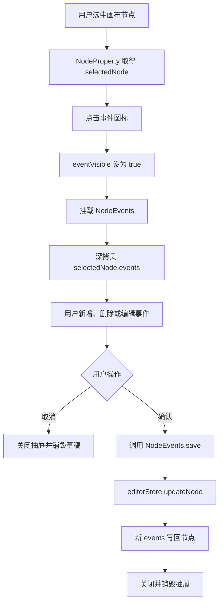
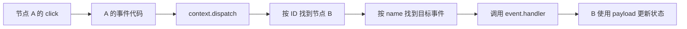
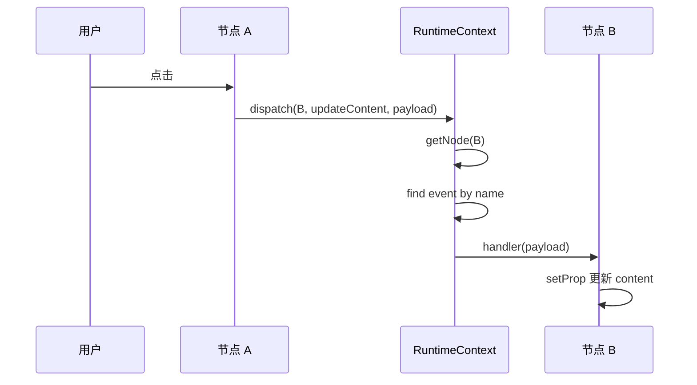

# 2026-07-30 代码整理

> 今日课程内容按节次分别记录。后续章节继续使用与第 34 节同级的二级标题。

## 34「事件配置面板」

### 34.1 本节目标

第 33 节已经让运行时能够执行节点事件，第 34 节继续补充编辑器侧的可视化配置入口，让用户不必直接修改页面 JSON，也能为节点新增、删除和编辑事件。

本次涉及 2 个文件，共新增约 169 行、删除约 8 行，主要完成以下工作：

1. 新建 `NodeEvents.vue` 事件配置组件。
2. 在节点属性面板标题区增加事件入口图标。
3. 使用独立抽屉承载事件配置界面。
4. 打开面板时深拷贝当前节点事件，形成临时编辑草稿。
5. 支持事件的新增、选择、删除和代码编辑。
6. 使用 Monaco Editor 编辑 JavaScript 函数体。
7. 点击确认后整体写回当前节点的 `events`。

### 34.2 2 个文件的职责

| 文件 | 本次职责 |
| --- | --- |
| `src/editor/panels/property/components/NodeProperty.vue` | 提供事件配置入口、控制抽屉和触发保存 |
| `src/editor/panels/property/components/NodeEvents.vue` | 管理事件草稿、事件列表、表单和代码编辑器 |

两个组件的边界如下：

```text
NodeProperty
  -> 负责什么时候打开和关闭事件抽屉
  -> 负责用户点击确认时调用保存

NodeEvents
  -> 负责事件数据如何编辑
  -> 负责把编辑结果写回当前节点
```

### 34.3 整体交互流程



核心思路是：

```text
打开抽屉
  -> 创建事件副本
  -> 只编辑副本
  -> 点击确认才写回节点
```

因此用户在抽屉中修改后点击取消，不会直接污染当前节点数据。

### 34.4 `NodeProperty.vue`：事件面板入口

文件：`src/editor/panels/property/components/NodeProperty.vue`

#### 34.4.1 引入事件配置组件

```ts
import NodeEvents from 
  '@/editor/panels/property/components/NodeEvents.vue'
```

`NodeProperty` 原本负责普通属性、布局、数据源和 JSON 配置，本次增加事件配置入口，但具体事件编辑逻辑仍然放在独立组件中。

这样可以避免节点属性组件继续膨胀，也让事件配置面板拥有自己的状态和生命周期。

#### 34.4.2 拆分两个抽屉状态

原来的通用 `visible` 改名为：

```ts
const jsonVisible = ref(false)
```

并新增：

```ts
const eventVisible = ref(false)
```

两个状态分别控制：

| 状态 | 对应界面 |
| --- | --- |
| `jsonVisible` | 节点 JSON 编辑抽屉 |
| `eventVisible` | 节点事件配置抽屉 |

使用明确名称后，后续增加其他抽屉时不会出现多个含义不清的 `visible`。

### 34.5 属性面板标题区的两个工具入口

标题区由原来的单个 JSON 图标改成一组工具图标：

```vue
<div class="flex gap-10">
  <span
    class="cursor-pointer"
    @click="eventVisible = true"
  >
    <Icon icon="codicon:symbol-event" />
  </span>

  <span
    class="cursor-pointer"
    @click="previewJson"
  >
    <Icon icon="si:json-duotone" />
  </span>
</div>
```

职责分别是：

- 事件图标：打开当前节点事件配置。
- JSON 图标：打开当前节点完整 JSON 编辑器。

这让常用的结构化事件配置与底层 JSON 编辑并存。普通用户使用表单，高级用户仍可查看完整节点结构。

### 34.6 事件抽屉生命周期

事件抽屉使用：

```vue
<el-drawer
  :destroy-on-close="true"
  v-model="eventVisible"
  title="时间配置"
  size="800"
>
  <NodeEvents ref="nodeEvents" />
</el-drawer>
```

`destroy-on-close` 表示抽屉关闭时销毁 `NodeEvents` 组件。

它对当前功能很重要：

```text
第一次打开
  -> NodeEvents 从当前节点生成草稿 A

关闭抽屉
  -> 组件销毁，草稿 A 消失

再次打开
  -> 组件重新挂载
  -> 从节点最新 events 生成草稿 B
```

如果用户点击取消，草稿会随着组件销毁而丢弃；如果点击确认，草稿先写回节点，再销毁组件。

当前标题写成了“时间配置”，语义上应为“事件配置”。

### 34.7 通过模板 ref 调用子组件保存

父组件创建模板 ref：

```ts
const nodeEvents = useTemplateRef('nodeEvents')
```

确认方法：

```ts
function onConfirmEvent() {
  nodeEvents.value?.save()
  eventVisible.value = false
}
```

执行过程：

```text
用户点击确认
  -> 父组件取得 NodeEvents 实例
  -> 调用子组件公开的 save()
  -> 子组件把草稿写回 store
  -> 父组件关闭抽屉
```

可选链 `?.` 可以避免组件实例尚未存在时直接报错。

这里使用的是命令式子组件 API。对于“父组件按钮控制子组件提交”这种场景可以工作，但也可以通过事件或 `v-model` 设计更显式的数据流。

### 34.8 `NodeEvents.vue`：事件草稿状态

文件：`src/editor/panels/property/components/NodeEvents.vue`

组件从 Pinia 获取当前节点：

```ts
const editorStore = useEditorStore()
const { selectedNode } = storeToRefs(editorStore)
```

事件草稿初始化：

```ts
const data = ref(
  deepClone(selectedNode.value.events) || [],
)
```

这里不能直接使用：

```ts
const data = selectedNode.value.events
```

因为数组和事件对象都是引用类型，直接绑定会导致输入框每次修改都同步修改 store，取消按钮就失去意义。

深拷贝后的关系是：

```text
selectedNode.events  -> 正式节点数据

data                 -> 独立编辑草稿
```

只有执行 `save()` 时，草稿才会进入正式节点数据。

### 34.9 当前选中事件

组件使用：

```ts
const activeEvent = ref()
```

保存当前正在编辑的事件对象。

列表点击后执行：

```ts
function selectDataEvent(event: MaterialEvent) {
  activeEvent.value = event
}
```

右侧表单使用：

```vue
<el-form v-if="activeEvent">
  <!-- 事件字段 -->
</el-form>
```

未选择事件时不渲染表单，选择后通过 `v-model` 直接编辑草稿中的对应事件。

由于 `activeEvent` 指向 `data` 数组中的对象，所以表单修改会立即反映到左侧列表名称，但仍然不会修改正式节点。

### 34.10 新增事件

当前新增逻辑的设计意图是创建一条默认事件：

```text
点击新增
  -> 创建默认事件对象
  -> 推入 data 草稿数组
  -> 自动选中新事件
  -> 右侧表单开始编辑
```

按照 `MaterialEvent` 类型，正确的数据结构应该是：

```ts
const newEvent: MaterialEvent = {
  name: '自定义事件',
  type: 'click',
  code: '',
}

data.value.push(newEvent)
selectDataEvent(newEvent)
```

当前源码误用了 `DataSourceSchema`：

```ts
const newSource: DataSourceSchema = {
  name: '自定义',
  type: '',
  data: '',
  code: '',
}
```

这是从数据源管理组件复制代码后遗留的类型和字段，导致新增事件逻辑无法通过 TypeScript 检查。

### 34.11 删除事件

当前根据名称查找事件：

```ts
function removeDataEvent(name: string) {
  const index = data.value.findIndex(
    (item) => item.name === name,
  )

  if (index !== -1) {
    data.value.splice(index, 1)

    if (activeEvent.value?.name === name) {
      selectDataEvent(null)
    }
  }
}
```

删除过程：

```text
点击删除图标
  -> @click.stop 阻止触发列表选择
  -> 按名称查找事件索引
  -> 从草稿数组删除
  -> 如果删除当前事件，则清空右侧表单
```

`@click.stop` 很重要。没有它时，点击删除按钮会先删除事件，又触发外层列表项的选择事件。

当前使用 `name` 作为身份存在限制：事件名称可以修改，也可能重复。更稳定的方案是为每条事件增加内部 `id`，或者删除时直接传入事件对象引用。

### 34.12 事件列表

左侧事件列表：

```vue
<div
  v-for="item in data"
  :key="item.name"
  :class="{
    active: item.name === activeEvent?.name,
  }"
  @click="selectDataEvent(item)"
>
  <span>{{ item.name }}</span>
  <span @click.stop="removeDataEvent(item.name)">
    <Icon icon="mdi:delete" color="red" />
  </span>
</div>
```

列表同时承担三种功能：

- 展示事件名称。
- 标识当前事件。
- 提供删除入口。

`active` class 使用主题主色显示当前选中项，便于用户理解右侧表单正在编辑哪条事件。

但 `:key="item.name"` 不稳定：用户在右侧修改名称时 key 会变化，Vue 可能重新创建对应 DOM。后续建议增加稳定事件 ID。

### 34.13 事件基础表单

右侧表单包含三个字段：

```vue
<el-form-item label="名称">
  <el-input v-model="activeEvent.name" />
</el-form-item>

<el-form-item label="类型">
  <el-input v-model="activeEvent.type" />
</el-form-item>

<el-form-item label="函数体">
  <!-- Monaco Editor -->
</el-form-item>
```

字段与第 33 节的 `MaterialEvent` 对应：

| 表单字段 | Schema 字段 | 运行时作用 |
| --- | --- | --- |
| 名称 | `name` | 标识事件和辅助管理 |
| 类型 | `type` | 作为 `v-on` 的监听事件名 |
| 函数体 | `code` | 运行时交给 `new Function()` 执行 |

当前事件类型使用普通文本输入框，用户可能输入不存在或不支持的类型。更适合使用下拉选择，例如 `click`、`mouseenter`、`mouseleave`。

### 34.14 Monaco 事件代码编辑器

事件代码使用：

```vue
<monaco-editor
  v-model="activeEvent.code"
  lang="javascript"
/>
```

编辑器上下展示函数外壳：

```text
function ($context, $node) {
  // 用户在 Monaco 中编辑的 code
}
```

这与运行时实际执行方式一致：

```ts
new Function('$context', '$node', event.code)
```

函数外壳可以帮助配置人员理解当前代码中可以直接使用：

```ts
$context
$node
```

示例代码：

```ts
$context.setProp(
  $node.id,
  'content',
  '点击后更新',
)
```

或者：

```ts
$context.refreshNodesByDataId('568')
```

当前 Monaco 只负责文本编辑，没有在保存前进行 JavaScript 语法校验。

### 34.15 `save()`：将草稿写回节点

`NodeEvents` 使用 `defineExpose()` 公开保存方法：

```ts
defineExpose({
  save() {
    editorStore.updateNode(
      selectedNode.value.id,
      {
        ...selectedNode.value,
        events: data.value,
      },
    )
  },
})
```

保存过程：

```text
读取当前 selectedNode
  -> 复制节点原有字段
  -> 使用 data 草稿替换 events
  -> editorStore.updateNode
  -> 在 nodes 数组中替换同 ID 节点
```

`updateNode()` 最终调用 `setNodes()`，并接入已有的 `applyChange()`，因此事件配置变化可以进入编辑器的撤销重做体系。

### 34.16 父子组件通信方式

当前通信方式是：

```text
父组件 NodeProperty
  -> 通过 template ref 获取 NodeEvents
  -> 调用 defineExpose 暴露的 save()
```

组件契约如下：

| 方向 | 当前方式 | 数据或动作 |
| --- | --- | --- |
| 父到子 | 子组件内部读取 Pinia | 当前选中节点 |
| 父到子 | 模板 ref | 调用 `save()` |
| 子到 store | `editorStore.updateNode()` | 保存事件数组 |

更显式的 Vue 数据流可以设计为：

```vue
<NodeEvents
  :node="selectedNode"
  @save="onSaveEvents"
/>
```

或使用事件数组的 `v-model`。这样子组件不必同时依赖 Pinia 和父组件命令，测试也会更简单。

当前实现仍然可用，优点是父组件确认按钮可以直接控制子组件提交。

### 34.17 取消和确认的差异

#### 点击取消

```text
eventVisible = false
  -> 抽屉关闭
  -> destroy-on-close 销毁 NodeEvents
  -> data 草稿丢弃
  -> selectedNode.events 保持不变
```

#### 点击确认

```text
onConfirmEvent
  -> nodeEvents.save()
  -> updateNode 写回 events
  -> eventVisible = false
  -> 抽屉关闭并销毁组件
```

“草稿 + 确认提交”是复杂表单和弹窗编辑的常见模式，能够避免未确认输入实时污染正式状态。

### 34.18 与第 33 节运行时的连接

事件面板保存后的数据结构：

```ts
node.events = [
  {
    name: '刷新图表',
    type: 'click',
    code: `$context.refreshNodesByDataId('568')`,
  },
]
```

页面预览或发布后，`ScreenRenderer` 会读取这份配置：

```text
NodeEvents 保存事件
  -> MaterialSchema.events
  -> 页面 JSON 或发布快照
  -> ScreenRenderer.createEvents
  -> v-on 动态绑定
  -> 用户触发事件
  -> new Function 执行 code
```

编辑器面板负责“生成配置”，运行时渲染器负责“消费配置”。二者通过 `MaterialEvent` Schema 解耦。

### 34.19 类型检查结果

本机默认 Node.js 为 `v16.16.0`，低于当前 pnpm 要求。使用工作区自带的 Node.js 运行：

```bash
pnpm type-check
```

检查未通过，共发现 6 个错误。

其中 3 个来自本节新建的 `NodeEvents.vue`：

```text
1. type: '' 不符合 DataSourceSchema 的 'static' | 'api'

2. DataSourceSchema 不能推入 MaterialEvent[]

3. DataSourceSchema 缄少 MaterialEvent 必需的 code 字段
```

根本原因是新增事件时错误使用了 `DataSourceSchema`。应改成：

```ts
const newEvent: MaterialEvent = {
  name: '自定义事件',
  type: 'click',
  code: '',
}
```

另外 3 个错误来自已有的 `DataSourceManager.vue`，是 JSON 字符串编辑状态与 `DataSourceSchema` 对象类型不一致的历史问题。

### 34.20 当前实现的注意事项

1. `onAdd()` 错误使用 `DataSourceSchema`，需要改为 `MaterialEvent`。
2. `DataSourceSchema`、`fetchData`、`HttpMethod` 等导入是复制残留，应删除。
3. `responseText` 和 `methods` 没有使用，应删除。
4. 注释中的“新增数据源”“删除数据源”应改成“新增事件”“删除事件”。
5. 事件抽屉标题“时间配置”应改为“事件配置”。
6. `activeEvent` 没有类型，建议声明为 `Ref<MaterialEvent | null>`。
7. `data` 建议显式声明为 `Ref<MaterialEvent[]>`。
8. 事件名称可能重复，不适合作为删除依据、选中依据和 Vue key。
9. 编辑事件名称会改变 `:key`，可能导致列表项 DOM 被重新创建。
10. 打开抽屉后默认没有选中已有事件，右侧首先显示为空；可以默认选中第一项。
11. 没有选中节点时点击事件图标，`selectedNode.value.events` 可能报错，应禁用入口或增加空值保护。
12. 抽屉打开期间如果切换选中节点，草稿来自旧节点，但保存目标可能变成新节点，应在打开时固定目标节点 ID。
13. 事件名称、类型和代码都没有必填校验。
14. 事件类型建议使用下拉选择或白名单，而不是自由文本输入。
15. Monaco 代码没有保存前语法检查，错误会延迟到运行时触发。
16. 子组件直接读取 Pinia，又通过公开方法提交，组件耦合较高；可考虑 props + emit。
17. `nodeEvents.value?.save()` 失败时父组件仍会关闭抽屉，目前没有保存结果或异常反馈。
18. 删除事件没有二次确认，误删后只能依赖取消或编辑器撤销。
19. `deepClone()` 基于 JSON 序列化，当前事件字段均为字符串，适合此场景。
20. UI 当前延续 Element Plus 样式；后续优化时应保持左右列表、标准表单和抽屉操作层级清晰。

### 34.21 值得记住的实现思路

#### 弹窗和抽屉编辑应该使用草稿

需要“确认/取消”的复杂编辑界面，不应直接双向绑定正式 store。先深拷贝为草稿，确认后整体提交，取消时直接销毁草稿。

#### 编辑器和运行时通过 Schema 解耦

事件配置面板只负责生成 `MaterialEvent[]`，运行时只负责读取和执行。两边不需要直接调用彼此组件。

#### 类型名称应该与业务对象一致

事件必须使用 `MaterialEvent`，数据源必须使用 `DataSourceSchema`。复制组件代码后应及时清理类型、变量和注释，否则 TypeScript 会暴露出混用问题。

#### 列表项需要稳定身份

用户可修改的名称不适合作为 key。为事件增加不可变 ID，可以解决重复名称、重命名重渲染和精确删除问题。

#### 子组件公开方法应该尽量小

`NodeEvents` 只公开 `save()`，没有暴露内部草稿和表单状态，保持了相对清晰的命令式边界。

### 34.22 最终逻辑总结

```text
用户选中节点
  -> NodeProperty 显示节点名称和事件图标

点击事件图标
  -> eventVisible = true
  -> 挂载 NodeEvents
  -> 深拷贝 selectedNode.events 为 data 草稿

编辑事件
  -> 左侧列表选择或删除事件
  -> 右侧表单编辑 name 和 type
  -> Monaco 编辑 code
  -> 所有修改只作用于草稿

点击取消
  -> 关闭抽屉
  -> destroy-on-close 销毁组件
  -> 草稿丢弃

点击确认
  -> 父组件调用 NodeEvents.save()
  -> editorStore.updateNode()
  -> data 草稿写入 node.events
  -> 节点变更进入撤销重做流程
  -> 关闭并销毁抽屉

页面运行
  -> ScreenRenderer 读取 node.events
  -> 动态绑定事件
  -> 执行用户配置的事件代码
```

本节的核心，是补齐“事件 Schema 的可视化生产端”，形成“编辑器配置事件 → 页面保存事件 → 运行时绑定并执行事件”的完整闭环。

## 35「跨组件事件联动」

### 35.1 本节目标

第 34 节解决了事件的可视化配置，第 35 节继续让一个节点的事件主动调用另一个节点的命名事件，并支持在两个事件之间传递数据。

本次涉及 6 个文件，主要完成以下工作：

1. 为事件增加标题、默认数据和运行时处理函数字段。
2. 为运行时上下文增加 `dispatch()` 事件分发方法。
3. 允许事件函数接收 `$payload` 参数。
4. 在首次渲染时创建事件处理函数，后续渲染复用。
5. 通过目标节点 ID 和事件名称触发其他节点事件。
6. 完善事件配置面板中的标题、函数名和参数提示。
7. 修复新增事件时误用 `DataSourceSchema` 的类型问题。

### 35.2 6 个文件的职责

| 文件 | 本次职责 |
| --- | --- |
| `src/schema/material.ts` | 扩展事件 Schema，增加标题、数据和运行时 handler |
| `src/runtime/context.ts` | 增加跨节点事件分发方法 `dispatch()` |
| `src/components/ScreenRenderer/index.vue` | 创建、缓存并调用支持 payload 的事件处理函数 |
| `src/materials/text/index.ts` | 为文本默认点击事件补充可读标题 |
| `src/editor/panels/property/components/NodeEvents.vue` | 完善事件配置字段和函数签名展示 |
| `src/editor/panels/property/components/NodeProperty.vue` | 继续作为事件抽屉入口和保存控制器 |

### 35.3 跨组件事件联动是什么

第 33 节的事件主要响应当前节点自身的原生事件：

```text
点击文本节点
  -> 执行该文本节点的 click 事件代码
```

第 35 节新增的联动允许当前事件继续分发到另一个节点：

```text
点击节点 A
  -> 执行节点 A 的 click 事件
  -> 调用 $context.dispatch(...)
  -> 找到节点 B
  -> 找到节点 B 中指定名称的事件
  -> 执行节点 B 的事件处理函数
  -> 将 payload 传给节点 B
```



节点 A 不需要直接引用节点 B 的 Vue 组件实例，只需要知道目标节点 ID 和目标事件名称。

### 35.4 `MaterialEvent` 的新增字段

文件：`src/schema/material.ts`

事件结构新增：

```ts
export interface MaterialEvent {
  type: string
  name: string
  code: string

  data?: string
  title: string
  handler?: (...args: any[]) => any
}
```

本次字段职责如下：

| 字段 | 所属阶段 | 作用 |
| --- | --- | --- |
| `title` | 编辑配置 | 给用户看的事件标题 |
| `name` | 配置与运行 | 给代码使用的事件名称 |
| `type` | 运行 | 绑定 Vue 或 DOM 事件类型 |
| `code` | 配置与运行 | 事件函数体字符串 |
| `data` | 配置预留 | 预留的事件数据字段，当前尚未消费 |
| `handler` | 运行 | 由 `code` 编译得到的函数 |

这里开始区分“可读标题”和“程序名称”：

```text
title = 点击事件
name  = refreshCharts
```

`title` 可以使用中文并展示在配置列表，`name` 更适合在 `dispatch()` 中作为稳定标识。

### 35.5 配置数据与运行时数据

`MaterialEvent` 现在同时包含两类数据：

```text
可序列化配置
  -> title
  -> name
  -> type
  -> code
  -> data

运行时派生数据
  -> handler 函数
```

页面保存和发布时，JSON 能够保存字符串字段，但函数无法被 JSON 序列化：

```ts
JSON.stringify({ handler: () => {} })
// handler 会被忽略
```

因此页面重新加载后，需要由 `ScreenRenderer` 根据 `code` 再次生成 `handler`。

当前把 `handler` 放在 Schema 上可以快速实现缓存，但也把持久化模型和运行时状态混在了一起。更清晰的长期方案是维护独立的运行时 Handler Map。

### 35.6 `ScreenRenderer` 创建事件处理函数

文件：`src/components/ScreenRenderer/index.vue`

事件创建逻辑变为：

```ts
if (event.handler) {
  listeners[event.type] = event.handler
  return
}

event.handler = listeners[event.type] = (payload) => {
  const fn = new Function(
    '$context',
    '$node',
    '$payload',
    event.code,
  )

  fn(context, node, payload)
}
```

执行逻辑分为两种情况。

#### 首次处理事件

```text
event.handler 不存在
  -> 创建监听函数
  -> 保存到 listeners[event.type]
  -> 同时保存到 event.handler
```

#### 后续重新渲染

```text
event.handler 已存在
  -> 不再创建函数
  -> 直接放入 listeners[event.type]
```

这样可以避免每次组件重新渲染时都重新创建 `new Function()` 和外层处理函数。

### 35.7 `$payload` 参数

动态函数从两个参数扩展为三个参数：

```ts
new Function(
  '$context',
  '$node',
  '$payload',
  event.code,
)
```

三个参数分别表示：

| 参数 | 作用 |
| --- | --- |
| `$context` | 操作整个运行时页面 |
| `$node` | 当前事件所属节点 |
| `$payload` | 本次事件携带的数据 |

`$payload` 有两种来源。

#### 原生事件触发

当监听器通过 `v-on` 响应点击时，Vue 会把原始事件对象传进来：

```text
click
  -> handler(MouseEvent)
  -> $payload 是 MouseEvent
```

事件代码可以读取：

```ts
console.log($payload.clientX)
console.log($payload.clientY)
```

#### `dispatch()` 触发

当另一个节点主动分发事件时，payload 是调用方传入的任意业务数据：

```ts
$context.dispatch(
  'target-node-id',
  'updateContent',
  { text: '新的内容' },
)
```

目标事件中可以读取：

```ts
$context.setProp(
  $node.id,
  'content',
  $payload.text,
)
```

同一个 `$payload` 参数统一承载原生事件对象和跨组件业务数据。

### 35.8 `dispatch()`：跨节点事件分发

文件：`src/runtime/context.ts`

运行时上下文接口新增：

```ts
dispatch(
  id: string,
  name: string,
  payload?: any,
): void
```

实现逻辑：

```ts
const dispatch = (id, name, payload) => {
  const node = getNode(id)

  if (!node) {
    console.warn(`没有找到${id}对应的组件实例`)
    return
  }

  const event = node.events?.find(
    (event) => event.name === name,
  )

  if (event) {
    event.handler?.(payload)
  }
}
```

可以拆成四步：

1. 根据 ID 查找目标节点。
2. 在目标节点的事件列表中按 `name` 查找事件。
3. 取得渲染阶段生成的 `handler`。
4. 调用 handler，并把 payload 传给目标事件。

### 35.9 为什么按事件名称查找

事件类型描述“外部如何触发”：

```text
click
mouseenter
mouseleave
```

事件名称描述“业务动作是什么”：

```text
refreshCharts
updateContent
changeRegion
```

`dispatch()` 使用业务名称而不是 DOM 类型：

```ts
node.events.find(
  (event) => event.name === name,
)
```

这样调用方不需要知道目标事件绑定的是 `click` 还是其他原生事件，只需要知道它公开的业务事件名称。

### 35.10 `dispatch()` 与 `trigger()` 的区别

运行时上下文现在有两种跨组件调用方式：

| 方法 | 查找目标 | 调用对象 | 适合场景 |
| --- | --- | --- | --- |
| `trigger(id, method, args)` | 组件实例 Map | `defineExpose()` 公开方法 | 刷新、播放、暂停等组件能力 |
| `dispatch(id, eventName, payload)` | 节点事件配置 | `MaterialEvent.handler` | 页面配置中的业务事件联动 |

`trigger()` 示例：

```ts
$context.trigger(
  'chart-node-id',
  'refresh',
  { year: 2026 },
)
```

`dispatch()` 示例：

```ts
$context.dispatch(
  'text-node-id',
  'updateContent',
  { text: '华东区域' },
)
```

前者依赖物料组件公开 API，后者依赖页面中配置的命名事件。

### 35.11 一个完整的跨组件示例

假设节点 A 是按钮或文本，节点 B 是另一个文本节点。

#### 节点 B 配置接收事件

```ts
{
  title: '更新文本',
  name: 'updateContent',
  type: 'click',
  data: '',
  code: `
    $context.setProp(
      $node.id,
      'content',
      $payload.text,
    )
  `,
}
```

#### 节点 A 配置点击事件

```ts
{
  title: '发送文本',
  name: 'sendContent',
  type: 'click',
  data: '',
  code: `
    $context.dispatch(
      'node-b-id',
      'updateContent',
      { text: '节点 A 发送的数据' },
    )
  `,
}
```

#### 执行过程



最终节点 B 的文本内容更新，而节点 A 和节点 B 不需要建立 Vue props 或 emit 的直接父子关系。

### 35.12 为什么叫“跨组件”联动

普通 Vue 组件通信通常使用：

```text
父组件通过 props 向下传递
子组件通过 emits 向上通知
```

大屏中的两个物料节点通常是同级动态组件，并且节点数量、类型和关系来自页面 Schema，无法预先在模板中写死通信链路。

```text
ScreenRenderer
  -> 动态节点 A
  -> 动态节点 B
  -> 动态节点 C
```

运行时上下文承担中介角色：

```text
节点 A
  -> RuntimeContext
  -> 节点 B
```

这类似事件总线或中介者模式，但当前实现通过节点 ID 和事件名称精确寻址，不是全局广播。

### 35.13 事件 Handler 的缓存目的

如果每次渲染都执行：

```ts
new Function(...)
```

会重复解析同一段代码并创建函数对象。

当前通过：

```ts
event.handler
```

缓存编译结果，理想生命周期是：

```text
读取事件配置
  -> 首次编译 code
  -> 保存 handler
  -> 原生事件和 dispatch 共用 handler
```

这也让 `dispatch()` 不必重新理解 `code`，只负责查找并调用已有函数。

### 35.14 Handler 缓存的旧闭包风险

当前 `handler` 闭包捕获了创建时的：

```ts
context
node
event.code
```

由于 `handler` 被写回事件 Schema，如果同一个页面对象被新的 `ScreenRenderer` 再次挂载，可能直接复用旧 handler：

```text
第一次打开预览
  -> handler 捕获 Context A
  -> handler 保存在 page.events

关闭预览后再次打开
  -> 创建 Context B
  -> creatEvents 发现旧 handler
  -> 继续复用捕获 Context A 的函数
```

这可能导致事件操作已经卸载的组件实例或旧运行时上下文。

更稳妥的方案是把 handler 缓存在渲染器内部：

```ts
Map<nodeId, Map<eventName, EventHandler>>
```

渲染器卸载时整个 Map 随组件销毁，不把运行时闭包写入持久化 Schema。

### 35.15 事件代码变化后的缓存失效

当前逻辑只判断：

```ts
if (event.handler) {
  return event.handler
}
```

如果运行期间修改了 `event.code`，旧 handler 仍然执行旧代码，因为没有重新编译。

缓存需要明确失效条件：

```text
event.code 变化
  -> 删除旧 handler
  -> 使用新 code 创建 handler
```

可以通过监听事件代码、保存编译时 code，或使用 `(nodeId, eventName, code)` 作为缓存 key 解决。

### 35.16 `NodeEvents.vue` 的改进

文件：`src/editor/panels/property/components/NodeEvents.vue`

#### 修正新增事件类型

第 34 节中错误使用的 `DataSourceSchema` 已改为：

```ts
const newSource: MaterialEvent = {
  title: '自定义',
  name: '',
  type: '',
  data: '',
  code: '',
}
```

现在新增对象与 `MaterialEvent` 一致，可以正常推入事件草稿数组。

#### 增加事件标题

左侧列表由显示程序名称改为显示标题：

```vue
<span>{{ item.title }}</span>
```

右侧表单新增：

```vue
<el-form-item label="标题">
  <el-input v-model="activeEvent.title" />
</el-form-item>
```

用户可以看到“点击事件”“更新图表”等可读标题，而代码仍使用稳定事件名称。

#### 函数签名提示

代码编辑器上方现在显示：

```text
function 事件名称($context, $node, $payload) {
```

它与实际 `new Function()` 参数保持一致，提醒用户可以在事件代码中使用 `$payload`。

#### 代码字体

函数容器增加等宽字体：

```scss
font-family:
  Menlo,
  Monaco,
  Consolas,
  'Courier New',
  monospace;
```

代码外壳和 Monaco Editor 的视觉语言更加一致。

### 35.17 默认文本事件补充标题

文件：`src/materials/text/index.ts`

默认事件新增：

```ts
title: '点击事件'
```

完整结构为：

```ts
{
  type: 'click',
  name: 'fn',
  title: '点击事件',
  code: `$context.refreshNodesByDataId('568')`,
}
```

事件配置面板左侧会展示“点击事件”，而运行时仍可通过名称 `fn` 定位该事件。

### 35.18 `NodeProperty.vue` 在本节中的角色

`NodeProperty` 仍然负责：

```text
打开事件配置抽屉
  -> 挂载 NodeEvents
  -> 用户确认后调用 save()
  -> 将事件配置写回节点
```

跨组件联动所需的 `title`、`name`、`type`、`data` 和 `code` 都通过 `NodeEvents` 编辑，再由 `NodeProperty` 的确认动作统一提交。

这说明编辑器和运行时仍通过 Schema 解耦：

```text
NodeProperty / NodeEvents
  -> 生产事件配置

ScreenRenderer / RuntimeContext
  -> 消费事件配置
```

### 35.19 类型检查结果

使用工作区 Node.js 执行：

```bash
pnpm type-check
```

第 34 节中 `NodeEvents.vue` 的 3 个新增类型错误已经修复。本次检查只剩 3 个错误，全部来自已有的：

```text
src/editor/toolbar/components/DataSourceManager.vue
```

问题仍然是数据源表单中的 JSON 字符串状态与 `DataSourceSchema` 对象字段类型不一致。

第 35 节涉及的 6 个文件没有新增 TypeScript 检查错误。不过 `handler` 和 `payload` 使用 `any`，所以事件参数错误仍无法在编译阶段发现。

### 35.20 当前实现的注意事项

1. `creatEvents` 仍存在拼写错误，建议改为 `createEvents`。
2. `handler` 不适合存入持久化 Schema，建议使用独立运行时 Map。
3. 复用 handler 可能捕获旧 `context` 和旧节点对象。
4. `event.code` 变化时没有使旧 handler 失效。
5. `dispatch()` 未找到目标事件时没有日志，排查配置错误较困难。
6. `dispatch()` 中未找到节点的警告写成“组件实例”，实际查找的是节点 Schema。
7. 同一节点存在重复 `name` 时，`find()` 只执行第一条事件。
8. `name` 当前允许为空，但跨组件分发依赖它，应增加必填和唯一性校验。
9. `payload` 使用 `any`，调用方和接收方之间没有数据契约。
10. `data` 字段已经加入 Schema，但当前面板和运行时尚未使用。
11. 原生事件和业务 payload 共用 `$payload`，事件代码需要自行区分数据结构。
12. `dispatch()` 同步执行 handler，不支持等待异步结果，也没有返回值。
13. 节点之间可以互相 dispatch，若 A 调用 B、B 又调用 A，可能形成无限递归。
14. 目标节点 ID 写在事件代码中，复制节点或重新生成 ID 后联动关系可能失效。
15. `handler` 通过 `new Function()` 创建，仍需考虑脚本安全、异常捕获和权限边界。
16. `NodeEvents.vue` 仍残留未使用的 `HttpMethod` 导入。
17. 删除和 Vue key 仍使用可编辑的 `name`，重名和改名问题尚未解决。
18. 事件抽屉标题仍写成“时间配置”，应改成“事件配置”。
19. `newSource` 的变量名仍带有数据源语义，建议改为 `newEvent`。
20. `type` 默认是空字符串，保存前应校验事件类型。

### 35.21 值得记住的实现思路

#### 跨组件联动需要稳定寻址

节点 ID 确定目标节点，事件名称确定目标动作。二者组合形成运行时调用地址：

```text
nodeId + eventName
```

#### 配置标题和程序名称应该分开

`title` 面向配置人员，`name` 面向运行时代码。分离后可以自由调整界面文案，而不破坏已有事件调用。

#### payload 是事件之间的数据桥梁

有了 `$payload`，事件联动不只是发出通知，还能传递区域、日期、筛选条件和业务对象。

#### 配置模型和运行时状态应分层

`code` 属于可保存配置，`handler` 属于运行时编译结果。两者分开存放可以避免旧闭包、序列化和缓存失效问题。

#### 精确分发比全局广播更容易追踪

`dispatch(id, name, payload)` 明确指出目标节点和事件，比所有组件都监听同一个全局事件更容易理解和排查。

### 35.22 最终逻辑总结

```text
编辑器配置目标节点事件
  -> title 用于界面展示
  -> name 用于运行时定位
  -> code 定义事件动作

ScreenRenderer 渲染页面
  -> 首次根据 code 创建 handler
  -> handler 注入 context、node、payload
  -> handler 同时供 v-on 和 dispatch 使用

用户触发节点 A
  -> 执行节点 A 的事件代码
  -> 调用 context.dispatch(B.id, eventName, payload)

RuntimeContext 分发
  -> getNode 找到节点 B
  -> 按 name 查找 B 的事件
  -> 调用 B 的 handler(payload)

节点 B 接收数据
  -> 通过 $payload 读取业务参数
  -> 使用 $context 修改节点或刷新组件
  -> Vue 响应式更新页面
```

本节的核心，是在第 33 节“节点自身事件”和第 34 节“事件配置面板”之上，增加“按节点 ID 与事件名称精确调用”的跨组件通信能力，并用 `$payload` 完成事件间的数据传递。

<!-- 后续内容继续使用同级标题：## 36「...」 -->
