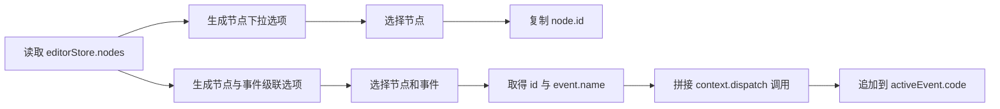
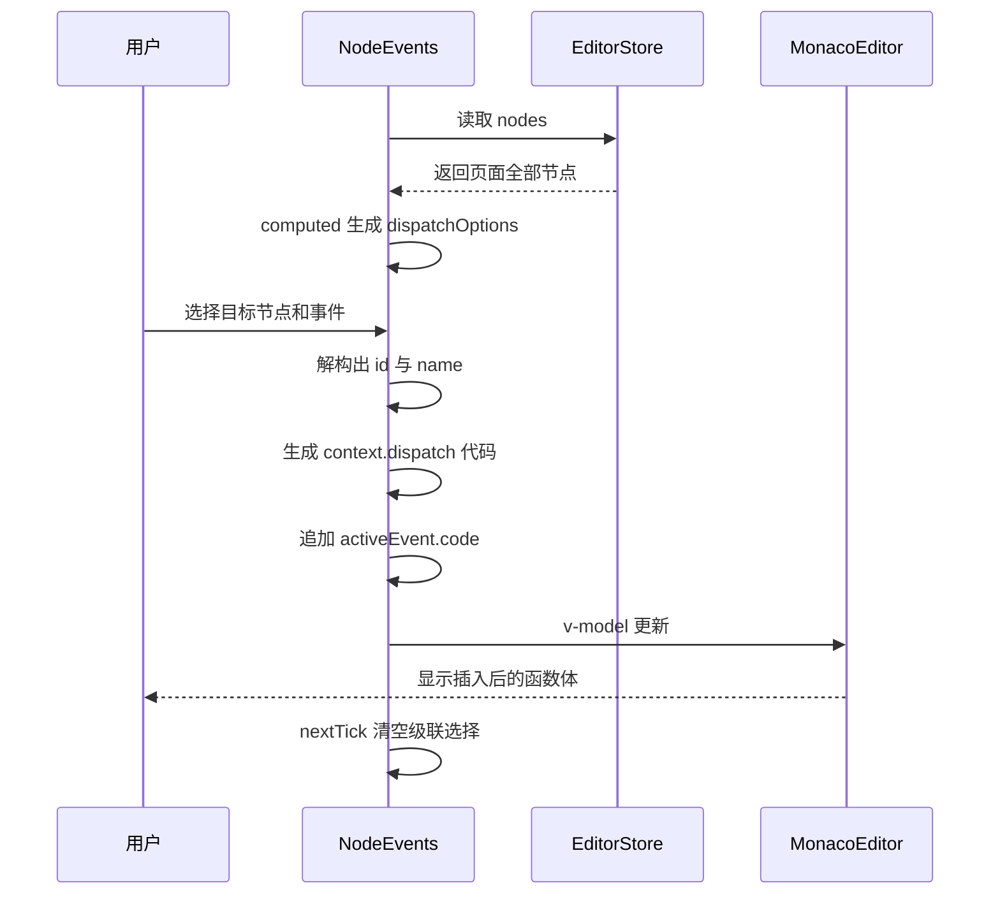

# 2026-08-01 代码整理

> 今日课程内容按节次分别记录。后续第 37、38 节继续使用与第 36 节同级的二级标题。

## 36「优化事件函数编辑体验」

### 36.1 本节目标

第 35 节已经完成跨组件事件联动，事件代码可以手动调用：

```ts
$context.dispatch('目标节点 ID', '目标事件名称', payload)
```

但是完全手写存在两个明显问题：

1. 节点 ID 是随机字符串，不方便记忆，也容易复制错误。
2. 目标事件名称需要回到其他节点中查询，编辑过程频繁跳转。

第 36 节在事件函数编辑区增加两个辅助工具：

- **复制节点 ID**：从节点下拉列表中选择节点，自动复制其 ID。
- **触发事件**：通过“节点 -> 事件”级联选择，自动向当前函数体插入 `$context.dispatch()`。

本节只改变事件代码的编辑体验，不修改第 35 节已经完成的运行时分发机制。

### 36.2 今天实际涉及的文件

经过 Git 差异、文件时间和第 35 节最终代码三者比对，今天应记录 3 个文件：

| 文件 | 类型 | 本节职责 |
| --- | --- | --- |
| `src/editor/panels/property/components/NodeEvents.vue` | 业务源码 | 增加节点 ID 复制和事件调用代码插入工具 |
| `auto-imports.d.ts` | 自动生成声明 | 增加全局 `ElMessage` 的类型声明 |
| `components.d.ts` | 自动生成声明 | 增加全局 `ElCascader` 组件声明 |

核心业务修改只有 `NodeEvents.vue`。另外两个 `.d.ts` 文件是 Vite 插件根据模板和源码使用情况自动更新的类型声明，不承担业务逻辑。

### 36.3 本次排除的旧文件

截图中还显示了以下 5 个源码文件，但它们不属于第 36 节的新逻辑：

| 排除文件 | 原因 |
| --- | --- |
| `src/runtime/context.ts` | 7 月 30 日第 35 节已增加 `dispatch()` |
| `src/materials/text/index.ts` | 7 月 30 日第 35 节已增加默认事件标题 |
| `src/components/ScreenRenderer/index.vue` | 7 月 30 日第 35 节已支持 `$payload` 和 handler 缓存 |
| `src/schema/material.ts` | 7 月 30 日第 35 节已扩展 `MaterialEvent` |
| `src/editor/panels/property/components/NodeProperty.vue` | 属于第 34/35 节的事件抽屉入口，本节没有新增业务语义 |

`NodeProperty.vue` 的文件写入时间虽然是今天，但当前内容仍是此前已经记录的事件抽屉、确认保存和 JSON 抽屉逻辑。因此不能只根据编辑器的“已更改”列表或文件时间判断课程归属，还需要比较实际代码逻辑。

### 36.4 优化前后的编辑流程

#### 优化前

```text
打开目标节点
  -> 查看或复制节点 ID
  -> 记住目标事件 name
  -> 返回当前节点
  -> 手写 $context.dispatch(...)
  -> 检查引号、逗号和括号
```

#### 优化后

```text
在当前事件配置面板中
  -> 选择目标节点
  -> 选择目标事件
  -> 自动生成 dispatch 调用
  -> 插入当前事件 code
```



### 36.5 读取页面全部节点

文件：`src/editor/panels/property/components/NodeEvents.vue`

原来组件只读取当前选中节点：

```ts
const { selectedNode } = storeToRefs(editorStore)
```

本节增加 `nodes`：

```ts
const { selectedNode, nodes } = storeToRefs(editorStore)
```

两个状态的用途不同：

| 状态 | 用途 |
| --- | --- |
| `selectedNode` | 当前正在配置事件的节点，也是保存目标 |
| `nodes` | 当前页面的全部节点，用于选择联动目标 |

`storeToRefs()` 保留了 Pinia 状态的响应性。如果页面节点名称或事件列表发生变化，依赖 `nodes` 的计算属性也会重新生成。

### 36.6 `dispatchEvent`：级联选择器状态

新增：

```ts
const dispatchEvent = ref()
```

它保存 `<el-cascader>` 当前选中的路径，例如：

```ts
[
  'node-b-id',
  'updateContent',
]
```

数组中：

- 第一个值是目标节点 ID。
- 第二个值是目标事件名称。

这两个值正好对应运行时方法：

```ts
$context.dispatch(id, name, payload?)
```

因此级联选择器的数据结构与运行时 API 的参数结构是一一对应的。

### 36.7 `dispatchOptions`：把页面 Schema 转为级联选项

本节使用计算属性生成级联数据：

```ts
const dispatchOptions = computed(() => {
  return nodes.value.map((node) => {
    return {
      label: node.name,
      value: node.id,
      children: node.events?.map((e) => {
        return {
          label: e.title,
          value: e.name,
        }
      }),
    }
  })
})
```

数据转换分成两层。

#### 第一层：节点

```ts
{
  label: node.name,
  value: node.id,
}
```

- `label` 显示用户可读的节点名称。
- `value` 保存运行时真正需要的节点 ID。

#### 第二层：事件

```ts
{
  label: event.title,
  value: event.name,
}
```

- `label` 显示事件标题，例如“更新文本”。
- `value` 保存用于 `dispatch()` 定位事件的程序名称，例如 `updateContent`。

最终数据大致为：

```ts
[
  {
    label: '标题文本',
    value: 'node-a-id',
    children: [
      {
        label: '更新内容',
        value: 'updateContent',
      },
    ],
  },
]
```

这里延续了第 35 节建立的两个区分：

```text
节点 name / 事件 title -> 给用户看
节点 id / 事件 name    -> 给程序定位
```

### 36.8 为什么使用 `computed()`

`dispatchOptions` 完全由 `nodes` 派生，不需要单独维护一份可变状态：

```text
nodes 更新
  -> computed 重新计算
  -> ElCascader 收到新 options
  -> 可选节点和事件同步更新
```

如果改为在组件挂载时只计算一次，那么打开面板期间页面节点发生变化时，下拉选项可能过期。使用计算属性可以让“页面节点数据”保持为唯一数据源。

### 36.9 复制节点 ID

新增方法：

```ts
async function copyNodeId(id: string) {
  /**
   * 只支持 https 或者开发环境
   */
  await navigator.clipboard.writeText(id)
  ElMessage.success('复制成功')
}
```

执行过程：

```text
用户选择节点
  -> el-select 触发 change
  -> 将 node.id 传给 copyNodeId
  -> Clipboard API 写入剪贴板
  -> ElMessage 显示“复制成功”
```

模板：

```vue
<el-select
  class="flex-1"
  placeholder="复制节点 ID"
  @change="copyNodeId"
>
  <el-option
    v-for="node in nodes"
    :key="node.id"
    :value="node.id"
  >
    {{ node.name }}
  </el-option>
</el-select>
```

界面展示节点名称，但选择后传递的是节点 ID，避免用户直接面对难读的随机字符串。

### 36.10 Clipboard API 的使用条件

`navigator.clipboard.writeText()` 通常只能在安全上下文中使用：

```text
可用：localhost、HTTPS 页面
可能不可用：普通 HTTP 地址、浏览器未授权剪贴板
```

当前代码在写入成功后提示“复制成功”，但没有捕获失败情况。更完整的实现可以增加：

```ts
try {
  await navigator.clipboard.writeText(id)
  ElMessage.success('复制成功')
}
catch {
  ElMessage.error('复制失败，请检查剪贴板权限')
}
```

这不是本节已实现的代码，而是当前逻辑后续可以补充的异常处理。

### 36.11 级联选择目标事件

模板新增：

```vue
<el-cascader
  class="flex-1"
  placeholder="触发事件"
  :options="dispatchOptions"
  v-model="dispatchEvent"
  @change="insertDispatch"
/>
```

使用级联选择器是因为目标具有天然的两级关系：

```text
页面节点
  -> 该节点拥有的事件
```

与两个互相独立的下拉框相比，级联选择器可以直接表达父子关系，也不需要额外维护“当前目标节点”和“该节点事件列表”两份状态。

### 36.12 自动插入 `dispatch()` 代码

新增方法：

```ts
function insertDispatch(values: string[]) {
  const [id, name] = values
  const code = `\n$context.dispatch('${id}', '${name}')`

  activeEvent.value.code += code

  nextTick(() => {
    dispatchEvent.value = undefined
  })
}
```

逻辑可以拆成四步。

#### 第一步：解析级联路径

```ts
const [id, name] = values
```

例如：

```ts
values = ['node-b-id', 'updateContent']
```

解构后得到：

```ts
id = 'node-b-id'
name = 'updateContent'
```

#### 第二步：生成代码字符串

```ts
const code = `\n$context.dispatch('${id}', '${name}')`
```

生成结果：

```ts
$context.dispatch('node-b-id', 'updateContent')
```

开头添加 `\n`，确保新调用从下一行开始，不会直接粘在原有函数代码末尾。

#### 第三步：追加到当前事件函数体

```ts
activeEvent.value.code += code
```

`activeEvent` 指向事件草稿 `data` 中的对象，因此追加后的代码会立即同步到 Monaco Editor，但仍不会直接修改 Pinia 中的正式节点。

#### 第四步：清空选择器

```ts
nextTick(() => {
  dispatchEvent.value = undefined
})
```

清空后占位文案“触发事件”重新出现，用户可以再次选择并插入其他事件调用。

### 36.13 为什么在 `nextTick()` 中清空

级联组件触发 `change` 时，其内部选择状态和外部 `v-model` 正在完成同一轮更新。

```text
用户完成选择
  -> ElCascader 更新 modelValue
  -> 触发 change
  -> Vue 完成本轮 DOM 与响应式更新
  -> 下一轮清空 dispatchEvent
```

将清空动作放到 `nextTick()`，可以避免它与组件本轮写入值的动作互相覆盖，也让同一个目标事件可以连续重复选择。

### 36.14 两个辅助工具的布局

两个控件放在事件基础表单之前：

```vue
<div class="flex gap-20 mb-20">
  <el-select class="flex-1" ... />
  <el-cascader class="flex-1" ... />
</div>
```

布局含义：

- `flex`：横向排列。
- `gap-20`：两个控件之间保持统一间距。
- `mb-20`：工具区和下方事件表单分隔。
- `flex-1`：两个控件平均占用可用宽度。

辅助操作位于代码相关表单上方，用户先确定目标，再继续编辑标题、名称、类型和函数体，信息顺序较清晰。

### 36.15 与 Monaco Editor 的联动

本节没有直接调用 Monaco Editor 的实例 API，而是继续依赖已有的 `v-model`：

```vue
<monaco-editor
  v-model="activeEvent.code"
  lang="javascript"
/>
```

代码插入链路为：

```text
insertDispatch 修改 activeEvent.code
  -> MonacoEditor 的 modelValue 发生变化
  -> MonacoEditor 内部 watch 监听新值
  -> instance.setValue(newVal)
  -> 编辑器显示自动生成的代码
```

因此 `NodeEvents` 不需要知道 Monaco 实例如何创建，也不需要直接操作编辑器 DOM。父组件只修改数据，编辑器组件负责把数据变化同步到界面。

### 36.16 完整使用示例

假设当前正在编辑节点 A 的点击事件，希望触发节点 B 的 `updateContent` 事件。

#### 页面现有数据

```ts
nodes = [
  {
    id: 'node-b-id',
    name: '结果文本',
    events: [
      {
        title: '更新内容',
        name: 'updateContent',
        type: 'click',
        code: '',
      },
    ],
  },
]
```

#### 用户操作

```text
打开节点 A 的事件配置
  -> 在“触发事件”中选择“结果文本”
  -> 再选择“更新内容”
```

#### 自动插入

```ts
$context.dispatch('node-b-id', 'updateContent')
```

#### 用户继续补充 payload

当前自动生成代码没有第三个参数，用户仍可在 Monaco 中修改为：

```ts
$context.dispatch(
  'node-b-id',
  'updateContent',
  { text: '新的内容' },
)
```

#### 运行阶段

```text
节点 A 事件执行
  -> RuntimeContext.dispatch
  -> 根据 node-b-id 找到节点 B
  -> 根据 updateContent 找到目标事件
  -> 调用目标 event.handler(payload)
```

第 36 节只负责更方便地生成调用代码，真正执行联动的仍是第 35 节的 `RuntimeContext` 和 `ScreenRenderer`。

### 36.17 自动生成的类型声明

#### `auto-imports.d.ts`

新增：

```ts
const ElMessage: typeof import('element-plus/es').ElMessage
```

因为 `NodeEvents.vue` 直接使用：

```ts
ElMessage.success('复制成功')
```

项目的 `unplugin-auto-import` 会自动导入 Element Plus API，并在声明文件中告诉 TypeScript：`ElMessage` 是一个可用的全局标识符。

#### `components.d.ts`

新增：

```ts
ElCascader: typeof import('element-plus/es')['ElCascader']
```

因为模板中新增：

```vue
<el-cascader />
```

`unplugin-vue-components` 自动解析组件，并生成 Vue 全局组件类型声明，让模板类型检查能够识别 `ElCascader` 的属性和事件。

这两个文件通常由开发服务器或构建插件生成，不建议手工维护。

### 36.18 本节数据流总结



### 36.19 当前实现的注意事项

1. `copyNodeId()` 没有捕获剪贴板权限或非安全上下文错误，复制失败时缺少反馈。
2. `insertDispatch()` 假设 `values` 一定包含节点 ID 和事件名称，需要防止只选中节点时出现 `name === undefined`。
3. 没有事件的节点仍可能作为级联选项出现，应禁用或过滤这些节点。
4. 当前节点自身也在目标列表中，允许事件调用自身；如果目标事件再次分发回来，可能造成递归。
5. 自动插入的代码没有 payload 参数，复杂联动仍需用户手工补充第三个参数。
6. 代码始终追加到函数体末尾，不能插入 Monaco 当前光标位置。
7. 追加前只增加一个换行，没有自动补充分号，也没有统一格式化。
8. 节点名称或事件标题重复时，界面标签相同，但底层仍依赖 ID 和事件 name 定位。
9. 目标事件 `name` 为空或重复时，自动生成的代码无法保证准确分发。
10. `dispatchEvent`、`activeEvent` 当前没有显式泛型类型，类型约束仍较弱。
11. `insertDispatch()` 直接访问 `activeEvent.value.code`，后续若工具区脱离 `v-if="activeEvent"`，需要增加空值保护。
12. 复制节点下拉框只用于触发动作，但选择后仍保留选中值；可以在复制完成后清空，便于重复复制同一节点。
13. `ElMessage` 和 `ElCascader` 的声明文件是自动生成内容，插件重新扫描时可能调整排序，不应在其中编写业务代码。
14. 自动插入只是字符串生成，不会检查 JavaScript 语法或确认目标事件在运行时仍然存在。

### 36.20 可继续优化的方向

#### 插入到 Monaco 光标位置

当前：

```ts
activeEvent.value.code += code
```

更自然的代码编辑体验是取得 Monaco 当前 selection，通过 `executeEdits()` 在光标处插入，并在插入后恢复焦点。

#### 支持 payload 模板

可以提供“无参数”和“携带参数”两种插入方式：

```ts
$context.dispatch('node-id', 'event-name')

$context.dispatch('node-id', 'event-name', {
  // payload
})
```

#### 过滤无效目标

生成 `dispatchOptions` 时可以：

- 排除没有事件的节点。
- 排除名称为空的事件。
- 对重复事件名给出校验提示。
- 根据业务要求决定是否排除当前节点。

#### 增加失败反馈

复制节点 ID 时使用 `try/catch`，事件代码插入前校验级联路径长度和当前事件状态，使辅助功能在异常情况下也有明确反馈。

### 36.21 类型检查结果

使用工作区自带的 Node.js 与 pnpm 执行：

```bash
pnpm type-check
```

检查仍未完全通过，共有 3 个错误，全部来自已有文件：

```text
src/editor/toolbar/components/DataSourceManager.vue
```

错误内容仍是 JSON 编辑字符串与 `DataSourceSchema` 中对象类型不一致，和第 35 节记录的历史问题相同。

本节涉及的 `NodeEvents.vue`、`auto-imports.d.ts`、`components.d.ts` 没有新增 TypeScript 错误。

### 36.22 值得记住的实现思路

#### 让界面显示可读名称，让代码使用稳定标识

用户选择的是节点名称和事件标题，生成代码时使用的是节点 ID 和事件 name。显示字段与定位字段各司其职。

#### 层级数据适合级联选择器

“节点拥有事件”是明确的父子关系。将 Schema 映射为 `children` 结构后，级联选择器可以直接表达这种关系。

#### 派生选项使用计算属性

选项来自 `nodes`，不应再维护一份容易过期的副本。`computed()` 可以保持界面选项与页面 Schema 同步。

#### 通过响应式数据驱动代码编辑器

业务组件只修改 `activeEvent.code`，Monaco Editor 通过 `v-model` 和内部 `watch` 同步内容。组件之间不需要共享编辑器实例。

#### 自动生成代码可以减少机械错误

节点 ID、事件名称、引号和函数调用格式都由程序生成，用户把注意力放在 payload 和业务处理逻辑上。

### 36.23 最终逻辑总结

```text
打开节点事件配置
  -> NodeEvents 读取 selectedNode 和页面全部 nodes

生成辅助选项
  -> 节点 name 作为界面标签
  -> 节点 id 作为复制值和 dispatch 第一个参数
  -> 事件 title 作为界面标签
  -> 事件 name 作为 dispatch 第二个参数

复制节点 ID
  -> 选择节点
  -> navigator.clipboard.writeText(node.id)
  -> ElMessage 提示复制成功

插入事件调用
  -> 级联选择目标节点和目标事件
  -> insertDispatch 取得 id 与 name
  -> 拼接 context.dispatch 调用
  -> 追加到 activeEvent.code
  -> Monaco Editor 响应 v-model 变化
  -> nextTick 清空级联选择器

保存事件
  -> 延续第 34 节的草稿提交机制
  -> NodeEvents.save()
  -> editorStore.updateNode()

页面运行
  -> 延续第 35 节的事件分发机制
  -> RuntimeContext.dispatch()
  -> 目标 event.handler(payload)
```

本节的核心，是把第 35 节已经可用但需要手写的跨组件事件 API，包装成编辑器中的可视化辅助操作。运行时能力没有变化，配置过程变得更快，也减少了节点 ID 和事件名称的手工输入错误。

<!-- 后续内容继续使用同级标题：## 37「...」 -->
