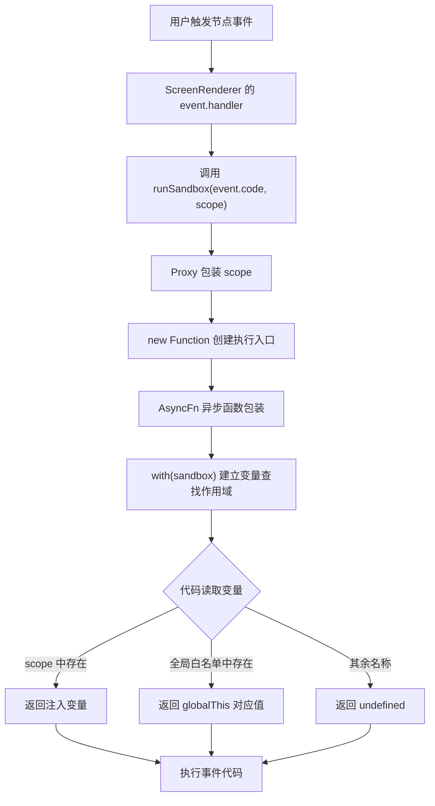

# 2026-08-02 代码整理

> 今日课程内容按节次分别记录。后续章节继续使用与第 37 节同级的二级标题。

## 37「实现沙箱代码」

### 37.1 本节目标

第 33～36 节已经完成事件代码的配置、运行、跨组件分发和编辑体验优化。此前事件函数使用 `new Function()` 直接执行：

```ts
const fn = new Function('$context', '$node', '$payload', event.code)
fn(context, node, payload)
```

这种方式虽然能向代码注入三个参数，但用户代码仍在页面的全局 JavaScript 环境中执行，可以直接访问大量浏览器全局对象。

第 37 节增加一个轻量沙箱执行器，目标是：

1. 把事件代码的执行逻辑从渲染组件中抽离。
2. 使用独立作用域注入 `$context`、`$node` 和 `$payload`。
3. 只允许直接访问少量白名单全局对象。
4. 屏蔽未注入、未加入白名单的全局变量名称。
5. 使用异步函数包装事件代码，使函数体可以使用 `await`。

需要注意：当前实现是基于 `Proxy + with + new Function` 的轻量作用域隔离，不是浏览器安全意义上的强沙箱，不能用于执行完全不可信的恶意代码。

### 37.2 本节涉及的两个文件

| 文件 | 类型 | 本节职责 |
| --- | --- | --- |
| `src/runtime/sandbox.ts` | 新增 | 创建受控作用域并执行事件代码 |
| `src/components/ScreenRenderer/index.vue` | 修改 | 使用 `runSandbox()` 替代原来的直接 `new Function()` 调用 |

职责边界如下：

```text
ScreenRenderer
  -> 决定什么时候执行事件
  -> 准备 context、node、payload

sandbox.ts
  -> 决定代码可以直接访问哪些变量
  -> 创建函数并执行代码
```

沙箱逻辑放在 `src/runtime` 而不是 Vue 组件内部，说明它属于运行时基础能力，不依赖模板、组件状态或界面结构。

### 37.3 整体执行流程



### 37.4 全局白名单 `globalKeys`

文件：`src/runtime/sandbox.ts`

```ts
const globalKeys = new Set([
  'console',
  'Promise',
  'setTimeout',
  'clearTimeout',
  'setInterval',
  'clearInterval',
])
```

白名单规定事件代码能够通过变量名称直接读取哪些全局对象。

| 名称 | 用途 |
| --- | --- |
| `console` | 输出日志和调试信息 |
| `Promise` | 创建或组合异步任务 |
| `setTimeout` | 延迟执行一次任务 |
| `clearTimeout` | 取消延时任务 |
| `setInterval` | 周期性执行任务 |
| `clearInterval` | 取消周期任务 |

使用 `Set` 而不是数组，是因为这里的核心操作是判断某个名称是否在白名单中：

```ts
globalKeys.has(key)
```

`Set` 能直接表达“唯一值集合”的业务含义。

### 37.5 默认不开放的全局名称

没有进入白名单的名称不会通过 Proxy 的 `get` 分支返回，例如：

```text
window
document
localStorage
sessionStorage
fetch
XMLHttpRequest
WebSocket
eval
Function
globalThis
```

因此在正常的变量名称查找路径中，下面的代码无法直接取得浏览器对象：

```ts
console.log(window)
console.log(document)
```

它们会被 `with` 作用域中的 Proxy 截获，而 Proxy 对非白名单名称返回 `undefined`。

这种设计属于“默认拒绝”：只有明确加入 `globalKeys` 或显式放入 `scope` 的变量才会被返回。

### 37.6 `runSandbox()` 的输入

```ts
export function runSandbox(
  code: string,
  scope: Record<string, any>,
) {
  // ...
}
```

两个参数分别承担不同职责：

| 参数 | 含义 |
| --- | --- |
| `code` | 用户在事件配置面板中编写的函数体字符串 |
| `scope` | 本次执行允许访问的业务变量集合 |

调用示例：

```ts
runSandbox(event.code, {
  $context: context,
  $node: node,
  $payload: payload,
})
```

`scope` 每次事件触发时重新创建，因此 `$node` 和 `$payload` 都对应本次事件，而不是固定的全局状态。

### 37.7 使用 Proxy 包装作用域

```ts
const sandbox = new Proxy(scope, {
  has() {
    return true
  },
  get(target, key) {
    // ...
  },
})
```

Proxy 在这里不负责 Vue 响应式，而是拦截 JavaScript 对作用域变量的查找。

```text
事件代码读取某个名称
  -> with 环境询问 Proxy：这个名称是否存在？
  -> has() 返回 true
  -> 继续通过 get() 决定返回什么
```

Proxy 包装的是传入的 `scope` 原对象，所以 `$context`、`$node` 和 `$payload` 仍然是调用方提供的真实对象。

### 37.8 `has()` 为什么始终返回 `true`

```ts
has() {
  return true
}
```

`with` 在解析标识符时会先触发 Proxy 的 `has` 拦截器。

如果返回 `false`，JavaScript 会继续向外层作用域查找该变量，最终可能访问浏览器全局对象：

```text
with sandbox 中没有 window
  -> 继续查找外层作用域
  -> 找到浏览器 window
```

现在对所有名称都返回 `true`：

```text
读取 window
  -> Proxy 声明自己拥有 window
  -> 不再向外查找
  -> get() 决定返回 undefined
```

因此 `has() => true` 是阻断普通标识符向全局作用域继续查找的关键。

### 37.9 处理 `Symbol.unscopables`

```ts
if (key === Symbol.unscopables) return
```

`Symbol.unscopables` 是 JavaScript 为 `with` 语句提供的特殊协议，可以声明某些对象属性不应该进入 `with` 的变量作用域。

当运行环境查询这个 Symbol 时，当前代码直接返回 `undefined`，表示没有额外的排除列表，也避免把 Symbol 当作普通字符串键继续处理。

### 37.10 优先读取注入变量

```ts
if (Object.hasOwn(target, key)) {
  return target[key as string]
}
```

查找顺序的第一优先级是 `scope` 自身属性。

本节传入：

```ts
{
  $context: context,
  $node: node,
  $payload: payload,
}
```

因此事件代码可以直接使用：

```ts
$context.setProp($node.id, 'content', $payload.text)
```

`Object.hasOwn()` 只检查对象自身属性，不读取原型链上的同名属性。与 `key in target` 相比，它可以避免把 `toString`、`constructor` 等继承属性误认为显式注入变量。

### 37.11 再读取全局白名单

```ts
if (globalKeys.has(key as string)) {
  const value = globalThis[key]
  return typeof value === 'function'
    ? value.bind(globalThis)
    : value
}
```

如果变量不在 `scope` 中，沙箱再检查全局白名单。

例如事件代码执行：

```ts
setTimeout(() => {
  console.log('执行完成')
}, 1000)
```

查找过程为：

```text
读取 setTimeout
  -> scope 没有该属性
  -> globalKeys 包含 setTimeout
  -> 从 globalThis 读取真实函数
  -> 返回绑定 globalThis 后的函数
```

对函数调用 `bind(globalThis)` 可以保留全局函数原本的调用上下文，降低某些宿主 API 脱离全局对象调用时出现上下文错误的风险。

### 37.12 非白名单变量返回 `undefined`

`get()` 没有为其他名称提供返回值：

```ts
get(target, key) {
  // scope 和白名单都未命中
  // 隐式 return undefined
}
```

结合始终返回 `true` 的 `has()`：

```text
Proxy 声明名称存在
  -> 阻止向外查找
  -> get 没有返回对应对象
  -> 变量值为 undefined
```

这形成当前轻量沙箱的主要限制机制。

### 37.13 使用 `new Function()` 创建执行入口

```ts
const fn = new Function(
  'sandbox',
  `
  const AsyncFn = async () => {
    with(sandbox) {
      ${code}
    }
  }
  AsyncFn()
  `,
)
```

`new Function()` 只接收一个显式参数：

```ts
sandbox
```

与旧实现的差异是：

```text
旧实现
  -> 将 context、node、payload 分别声明为函数参数

新实现
  -> 只传入一个 Proxy
  -> 由 with 把 Proxy 属性变成可直接访问的变量
```

因此以后增加注入能力时，只需要扩展 `scope`：

```ts
runSandbox(code, {
  $context: context,
  $node: node,
  $payload: payload,
  $utils: utils,
})
```

不必同步修改动态函数的参数列表。

### 37.14 `with(sandbox)` 的作用

```ts
with (sandbox) {
  // 用户代码
}
```

`with` 会把对象属性临时加入当前代码块的标识符查找链。

概念上：

```ts
sandbox.$context
sandbox.$node
sandbox.$payload
```

在 `with` 代码块中可以写成：

```ts
$context
$node
$payload
```

这保持了事件面板中已有的函数编辑体验，用户无需改写第 33～36 节已经保存的事件代码。

`with` 不能在严格模式中使用，因此该动态函数依赖 `new Function()` 默认创建的非严格模式环境。它适合当前实验性作用域实现，但不适合作为普通业务代码的通用写法。

### 37.15 使用异步函数包装代码

```ts
const AsyncFn = async () => {
  with (sandbox) {
    ${code}
  }
}

AsyncFn()
```

事件代码被放进 `async` 函数后，可以直接使用 `await`：

```ts
const result = await Promise.resolve($payload)
console.log(result)
```

异步包装为后续开放请求能力、等待组件方法或串联异步事件提供了基础。

不过当前没有 `return AsyncFn()`，`runSandbox()` 也没有返回 Promise。因此调用方暂时不能等待事件完成，也不能取得事件代码的返回值。

### 37.16 执行动态函数

```ts
fn(sandbox)
```

这里把 Proxy 实例作为唯一参数传入动态函数。

完整链路为：

```text
runSandbox(code, scope)
  -> new Proxy(scope)
  -> new Function('sandbox', body)
  -> fn(sandbox)
  -> 创建 AsyncFn
  -> AsyncFn()
  -> with(sandbox)
  -> 执行 code
```

每次调用 `runSandbox()` 都会创建新的 Proxy、动态函数和异步函数。

### 37.17 `ScreenRenderer` 接入沙箱

文件：`src/components/ScreenRenderer/index.vue`

首先导入：

```ts
import { runSandbox } from '@/runtime/sandbox.ts'
```

事件处理器由原来的：

```ts
const fn = new Function(
  '$context',
  '$node',
  '$payload',
  event.code,
)

fn(context, node, payload)
```

改为：

```ts
runSandbox(event.code, {
  $context: context,
  $node: node,
  $payload: payload,
})
```

渲染器不再关心 Proxy、白名单、`with` 和异步包装，只负责传递本次事件所需的运行时对象。

### 37.18 三个注入变量

| 变量 | 实际值 | 事件代码中的作用 |
| --- | --- | --- |
| `$context` | `createRuntimeContext()` 返回的运行时上下文 | 查找节点、修改属性、触发组件方法、分发事件 |
| `$node` | 当前事件所属的 `MaterialSchema` | 读取当前节点 ID、属性、样式和事件配置 |
| `$payload` | 原生事件对象或 `dispatch()` 传入的数据 | 读取本次事件参数 |

这与之前 Monaco Editor 展示的函数外壳保持一致：

```ts
function eventName($context, $node, $payload) {
  // 用户代码
}
```

虽然底层不再使用三个动态函数参数，但用户看到的编程模型没有变化。

### 37.19 原生事件与跨组件事件都经过沙箱

`event.handler` 同时被两种入口复用。

#### 原生事件

```text
用户点击节点
  -> Vue v-on 调用 event.handler(MouseEvent)
  -> runSandbox
  -> $payload = MouseEvent
```

#### 跨组件分发

```text
节点 A 调用 $context.dispatch(B, name, payload)
  -> RuntimeContext 找到节点 B 的 event.handler
  -> event.handler(payload)
  -> runSandbox
  -> $payload = 业务数据
```

因此接入点放在统一的 `event.handler` 内部，可以保证两条触发路径都使用相同的沙箱规则。

### 37.20 Handler 缓存仍然保留

第 35 节加入的缓存逻辑没有改变：

```ts
if (event.handler) {
  listeners[event.type] = event.handler
  return
}
```

第一次创建 handler 时，闭包内部使用 `runSandbox()`；后续重新渲染直接复用这个 handler。

需要区分两层函数：

```text
外层 event.handler
  -> 被缓存在 MaterialEvent 上

内层动态执行函数
  -> 当前每次触发事件时由 runSandbox 重新创建
```

所以当前缓存减少的是 Vue 事件监听函数的重复创建，并没有缓存 `new Function()` 编译结果。

### 37.21 一个完整示例

事件配置：

```ts
{
  title: '延迟更新内容',
  name: 'updateLater',
  type: 'click',
  code: `
    await new Promise((resolve) => {
      setTimeout(resolve, 500)
    })

    console.log('准备更新节点')

    $context.setProp(
      $node.id,
      'content',
      $payload.text,
    )
  `,
}
```

执行时变量来源：

```text
Promise     -> globalKeys 白名单
setTimeout  -> globalKeys 白名单
console     -> globalKeys 白名单
$context    -> scope 注入
$node       -> scope 注入
$payload    -> scope 注入
```

如果代码直接使用未开放的 `document`，正常名称查找会得到 `undefined`。

### 37.22 当前沙箱能限制什么

当前实现可以限制普通代码通过变量名称直接访问全局对象：

```text
直接读取 window        -> 不在 scope 和白名单中
直接读取 document      -> 不在 scope 和白名单中
直接读取 localStorage  -> 不在 scope 和白名单中
直接读取 fetch         -> 不在 scope 和白名单中
```

它还带来以下工程收益：

1. 运行时注入集中在 `scope` 中，后续扩展更清晰。
2. 全局能力集中在 `globalKeys` 中，代码审查时容易看到开放范围。
3. 事件执行细节从 Vue 渲染器中分离，组件职责更单一。
4. 已有 `$context`、`$node`、`$payload` 事件代码无需迁移。
5. 异步函数包装允许事件代码使用 `await`。

### 37.23 当前沙箱不能保证什么

当前实现不能作为执行恶意代码的安全边界，主要原因包括：

#### `this` 可能绕过名称拦截

动态函数默认不是严格模式，`AsyncFn` 又是箭头函数，会继承外层动态函数的 `this`。因此用户代码可能通过 `this` 接触真实全局对象，而 `this` 不属于普通标识符查找，不会被 Proxy 的 `has/get` 拦截。

#### 构造器链可能逃逸

沙箱注入了真实对象，例如 `$node`、`$context` 和 `$payload`。JavaScript 对象可以沿 `constructor.constructor` 获得函数构造能力，进而尝试取得全局对象。

#### 注入对象本身拥有真实权限

`$context` 可以修改页面节点并触发组件方法。这是事件系统需要的能力，但也意味着事件代码并非纯计算环境。

#### 定时器任务不会自动回收

沙箱允许 `setTimeout` 和 `setInterval`。如果事件代码创建周期任务却不清理，组件卸载后任务仍可能继续运行。

#### 不具备资源限制

当前没有执行超时、CPU 限制、内存限制或无限循环中断能力。同步死循环仍会阻塞页面主线程。

因此更准确的定位是：

```text
当前实现 = 受控变量作用域 / 轻量代码运行器
当前实现 != 可靠的不可信代码安全沙箱
```

### 37.24 异步错误和返回值问题

当前动态函数中执行：

```ts
AsyncFn()
```

但没有：

```ts
return AsyncFn()
```

外层也只是：

```ts
fn(sandbox)
```

这会导致：

1. `runSandbox()` 返回 `undefined`。
2. 调用方无法 `await` 事件完成。
3. 事件代码的返回值无法传回调用方。
4. 异步异常可能成为未处理的 Promise rejection。

后续可以改为：

```ts
export async function runSandbox(
  code: string,
  scope: Record<string, unknown>,
) {
  // 动态函数内部 return AsyncFn()
  return await fn(sandbox)
}
```

并由事件处理器统一捕获错误和展示日志。

### 37.25 当前实现的其他注意事项

1. `runSandbox()` 的 `scope` 使用 `Record<string, any>`，注入变量缺少明确类型契约。
2. `globalThis[key]` 的 key 类型较宽，当前项目关闭严格模式后可以通过检查，但类型仍可收紧。
3. 每次事件触发都会重新执行 `new Function()`，高频事件可能产生额外解析开销。
4. `event.code` 存在语法错误时，会在事件触发阶段抛错，目前没有统一错误提示。
5. 白名单中的函数统一绑定 `globalThis`，实现简单，但不同全局值是否需要绑定可以分别处理。
6. `Promise` 也会进入“函数则 bind”的分支，虽然绑定后的构造器通常仍可使用，但语义并不直观。
7. `with` 无法在严格模式和 ES Module 代码中直接使用，当前依赖动态函数创建非严格环境。
8. 没有 `set` 拦截器，事件代码对作用域变量的赋值会落到 Proxy 目标对象上。
9. `$node` 是真实节点对象，修改其嵌套字段可能直接改变运行时页面状态。
10. 白名单开放定时器后，应考虑组件卸载时统一清理。
11. 缓存在 Schema 上的 `event.handler` 仍存在第 35 节记录的旧闭包和缓存失效风险。
12. `ScreenRenderer` 中旧的 `new Function()` 代码被注释保留，逻辑稳定后可以删除，避免出现两个实现来源。
13. `creatEvents` 仍有拼写问题，建议后续改为 `createEvents`。
14. 沙箱没有单元测试，变量拦截、白名单、异步代码和错误传播容易在重构时回归。

### 37.26 更强隔离方案

如果未来需要运行来源不可信的代码，不能只继续扩展当前 Proxy。可以根据需求选择：

| 方案 | 隔离程度 | 适合场景 |
| --- | --- | --- |
| 当前 `Proxy + with` | 低 | 内部可信配置人员编写的事件脚本 |
| 独立 Web Worker | 中 | 纯计算任务、需要避免阻塞主线程 |
| sandboxed iframe | 中到高 | 需要独立浏览上下文和消息通信 |
| 服务端隔离进程/容器 | 高 | 多租户或真正不可信代码执行 |
| 受限 DSL/表达式解释器 | 可控 | 只需要条件、取值、赋值和少量业务动作 |

对于大屏事件配置，长期更稳妥的方向通常是受限 DSL 或动作编排：用户选择“修改属性”“刷新数据源”“触发事件”等动作，系统生成结构化配置，而不是开放任意 JavaScript。

### 37.27 建议补充的测试

#### 作用域注入

```text
能够读取 $context、$node、$payload
不能把未注入名称错误解析为外层变量
```

#### 白名单

```text
能够使用 console、Promise 和定时器
直接访问 document、window、fetch 时得不到对应全局值
```

#### 异步代码

```text
事件代码可以使用 await
异步异常能够被调用方捕获
返回值能够按预期传递
```

#### 生命周期

```text
多次执行使用独立 scope
不同节点不会读取彼此 payload
组件卸载后定时任务可以被清理
```

#### 安全边界

```text
验证 this 是否能够取得 globalThis
验证 constructor.constructor 逃逸路径
把已知限制固定为测试或明确文档
```

安全相关代码不能只测试“正常用法”，还需要验证绕过路径。

### 37.28 类型检查结果

使用工作区自带的 Node.js 与 pnpm 执行：

```bash
pnpm type-check
```

检查仍未完全通过，共有 3 个错误，全部来自已有文件：

```text
src/editor/toolbar/components/DataSourceManager.vue
```

错误仍是 JSON 编辑字符串与 `DataSourceSchema` 对象字段类型不一致，与前几节记录的历史问题相同。

本节涉及的 `src/runtime/sandbox.ts` 和 `src/components/ScreenRenderer/index.vue` 没有新增 TypeScript 错误。

### 37.29 值得记住的实现思路

#### 权限应默认拒绝、按需开放

全局能力集中在 `globalKeys`，只有明确加入白名单的名称才能通过正常查找路径读取。新增能力时应该逐项评估，而不是直接开放整个 `window`。

#### 运行时能力通过 scope 注入

业务代码依赖 `$context`、`$node`、`$payload`，由调用方显式提供。注入对象就是事件代码的能力边界和 API 契约。

#### `has() => true` 用于阻断作用域外查找

只在 `get()` 中返回 `undefined` 不够；必须先让 Proxy 声明自己拥有所有名称，才能阻止 `with` 继续向全局作用域查找。

#### 执行机制应与渲染组件分离

`ScreenRenderer` 只负责事件绑定和参数准备，代码执行规则集中在 `sandbox.ts`。以后调整白名单或更换隔离方案时，不需要继续扩张渲染组件。

#### 变量隔离不等于安全隔离

Proxy 可以影响普通变量名称查找，但无法自动解决 `this`、构造器逃逸、主线程阻塞、资源限制和宿主对象权限问题。安全等级必须根据真实边界判断。

### 37.30 最终逻辑总结

```text
页面渲染
  -> ScreenRenderer 为节点创建 event.handler

事件触发
  -> handler 接收原生事件或业务 payload
  -> 调用 runSandbox(event.code, scope)

准备 scope
  -> $context = 当前运行时上下文
  -> $node = 当前事件所属节点
  -> $payload = 本次事件参数

创建沙箱
  -> Proxy 包装 scope
  -> has 对所有名称返回 true
  -> 阻止普通标识符继续向全局查找

变量读取
  -> scope 自身属性优先
  -> 其次读取 globalKeys 白名单
  -> 其他名称返回 undefined

执行代码
  -> new Function 创建动态入口
  -> AsyncFn 提供 await 环境
  -> with(sandbox) 提供直接变量访问
  -> fn(sandbox) 启动事件函数

运行结果
  -> 事件代码继续使用 $context、$node、$payload
  -> 原生事件和跨组件 dispatch 使用同一套执行规则
```

本节的核心，是把事件代码从“直接在动态函数中执行”升级为“在受控变量作用域中执行”，并将执行机制抽离成独立运行时模块。它改善了能力管理和代码结构，但当前仍是轻量隔离方案，不应当被当作恶意代码安全沙箱。

<!-- 后续内容继续使用同级标题：## 38「...」 -->
