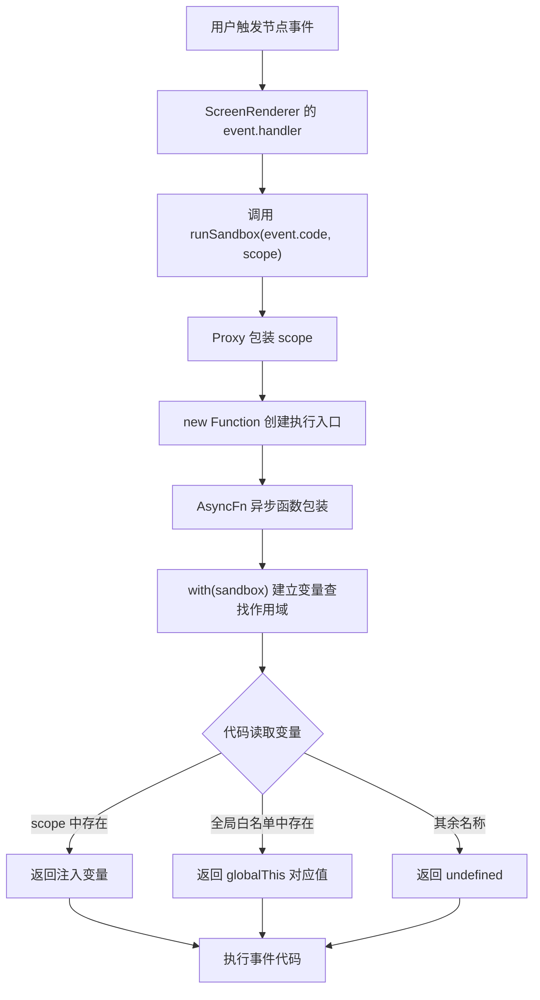
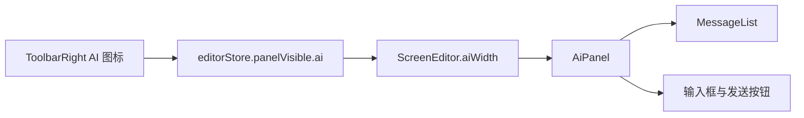
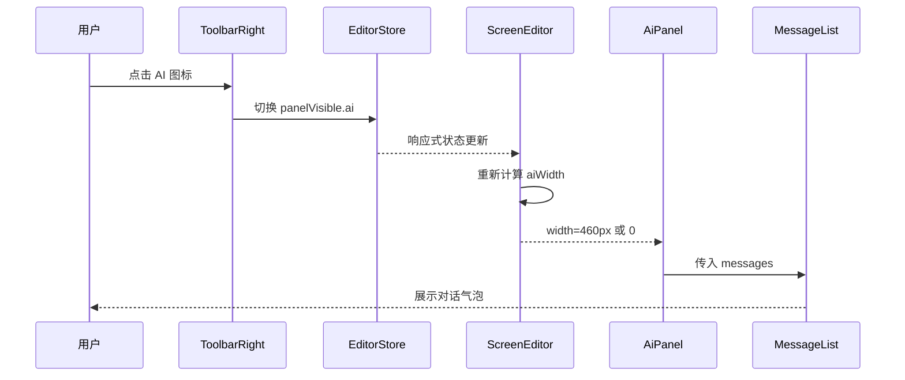
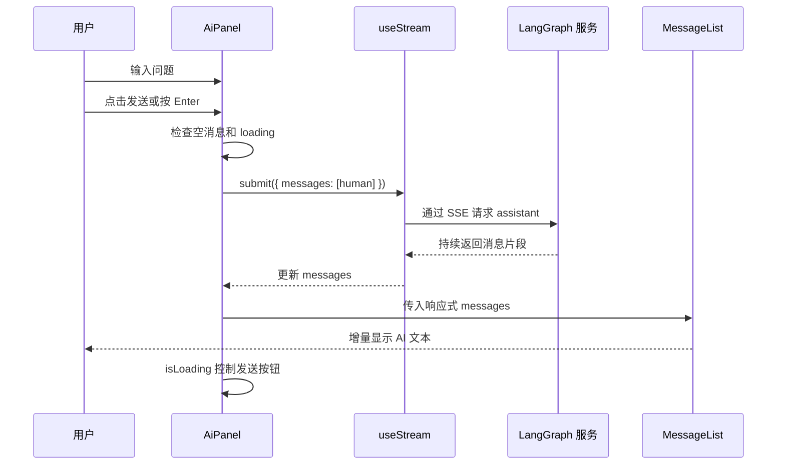

# 2026-08-02 代码整理

> 今日课程内容按节次分别记录。后续章节继续使用与第 37 节同级的二级标题。

## 37「实现沙箱代码」

### 37.1 本节目标

第 33～36 节已经完成事件代码的配置、运行、跨组件分发和编辑体验优化。此前事件函数使用 `new Function()` 直接执行：

```ts
const fn = new Function('$context', '$node', '$payload', event.code)
fn(context, node, payload)
```

这种方式虽然能向代码注入三个参数，但用户代码仍在页面的全局 JavaScript 环境中执行，可以直接访问大量浏览器全局对象。

第 37 节增加一个轻量沙箱执行器，目标是：

1. 把事件代码的执行逻辑从渲染组件中抽离。
2. 使用独立作用域注入 `$context`、`$node` 和 `$payload`。
3. 只允许直接访问少量白名单全局对象。
4. 屏蔽未注入、未加入白名单的全局变量名称。
5. 使用异步函数包装事件代码，使函数体可以使用 `await`。

需要注意：当前实现是基于 `Proxy + with + new Function` 的轻量作用域隔离，不是浏览器安全意义上的强沙箱，不能用于执行完全不可信的恶意代码。

### 37.2 本节涉及的两个文件

| 文件 | 类型 | 本节职责 |
| --- | --- | --- |
| `src/runtime/sandbox.ts` | 新增 | 创建受控作用域并执行事件代码 |
| `src/components/ScreenRenderer/index.vue` | 修改 | 使用 `runSandbox()` 替代原来的直接 `new Function()` 调用 |

职责边界如下：

```text
ScreenRenderer
  -> 决定什么时候执行事件
  -> 准备 context、node、payload

sandbox.ts
  -> 决定代码可以直接访问哪些变量
  -> 创建函数并执行代码
```

沙箱逻辑放在 `src/runtime` 而不是 Vue 组件内部，说明它属于运行时基础能力，不依赖模板、组件状态或界面结构。

### 37.3 整体执行流程


```mermaid
flowchart TD
  A["用户触发节点事件"] --> B["ScreenRenderer 的 event.handler"]
  B --> C["调用 runSandbox(event.code, scope)"]
  C --> D["Proxy 包装 scope"]
  D --> E["new Function 创建执行入口"]
  E --> F["AsyncFn 异步函数包装"]
  F --> G["with(sandbox) 建立变量查找作用域"]
  G --> H{"代码读取变量"}
  H -->|"scope 中存在"| I["返回注入变量"]
  H -->|"全局白名单中存在"| J["返回 globalThis 对应值"]
  H -->|"其余名称"| K["返回 undefined"]
  I --> L["执行事件代码"]
  J --> L
  K --> L
```

### 37.4 全局白名单 `globalKeys`

文件：`src/runtime/sandbox.ts`

```ts
const globalKeys = new Set([
  'console',
  'Promise',
  'setTimeout',
  'clearTimeout',
  'setInterval',
  'clearInterval',
])
```

白名单规定事件代码能够通过变量名称直接读取哪些全局对象。

| 名称 | 用途 |
| --- | --- |
| `console` | 输出日志和调试信息 |
| `Promise` | 创建或组合异步任务 |
| `setTimeout` | 延迟执行一次任务 |
| `clearTimeout` | 取消延时任务 |
| `setInterval` | 周期性执行任务 |
| `clearInterval` | 取消周期任务 |

使用 `Set` 而不是数组，是因为这里的核心操作是判断某个名称是否在白名单中：

```ts
globalKeys.has(key)
```

`Set` 能直接表达“唯一值集合”的业务含义。

### 37.5 默认不开放的全局名称

没有进入白名单的名称不会通过 Proxy 的 `get` 分支返回，例如：

```text
window
document
localStorage
sessionStorage
fetch
XMLHttpRequest
WebSocket
eval
Function
globalThis
```

因此在正常的变量名称查找路径中，下面的代码无法直接取得浏览器对象：

```ts
console.log(window)
console.log(document)
```

它们会被 `with` 作用域中的 Proxy 截获，而 Proxy 对非白名单名称返回 `undefined`。

这种设计属于“默认拒绝”：只有明确加入 `globalKeys` 或显式放入 `scope` 的变量才会被返回。

### 37.6 `runSandbox()` 的输入

```ts
export function runSandbox(
  code: string,
  scope: Record<string, any>,
) {
  // ...
}
```

两个参数分别承担不同职责：

| 参数 | 含义 |
| --- | --- |
| `code` | 用户在事件配置面板中编写的函数体字符串 |
| `scope` | 本次执行允许访问的业务变量集合 |

调用示例：

```ts
runSandbox(event.code, {
  $context: context,
  $node: node,
  $payload: payload,
})
```

`scope` 每次事件触发时重新创建，因此 `$node` 和 `$payload` 都对应本次事件，而不是固定的全局状态。

### 37.7 使用 Proxy 包装作用域

```ts
const sandbox = new Proxy(scope, {
  has() {
    return true
  },
  get(target, key) {
    // ...
  },
})
```

Proxy 在这里不负责 Vue 响应式，而是拦截 JavaScript 对作用域变量的查找。

```text
事件代码读取某个名称
  -> with 环境询问 Proxy：这个名称是否存在？
  -> has() 返回 true
  -> 继续通过 get() 决定返回什么
```

Proxy 包装的是传入的 `scope` 原对象，所以 `$context`、`$node` 和 `$payload` 仍然是调用方提供的真实对象。

### 37.8 `has()` 为什么始终返回 `true`

```ts
has() {
  return true
}
```

`with` 在解析标识符时会先触发 Proxy 的 `has` 拦截器。

如果返回 `false`，JavaScript 会继续向外层作用域查找该变量，最终可能访问浏览器全局对象：

```text
with sandbox 中没有 window
  -> 继续查找外层作用域
  -> 找到浏览器 window
```

现在对所有名称都返回 `true`：

```text
读取 window
  -> Proxy 声明自己拥有 window
  -> 不再向外查找
  -> get() 决定返回 undefined
```

因此 `has() => true` 是阻断普通标识符向全局作用域继续查找的关键。

### 37.9 处理 `Symbol.unscopables`

```ts
if (key === Symbol.unscopables) return
```

`Symbol.unscopables` 是 JavaScript 为 `with` 语句提供的特殊协议，可以声明某些对象属性不应该进入 `with` 的变量作用域。

当运行环境查询这个 Symbol 时，当前代码直接返回 `undefined`，表示没有额外的排除列表，也避免把 Symbol 当作普通字符串键继续处理。

### 37.10 优先读取注入变量

```ts
if (Object.hasOwn(target, key)) {
  return target[key as string]
}
```

查找顺序的第一优先级是 `scope` 自身属性。

本节传入：

```ts
{
  $context: context,
  $node: node,
  $payload: payload,
}
```

因此事件代码可以直接使用：

```ts
$context.setProp($node.id, 'content', $payload.text)
```

`Object.hasOwn()` 只检查对象自身属性，不读取原型链上的同名属性。与 `key in target` 相比，它可以避免把 `toString`、`constructor` 等继承属性误认为显式注入变量。

### 37.11 再读取全局白名单

```ts
if (globalKeys.has(key as string)) {
  const value = globalThis[key]
  return typeof value === 'function'
    ? value.bind(globalThis)
    : value
}
```

如果变量不在 `scope` 中，沙箱再检查全局白名单。

例如事件代码执行：

```ts
setTimeout(() => {
  console.log('执行完成')
}, 1000)
```

查找过程为：

```text
读取 setTimeout
  -> scope 没有该属性
  -> globalKeys 包含 setTimeout
  -> 从 globalThis 读取真实函数
  -> 返回绑定 globalThis 后的函数
```

对函数调用 `bind(globalThis)` 可以保留全局函数原本的调用上下文，降低某些宿主 API 脱离全局对象调用时出现上下文错误的风险。

### 37.12 非白名单变量返回 `undefined`

`get()` 没有为其他名称提供返回值：

```ts
get(target, key) {
  // scope 和白名单都未命中
  // 隐式 return undefined
}
```

结合始终返回 `true` 的 `has()`：

```text
Proxy 声明名称存在
  -> 阻止向外查找
  -> get 没有返回对应对象
  -> 变量值为 undefined
```

这形成当前轻量沙箱的主要限制机制。

### 37.13 使用 `new Function()` 创建执行入口

```ts
const fn = new Function(
  'sandbox',
  `
  const AsyncFn = async () => {
    with(sandbox) {
      ${code}
    }
  }
  AsyncFn()
  `,
)
```

`new Function()` 只接收一个显式参数：

```ts
sandbox
```

与旧实现的差异是：

```text
旧实现
  -> 将 context、node、payload 分别声明为函数参数

新实现
  -> 只传入一个 Proxy
  -> 由 with 把 Proxy 属性变成可直接访问的变量
```

因此以后增加注入能力时，只需要扩展 `scope`：

```ts
runSandbox(code, {
  $context: context,
  $node: node,
  $payload: payload,
  $utils: utils,
})
```

不必同步修改动态函数的参数列表。

### 37.14 `with(sandbox)` 的作用

```ts
with (sandbox) {
  // 用户代码
}
```

`with` 会把对象属性临时加入当前代码块的标识符查找链。

概念上：

```ts
sandbox.$context
sandbox.$node
sandbox.$payload
```

在 `with` 代码块中可以写成：

```ts
$context
$node
$payload
```

这保持了事件面板中已有的函数编辑体验，用户无需改写第 33～36 节已经保存的事件代码。

`with` 不能在严格模式中使用，因此该动态函数依赖 `new Function()` 默认创建的非严格模式环境。它适合当前实验性作用域实现，但不适合作为普通业务代码的通用写法。

### 37.15 使用异步函数包装代码

```ts
const AsyncFn = async () => {
  with (sandbox) {
    ${code}
  }
}

AsyncFn()
```

事件代码被放进 `async` 函数后，可以直接使用 `await`：

```ts
const result = await Promise.resolve($payload)
console.log(result)
```

异步包装为后续开放请求能力、等待组件方法或串联异步事件提供了基础。

不过当前没有 `return AsyncFn()`，`runSandbox()` 也没有返回 Promise。因此调用方暂时不能等待事件完成，也不能取得事件代码的返回值。

### 37.16 执行动态函数

```ts
fn(sandbox)
```

这里把 Proxy 实例作为唯一参数传入动态函数。

完整链路为：

```text
runSandbox(code, scope)
  -> new Proxy(scope)
  -> new Function('sandbox', body)
  -> fn(sandbox)
  -> 创建 AsyncFn
  -> AsyncFn()
  -> with(sandbox)
  -> 执行 code
```

每次调用 `runSandbox()` 都会创建新的 Proxy、动态函数和异步函数。

### 37.17 `ScreenRenderer` 接入沙箱

文件：`src/components/ScreenRenderer/index.vue`

首先导入：

```ts
import { runSandbox } from '@/runtime/sandbox.ts'
```

事件处理器由原来的：

```ts
const fn = new Function(
  '$context',
  '$node',
  '$payload',
  event.code,
)

fn(context, node, payload)
```

改为：

```ts
runSandbox(event.code, {
  $context: context,
  $node: node,
  $payload: payload,
})
```

渲染器不再关心 Proxy、白名单、`with` 和异步包装，只负责传递本次事件所需的运行时对象。

### 37.18 三个注入变量

| 变量 | 实际值 | 事件代码中的作用 |
| --- | --- | --- |
| `$context` | `createRuntimeContext()` 返回的运行时上下文 | 查找节点、修改属性、触发组件方法、分发事件 |
| `$node` | 当前事件所属的 `MaterialSchema` | 读取当前节点 ID、属性、样式和事件配置 |
| `$payload` | 原生事件对象或 `dispatch()` 传入的数据 | 读取本次事件参数 |

这与之前 Monaco Editor 展示的函数外壳保持一致：

```ts
function eventName($context, $node, $payload) {
  // 用户代码
}
```

虽然底层不再使用三个动态函数参数，但用户看到的编程模型没有变化。

### 37.19 原生事件与跨组件事件都经过沙箱

`event.handler` 同时被两种入口复用。

#### 原生事件

```text
用户点击节点
  -> Vue v-on 调用 event.handler(MouseEvent)
  -> runSandbox
  -> $payload = MouseEvent
```

#### 跨组件分发

```text
节点 A 调用 $context.dispatch(B, name, payload)
  -> RuntimeContext 找到节点 B 的 event.handler
  -> event.handler(payload)
  -> runSandbox
  -> $payload = 业务数据
```

因此接入点放在统一的 `event.handler` 内部，可以保证两条触发路径都使用相同的沙箱规则。

### 37.20 Handler 缓存仍然保留

第 35 节加入的缓存逻辑没有改变：

```ts
if (event.handler) {
  listeners[event.type] = event.handler
  return
}
```

第一次创建 handler 时，闭包内部使用 `runSandbox()`；后续重新渲染直接复用这个 handler。

需要区分两层函数：

```text
外层 event.handler
  -> 被缓存在 MaterialEvent 上

内层动态执行函数
  -> 当前每次触发事件时由 runSandbox 重新创建
```

所以当前缓存减少的是 Vue 事件监听函数的重复创建，并没有缓存 `new Function()` 编译结果。

### 37.21 一个完整示例

事件配置：

```ts
{
  title: '延迟更新内容',
  name: 'updateLater',
  type: 'click',
  code: `
    await new Promise((resolve) => {
      setTimeout(resolve, 500)
    })

    console.log('准备更新节点')

    $context.setProp(
      $node.id,
      'content',
      $payload.text,
    )
  `,
}
```

执行时变量来源：

```text
Promise     -> globalKeys 白名单
setTimeout  -> globalKeys 白名单
console     -> globalKeys 白名单
$context    -> scope 注入
$node       -> scope 注入
$payload    -> scope 注入
```

如果代码直接使用未开放的 `document`，正常名称查找会得到 `undefined`。

### 37.22 当前沙箱能限制什么

当前实现可以限制普通代码通过变量名称直接访问全局对象：

```text
直接读取 window        -> 不在 scope 和白名单中
直接读取 document      -> 不在 scope 和白名单中
直接读取 localStorage  -> 不在 scope 和白名单中
直接读取 fetch         -> 不在 scope 和白名单中
```

它还带来以下工程收益：

1. 运行时注入集中在 `scope` 中，后续扩展更清晰。
2. 全局能力集中在 `globalKeys` 中，代码审查时容易看到开放范围。
3. 事件执行细节从 Vue 渲染器中分离，组件职责更单一。
4. 已有 `$context`、`$node`、`$payload` 事件代码无需迁移。
5. 异步函数包装允许事件代码使用 `await`。

### 37.23 当前沙箱不能保证什么

当前实现不能作为执行恶意代码的安全边界，主要原因包括：

#### `this` 可能绕过名称拦截

动态函数默认不是严格模式，`AsyncFn` 又是箭头函数，会继承外层动态函数的 `this`。因此用户代码可能通过 `this` 接触真实全局对象，而 `this` 不属于普通标识符查找，不会被 Proxy 的 `has/get` 拦截。

#### 构造器链可能逃逸

沙箱注入了真实对象，例如 `$node`、`$context` 和 `$payload`。JavaScript 对象可以沿 `constructor.constructor` 获得函数构造能力，进而尝试取得全局对象。

#### 注入对象本身拥有真实权限

`$context` 可以修改页面节点并触发组件方法。这是事件系统需要的能力，但也意味着事件代码并非纯计算环境。

#### 定时器任务不会自动回收

沙箱允许 `setTimeout` 和 `setInterval`。如果事件代码创建周期任务却不清理，组件卸载后任务仍可能继续运行。

#### 不具备资源限制

当前没有执行超时、CPU 限制、内存限制或无限循环中断能力。同步死循环仍会阻塞页面主线程。

因此更准确的定位是：

```text
当前实现 = 受控变量作用域 / 轻量代码运行器
当前实现 != 可靠的不可信代码安全沙箱
```

### 37.24 异步错误和返回值问题

当前动态函数中执行：

```ts
AsyncFn()
```

但没有：

```ts
return AsyncFn()
```

外层也只是：

```ts
fn(sandbox)
```

这会导致：

1. `runSandbox()` 返回 `undefined`。
2. 调用方无法 `await` 事件完成。
3. 事件代码的返回值无法传回调用方。
4. 异步异常可能成为未处理的 Promise rejection。

后续可以改为：

```ts
export async function runSandbox(
  code: string,
  scope: Record<string, unknown>,
) {
  // 动态函数内部 return AsyncFn()
  return await fn(sandbox)
}
```

并由事件处理器统一捕获错误和展示日志。

### 37.25 当前实现的其他注意事项

1. `runSandbox()` 的 `scope` 使用 `Record<string, any>`，注入变量缺少明确类型契约。
2. `globalThis[key]` 的 key 类型较宽，当前项目关闭严格模式后可以通过检查，但类型仍可收紧。
3. 每次事件触发都会重新执行 `new Function()`，高频事件可能产生额外解析开销。
4. `event.code` 存在语法错误时，会在事件触发阶段抛错，目前没有统一错误提示。
5. 白名单中的函数统一绑定 `globalThis`，实现简单，但不同全局值是否需要绑定可以分别处理。
6. `Promise` 也会进入“函数则 bind”的分支，虽然绑定后的构造器通常仍可使用，但语义并不直观。
7. `with` 无法在严格模式和 ES Module 代码中直接使用，当前依赖动态函数创建非严格环境。
8. 没有 `set` 拦截器，事件代码对作用域变量的赋值会落到 Proxy 目标对象上。
9. `$node` 是真实节点对象，修改其嵌套字段可能直接改变运行时页面状态。
10. 白名单开放定时器后，应考虑组件卸载时统一清理。
11. 缓存在 Schema 上的 `event.handler` 仍存在第 35 节记录的旧闭包和缓存失效风险。
12. `ScreenRenderer` 中旧的 `new Function()` 代码被注释保留，逻辑稳定后可以删除，避免出现两个实现来源。
13. `creatEvents` 仍有拼写问题，建议后续改为 `createEvents`。
14. 沙箱没有单元测试，变量拦截、白名单、异步代码和错误传播容易在重构时回归。

### 37.26 更强隔离方案

如果未来需要运行来源不可信的代码，不能只继续扩展当前 Proxy。可以根据需求选择：

| 方案 | 隔离程度 | 适合场景 |
| --- | --- | --- |
| 当前 `Proxy + with` | 低 | 内部可信配置人员编写的事件脚本 |
| 独立 Web Worker | 中 | 纯计算任务、需要避免阻塞主线程 |
| sandboxed iframe | 中到高 | 需要独立浏览上下文和消息通信 |
| 服务端隔离进程/容器 | 高 | 多租户或真正不可信代码执行 |
| 受限 DSL/表达式解释器 | 可控 | 只需要条件、取值、赋值和少量业务动作 |

对于大屏事件配置，长期更稳妥的方向通常是受限 DSL 或动作编排：用户选择“修改属性”“刷新数据源”“触发事件”等动作，系统生成结构化配置，而不是开放任意 JavaScript。

### 37.27 建议补充的测试

#### 作用域注入

```text
能够读取 $context、$node、$payload
不能把未注入名称错误解析为外层变量
```

#### 白名单

```text
能够使用 console、Promise 和定时器
直接访问 document、window、fetch 时得不到对应全局值
```

#### 异步代码

```text
事件代码可以使用 await
异步异常能够被调用方捕获
返回值能够按预期传递
```

#### 生命周期

```text
多次执行使用独立 scope
不同节点不会读取彼此 payload
组件卸载后定时任务可以被清理
```

#### 安全边界

```text
验证 this 是否能够取得 globalThis
验证 constructor.constructor 逃逸路径
把已知限制固定为测试或明确文档
```

安全相关代码不能只测试“正常用法”，还需要验证绕过路径。

### 37.28 类型检查结果

使用工作区自带的 Node.js 与 pnpm 执行：

```bash
pnpm type-check
```

检查仍未完全通过，共有 3 个错误，全部来自已有文件：

```text
src/editor/toolbar/components/DataSourceManager.vue
```

错误仍是 JSON 编辑字符串与 `DataSourceSchema` 对象字段类型不一致，与前几节记录的历史问题相同。

本节涉及的 `src/runtime/sandbox.ts` 和 `src/components/ScreenRenderer/index.vue` 没有新增 TypeScript 错误。

### 37.29 值得记住的实现思路

#### 权限应默认拒绝、按需开放

全局能力集中在 `globalKeys`，只有明确加入白名单的名称才能通过正常查找路径读取。新增能力时应该逐项评估，而不是直接开放整个 `window`。

#### 运行时能力通过 scope 注入

业务代码依赖 `$context`、`$node`、`$payload`，由调用方显式提供。注入对象就是事件代码的能力边界和 API 契约。

#### `has() => true` 用于阻断作用域外查找

只在 `get()` 中返回 `undefined` 不够；必须先让 Proxy 声明自己拥有所有名称，才能阻止 `with` 继续向全局作用域查找。

#### 执行机制应与渲染组件分离

`ScreenRenderer` 只负责事件绑定和参数准备，代码执行规则集中在 `sandbox.ts`。以后调整白名单或更换隔离方案时，不需要继续扩张渲染组件。

#### 变量隔离不等于安全隔离

Proxy 可以影响普通变量名称查找，但无法自动解决 `this`、构造器逃逸、主线程阻塞、资源限制和宿主对象权限问题。安全等级必须根据真实边界判断。

### 37.30 最终逻辑总结

```text
页面渲染
  -> ScreenRenderer 为节点创建 event.handler

事件触发
  -> handler 接收原生事件或业务 payload
  -> 调用 runSandbox(event.code, scope)

准备 scope
  -> $context = 当前运行时上下文
  -> $node = 当前事件所属节点
  -> $payload = 本次事件参数

创建沙箱
  -> Proxy 包装 scope
  -> has 对所有名称返回 true
  -> 阻止普通标识符继续向全局查找

变量读取
  -> scope 自身属性优先
  -> 其次读取 globalKeys 白名单
  -> 其他名称返回 undefined

执行代码
  -> new Function 创建动态入口
  -> AsyncFn 提供 await 环境
  -> with(sandbox) 提供直接变量访问
  -> fn(sandbox) 启动事件函数

运行结果
  -> 事件代码继续使用 $context、$node、$payload
  -> 原生事件和跨组件 dispatch 使用同一套执行规则
```

本节的核心，是把事件代码从“直接在动态函数中执行”升级为“在受控变量作用域中执行”，并将执行机制抽离成独立运行时模块。它改善了能力管理和代码结构，但当前仍是轻量隔离方案，不应当被当作恶意代码安全沙箱。

## 38「为物料声明可触发事件」

### 38.1 本节目标

第 37 节完成了事件代码的沙箱执行。本节继续完善事件配置面板，让不同物料可以声明自己支持的可触发事件，配置人员在编辑事件类型时能够直接从物料定义中选择。

此前事件类型使用普通输入框，用户需要手写 activeEvent.type。本节改为：

物料 eventOptions -> 注册表查询 -> NodeEvents 选择器

这样“物料支持哪些事件”成为物料元数据的一部分，同时保留 allow-create 带来的自定义事件能力。

### 38.2 本节涉及的 4 个文件

| 文件 | 本节职责 |
| --- | --- |
| `src/schema/material.ts` | 为 `MaterialDefinition` 增加 `eventOptions` 类型 |
| `src/materials/text/index.ts` | 为文本物料声明事件列表 |
| `src/materials/index.ts` | 保存完整物料定义并提供事件选项查询 API |
| `src/editor/panels/property/components/NodeEvents.vue` | 读取当前物料事件选项并渲染选择器 |

四个文件形成完整数据流：

```text
文本物料 eventOptions
  -> register 注册
  -> MaterialMap 保存完整物料定义
  -> getMaterialEvenetOptions(type) 查询
  -> NodeEvents.eventsOptions
  -> el-select 更新 activeEvent.type
```

### 38.3 MaterialDefinition 增加事件声明

文件：`src/schema/material.ts`。

新增事件选项类型：

```ts
interface eventOptions {
  label: string
  value: string
  [key: string]: any
}
```

并在物料定义中增加：

```ts
export interface MaterialDefinition {
  name: string
  icon: string
  group: string
  setters: settersSchema[]
  eventOptions: eventOptions[]
  schema: Omit<MaterialSchema, 'id'>
}
```

字段含义：

| 字段 | 作用 |
| --- | --- |
| `label` | 配置面板展示给用户看的名称 |
| `value` | 写入 `MaterialEvent.type` 的实际事件名 |

例如 `{ label: '点击事件', value: 'click' }` 中，界面显示“点击事件”，运行时保存和绑定的是 `click`。

### 38.4 文本物料声明可触发事件

文件：`src/materials/text/index.ts`。

新增事件选项包括：

- 鼠标事件：`click`、`dblclick`、`mousedown`、`mouseup`、`mouseenter`、`mouseleave`、`mousemove`、`mousewheel`
- 键盘事件：`keydown`、`keyup`
- 组件事件：`vnodeMounted`
- 测试自定义事件：`foo`

示例：

```ts
eventOptions: [
  { label: '点击事件', value: 'click' },
  { label: '双击事件', value: 'dblclick' },
  { label: '鼠标移入', value: 'mouseenter' },
  { label: '键盘按下', value: 'keydown' },
]
```

`value` 最终会成为动态组件 `v-on` 的事件 key，因此必须与组件实际能够触发的事件名称一致。

### 38.5 物料注册表保存完整定义

文件：`src/materials/index.ts`。

原来只保存 setter：

```ts
const settersMap = new Map<string, settersSchema[]>()
```

本节改为保存完整物料定义：

```ts
const MaterialMap = new Map<string, MaterialDefinition>()
```

注册时写入：

```ts
MaterialMap.set(material.schema.type, material)
```

注册表从“字段缓存”升级为“领域对象缓存”：

```text
MaterialMap.get(type)
  -> name
  -> icon
  -> group
  -> setters
  -> eventOptions
  -> schema
```

这样后续增加物料元数据时，不需要继续创建多个平行 Map。原有 setter 查询保持兼容：

```ts
export function getMaterialSetters(type: string) {
  const material = MaterialMap.get(type)
  return material?.setters || []
}
```

### 38.6 新增事件选项查询 API

```ts
export function getMaterialEvenetOptions(type: string) {
  const material = MaterialMap.get(type)
  return material?.eventOptions || []
}
```

查询过程：

1. 根据当前节点的 `type` 找到物料定义。
2. 读取物料的 `eventOptions`。
3. 物料不存在或没有选项时返回空数组。

NodeEvents 不直接访问 Map，而是依赖这个查询函数。这样注册表内部结构可以变化，编辑器不需要同步修改。

当前函数名 `getMaterialEvenetOptions` 中 `Evenet` 是拼写错误，后续建议改为 `getMaterialEventOptions`，并同步修改导入方。

### 38.7 事件面板改为选择器

文件：`src/editor/panels/property/components/NodeEvents.vue`。

新增计算属性：

```ts
const eventsOptions = computed(() => {
  return getMaterialEvenetOptions(selectedNode.value.type)
})
```

模板从普通输入框改为：

```vue
<el-select
  v-model="activeEvent.type"
  allow-create
  filterable
  :options="eventsOptions"
  placeholder="请选择事件名"
/> 
```

交互含义：

- `filterable`：输入文字筛选标准事件。
- `allow-create`：允许输入物料未声明的自定义事件。
- `:options`：展示当前物料自己的事件列表。
- `v-model`：把选择结果写入事件草稿的 `type` 字段。

当前节点类型改变时，`computed` 会重新查询选项。`eventsOptions` 与第 36 节的 `dispatchOptions` 不同：前者用于选择当前事件类型，后者用于选择跨节点联动目标。

### 38.8 本节与运行时的关系

本节主要优化配置阶段，没有修改第 35 节的 `dispatch`，也没有修改第 37 节的沙箱执行器。保存后的事件仍然类似：

```ts
{
  type: 'click',
  name: 'fn',
  title: '点击事件',
  code: '...',
}
```

运行链路仍为：

```text
NodeEvents.save()
  -> 保存 MaterialEvent
  -> ScreenRenderer 按 event.type 绑定 handler
  -> 用户触发事件
  -> sandbox 执行 event.code
```

因此本节改变的是“如何选择 type”，不是“运行时如何执行 code”。

### 38.9 当前实现的注意事项

1. `eventOptions` 在 `MaterialDefinition` 中是必填字段，但 `area.ts`、`bar.ts`、`line.ts`、`pie.ts` 尚未补充该字段。
2. 如果事件是所有物料的必备能力，应给图表物料补充实际事件选项；如果事件是可选能力，应改为 `eventOptions?: eventOptions[]`。
3. `getMaterialEvenetOptions` 应改为 `getMaterialEventOptions`。
4. 类型接口 `eventOptions` 按 TypeScript 习惯应改为大写开头的 `EventOption`。
5. `[key: string]: any` 过于宽松，可以删除或改为明确扩展字段。
6. `allow-create` 允许输入运行时并不支持的事件名称，保存前仍应增加校验。
7. 新增事件时 `type` 仍是空字符串，不会自动选择第一个标准事件。
8. `selectedNode.value.type` 没有空值保护，未选择节点时应禁用事件入口或返回空选项。
9. `foo` 看起来是测试事件，正式功能中应确认是否保留。
10. `mousewheel` 的浏览器兼容性需要确认，现代场景通常还会考虑 `wheel`。
11. `vnodeMounted` 是否能通过当前动态组件的 `v-on` 触发，需要结合 Vue 实际行为验证。
12. `MaterialMap` 建议按命名习惯改为 `materialMap`。
13. 当前只有传入 `component` 时才写入物料 Map，未注册组件的物料无法通过查询 API 获取事件选项。
14. 事件名称、删除逻辑、列表 key 的稳定身份问题仍沿用前面章节的实现。

### 38.10 类型检查结果

使用工作区自带的 Node.js 与 pnpm 执行：

```bash
pnpm type-check
```

检查未通过，共有 7 个错误。历史错误仍有 3 个，来自：

`src/editor/toolbar/components/DataSourceManager.vue`

本节新增 4 个错误，来自图表物料缺少必填的 `eventOptions`：

- `src/materials/charts/area.ts`
- `src/materials/charts/bar.ts`
- `src/materials/charts/line.ts`
- `src/materials/charts/pie.ts`

错误本质是：

```text
MaterialDefinition.eventOptions 必填
  -> 图表物料对象没有 eventOptions
  -> TypeScript 报 TS2741
```

本节文件没有其他新增类型错误。

### 38.11 值得记住的实现思路

#### 元数据跟随物料定义

属性编辑器和事件编辑器都可以从物料元数据生成界面。新增物料时，优先修改物料声明，不要把类型判断散落在编辑器组件中。

#### 完整领域对象比平行字段 Map 更容易扩展

从 `settersMap` 切换到 `MaterialMap` 后，setter、事件选项和未来能力都能从一个物料定义读取。

#### 查询函数隔离内部存储

组件只调用查询 API，不直接访问注册表 Map。这样缓存结构可以调整而不扩大修改范围。

#### 展示字段与运行时字段分离

`label` 面向配置人员，`value` 面向事件绑定。二者分离后界面文案可以独立调整。

#### 公共类型扩展要检查存量实现

给接口增加必填字段时，必须同步检查所有实现对象。若旧物料可以暂时没有该能力，应使用可选字段或默认值，避免一次改动造成全量类型错误。

### 38.12 最终逻辑总结

```text
定义物料
  -> MaterialDefinition 增加 eventOptions
  -> 文本物料声明 click、dblclick、mouseenter 等事件

注册物料
  -> register() 保存完整 MaterialDefinition
  -> MaterialMap 按 schema.type 建立索引

查询选项
  -> getMaterialEvenetOptions(type)
  -> 返回当前物料支持的事件列表

编辑事件
  -> NodeEvents 根据 selectedNode.type 计算 eventsOptions
  -> el-select 展示 label
  -> 用户选择后把 value 写入 activeEvent.type
  -> allow-create 保留自定义事件能力

保存和运行
  -> NodeEvents.save() 保存 MaterialEvent
  -> ScreenRenderer 按 event.type 绑定 handler
  -> sandbox 执行 event.code
```

本节的核心，是把“物料支持哪些事件”从事件编辑器中的自由输入提升为物料元数据，并通过注册表查询后驱动配置界面。

## 39「AI会话面板」

### 39.1 本节目标

本节为编辑器增加 AI 会话面板的基础界面，完成面板显示/隐藏、消息列表展示和输入区域布局。

当前实现定位为“会话面板 UI 骨架”：

```text
工具栏 AI 图标
  -> 切换 editorStore.panelVisible.ai
  -> ScreenEditor 根据状态计算面板宽度
  -> AiPanel 显示或收起
  -> MessageList 展示对话记录
  -> 输入框暂存用户文本
```

目前还没有接入真实 AI 请求，发送按钮也尚未实现消息追加和接口调用。

### 39.2 本节涉及的 6 个文件

| 文件 | 本节职责 |
| --- | --- |
| `components.d.ts` | 自动增加 `ElAvatar` 全局组件声明 |
| `src/stores/editor.ts` | 增加 AI 面板可见状态，并默认打开 AI 面板 |
| `src/editor/panels/ai/index.vue` | AI 面板容器、消息状态和输入区 |
| `src/editor/panels/ai/components/MessageList.vue` | 渲染人类消息与 AI 消息 |
| `src/editor/index.vue` | 挂载 AI 面板并根据状态控制宽度 |
| `src/editor/toolbar/ToolbarRight.vue` | 增加 AI 图标和显示隐藏操作 |

### 39.3 整体组件关系


```mermaid
flowchart LR
  A[ToolbarRight AI 图标] --> B[editorStore.panelVisible.ai]
  B --> C[ScreenEditor.aiWidth]
  C --> D[AiPanel]
  D --> E[MessageList]
  D --> F[输入框与发送按钮]
```

各层职责保持简单：

- `ToolbarRight` 只负责触发显示状态切换。
- `editorStore` 保存面板的全局可见状态。
- `ScreenEditor` 负责页面布局和宽度计算。
- `AiPanel` 负责会话区域组合。
- `MessageList` 只负责消息列表展示。

### 39.4 编辑器 Store 增加 AI 面板状态

文件：`src/stores/editor.ts`。

原有面板状态：

```ts
const panelVisible = reactive({
  material: true,
  layer: true,
  property: true,
})
```

本节调整为：

```ts
const panelVisible = reactive({
  material: false,
  layer: false,
  property: false,
  ai: true,
})
```

字段作用：

| 字段 | 含义 |
| --- | --- |
| `material` | 物料面板是否显示 |
| `layer` | 图层面板是否显示 |
| `property` | 属性面板是否显示 |
| `ai` | AI 会话面板是否显示 |

AI 面板默认值为 `true`，所以进入编辑器时会直接显示 AI 面板；其他三个传统面板默认关闭，形成当前课程截图中的布局状态。

### 39.5 ToolbarRight 提供切换入口

文件：`src/editor/toolbar/ToolbarRight.vue`。

新增方法：

```ts
function showAiPanel() {
  editorStore.panelVisible.ai = !editorStore.panelVisible.ai
}
```

模板增加 AI 图标：

```vue
<span @click="showAiPanel">
  <Icon icon="mingcute:ai-fill" />
</span>
```

点击流程：

```text
点击 AI 图标
  -> 读取当前 panelVisible.ai
  -> 写入相反值
  -> Pinia 响应式更新
  -> ScreenEditor 重新计算 aiWidth
  -> AI 面板展开或收起
```

这里直接修改 Pinia 中的响应式状态，适合当前工具栏和编辑器布局共享同一个 store 的场景。

### 39.6 ScreenEditor 挂载 AI 面板

文件：`src/editor/index.vue`。

新增导入：

```ts
import AiPanel from '@/editor/panels/ai/index.vue'
```

新增宽度计算：

```ts
const aiWidth = computed(() => (
  editorStore.panelVisible.ai ? '460px' : '0',
))
```

模板将 AI 面板放在属性面板右侧：

```vue
<AiPanel
  class="ai overflow-hidden transition-all"
  :style="{ width: aiWidth }"
/>
```

关闭时并没有销毁组件，而是将宽度变成 `0`，并配合 `overflow-hidden transition-all` 实现收起效果。

```text
ai = true
  -> width: 460px
  -> 面板可见

ai = false
  -> width: 0
  -> 内容被裁剪并收起
```

### 39.7 AI 面板容器

文件：`src/editor/panels/ai/index.vue`。

组件使用 `MessageList` 和底部输入区组成：

```vue
<div class="ai-panel h-full">
  <div class="p-20 h-full flex flex-col">
    <MessageList
      class="message-list flex-1"
      :messages="messages"
    />
    <footer class="flex flex-col flex-none gap-10">
      <el-input v-model="message" type="textarea" :rows="4" />
      <el-button type="primary">发送</el-button>
    </footer>
  </div>
</div>
```

布局结构：

```text
AiPanel
  -> 外层占满高度
  -> 内层纵向 Flex
     -> MessageList flex-1，占用剩余空间
     -> footer flex-none，固定在底部
        -> 多行输入框
        -> 发送按钮
```

这种布局适合聊天界面：消息区随剩余空间伸缩，输入区始终位于底部。

### 39.8 会话消息状态

当前面板内置两条演示消息：

```ts
const messages = ref([
  {
    type: 'human',
    text: '你好，当前是什么模型？',
  },
  {
    type: 'ai',
    text: '你好，我是一个AI模型，专门用于回答问题和提供帮助。',
  },
])
```

`messages` 是本地响应式状态，目前只用于展示静态示例。`message` 保存输入框内容：

```ts
const message = ref('')
```

输入框通过 `v-model` 与 `message` 双向绑定，但发送按钮没有 `@click`，所以点击发送不会产生任何行为。

### 39.9 MessageList 的组件边界

文件：`src/editor/panels/ai/components/MessageList.vue`。

组件通过 props 接收消息：

```ts
defineProps(['messages'])
```

模板使用 `v-for` 遍历：

```vue
<div
  v-for="message in messages"
  :key="message.id"
  class="message-box flex gap-10"
  :class="`message-box-${message.type}`"
>
  <el-avatar :size="28">
    {{ message.type === 'ai' ? 'AI' : '我' }}
  </el-avatar>
  <div class="message-content">
    {{ message.text }}
  </div>
</div>
```

组件只负责展示，不负责修改消息数组，也不负责调用 AI 接口。这符合“数据由父组件持有，列表组件负责呈现”的职责划分。

### 39.10 消息样式和方向

默认消息内容使用深色背景和圆角：

```scss
.message-content {
  max-width: 85%;
  background: #1b3039;
  padding: 8px 10px;
  border-radius: 4px 12px 12px 12px;
}
```

人类消息通过类型 class 反转布局：

```scss
.message-box-human {
  flex-direction: row-reverse;
}
```

最终效果是：

```text
AI 消息    头像在左，内容在右
用户消息  头像在右，内容在左
```

消息内容使用插值 `{{ message.text }}`，会进行文本转义，不会把消息文本当作 HTML 执行。

### 39.11 自动生成的组件声明

文件：`components.d.ts`。

因为消息列表使用了：

```vue
<el-avatar :size="28">...</el-avatar>
```

`unplugin-vue-components` 自动在全局组件声明中增加：

```ts
ElAvatar: typeof import('element-plus/es')['ElAvatar']
```

这个文件是生成文件，不应手工添加业务代码。它只负责让 TypeScript 识别模板中的 Element Plus 全局组件。

### 39.12 当前数据流


```mermaid
sequenceDiagram
  participant U as 用户
  participant T as ToolbarRight
  participant S as EditorStore
  participant E as ScreenEditor
  participant A as AiPanel
  participant L as MessageList

  U->>T: 点击 AI 图标
  T->>S: 切换 panelVisible.ai
  S-->>E: 响应式状态更新
  E->>E: 重新计算 aiWidth
  E-->>A: width=460px 或 0
  A->>L: 传入 messages
  L-->>U: 展示对话气泡
```

### 39.13 当前实现的注意事项

1. `MessageList` 使用 `:key="message.id"`，但演示消息没有 `id`，应补充稳定 ID，否则列表更新时 key 为 `undefined`。
2. `defineProps(['messages'])` 缺少 TypeScript 类型，建议声明 `Message[]`，并限制 `type` 为 `human | ai`。
3. `messages` 与 `message` 目前都是 `AiPanel` 内部状态，尚未接入 Pinia 或 API。
4. 发送按钮没有点击处理函数，输入内容不会追加到消息列表。
5. AI 面板没有 loading、错误、空状态和请求中禁用按钮。
6. 没有处理 Enter 发送、Shift+Enter 换行、发送后清空输入等聊天常见交互。
7. 没有真实模型请求、流式输出、取消请求和会话历史持久化。
8. `panelVisible` 的字段目前没有统一类型，后续面板增加时容易出现状态命名不一致。
9. `showAiPanel()` 直接修改 store 状态，当前可用，但可以封装成 store action 以集中管理面板行为。
10. AI 面板固定宽度 `460px`，窄屏下可能压缩画布，应增加响应式宽度或最小画布保护。
11. `ScreenEditor` 中 `.material， .layer` 使用了全角逗号 `，`，该选择器存在样式失效风险；这不是本节 AI 逻辑新增的问题，但当前文件中仍然存在。
12. AI 面板只用宽度收起，内容仍然挂载；若后续加入请求或定时任务，需要明确隐藏时是否暂停或销毁会话状态。

### 39.14 类型检查结果

使用工作区自带的 Node.js 与 pnpm 执行：

```bash
pnpm type-check
```

检查未通过，共有 7 个错误：

- 3 个历史错误来自 `src/editor/toolbar/components/DataSourceManager.vue`。
- 4 个第 38 节遗留错误来自图表物料缺少必填的 `eventOptions`：`area.ts`、`bar.ts`、`line.ts`、`pie.ts`。

本节 AI 面板没有新增 TypeScript 错误。`components.d.ts` 的 `ElAvatar` 声明由组件自动扫描生成。

### 39.15 值得记住的实现思路

#### 面板显示状态应由共享状态统一管理

工具栏只负责触发切换，编辑器负责布局，面板负责内容。三者通过 Pinia 的 `panelVisible.ai` 连接，避免工具栏直接操作面板 DOM。

#### 布局容器和功能组件分离

`ScreenEditor` 决定 AI 面板放在哪里、宽度是多少；`AiPanel` 只关心会话内容。这样面板内部改成真实请求逻辑时，不需要重写编辑器布局。

#### 消息列表应该是展示型子组件

`MessageList` 接收消息数组并渲染，父组件持有状态。后续发送、流式更新、错误重试可以留在 `AiPanel` 或抽到 composable 中。

#### 先完成交互骨架，再接入模型能力

当前先搭建显示、隐藏、列表和输入区域，后续再接入请求、状态和错误处理。这样可以先验证面板在编辑器中的空间关系。

### 39.16 最终逻辑总结

```text
初始化编辑器
  -> editorStore.panelVisible.ai = true
  -> ScreenEditor 计算 aiWidth = 460px
  -> AiPanel 挂载到属性面板右侧

点击 AI 工具按钮
  -> ToolbarRight.showAiPanel()
  -> 切换 panelVisible.ai
  -> aiWidth 在 460px 和 0 之间变化
  -> AI 面板展开或收起

展示会话
  -> AiPanel 创建 messages 演示数据
  -> MessageList 接收 messages
  -> v-for 渲染 AI/用户消息
  -> 根据 message.type 调整头像和气泡方向

输入消息
  -> el-input 通过 v-model 写入 message
  -> 当前发送按钮尚未绑定处理逻辑

自动声明
  -> ElAvatar 被模板使用
  -> components.d.ts 自动增加全局组件类型
```

本节的核心，是在编辑器中建立 AI 会话面板的 UI 和布局骨架：由 Pinia 管理面板可见性，编辑器负责空间编排，AI 面板负责会话组合，消息列表负责展示。当前仍属于静态原型，真实 AI 请求和消息发送流程留待后续章节实现。

+## 40「sse流式输出」

### 40.1 本节目标

第 39 节完成了 AI 会话面板的静态 UI。本节接入 `@langchain/vue` 的 `useStream()`，让会话面板可以连接本地 LangGraph 服务，并接收 AI 的流式消息。

本节完成的功能：

1. 使用 `useStream()` 管理消息、提交方法和加载状态。
2. 配置本地 AI 服务地址和 assistant ID。
3. 提交用户消息并清空输入框。
4. 防止空消息或重复请求。
5. 支持 Enter 发送、Shift+Enter 换行。
6. 兼容中文输入法组合输入。
7. 在 AI 消息尚未产生文本时显示动态省略号。
8. 为后续自动滚动消息列表预留监听位置。

本节仍然没有修改运行时画布、事件系统或物料逻辑，改动集中在 AI 面板和消息展示层。

### 40.2 本节实际涉及的文件

| 文件 | 作用 | 是否记录为核心逻辑 |
| --- | --- | --- |
| `src/editor/panels/ai/index.vue` | 接入 `useStream()`，实现提交和键盘交互 | 是 |
| `src/editor/panels/ai/components/MessageList.vue` | 适配流式消息空文本状态和 loading 动画 | 是 |
| `package.json` | 增加 `@langchain/vue` 依赖 | 配套 |
| `pnpm-lock.yaml` | 锁定 LangChain 及其传递依赖 | 配套 |

截图中还显示了 `2026-08-02-code-notes.md`、`components.d.ts`、`src/editor/index.vue`、`src/stores/editor.ts` 和 `ToolbarRight.vue`，它们属于第 39 节 AI 面板基础布局；本节没有新的业务逻辑变化，不重复记录。

### 40.3 整体数据流


```mermaid
sequenceDiagram
  participant U as 用户
  participant A as AiPanel
  participant S as useStream
  participant G as LangGraph 服务
  participant L as MessageList

  U->>A: 输入问题
  U->>A: 点击发送或按 Enter
  A->>A: 检查空消息和 loading
  A->>S: submit({ messages: [human] })
  S->>G: 通过 SSE 请求 assistant
  G-->>S: 持续返回消息片段
  S-->>A: 更新 messages
  A->>L: 传入响应式 messages
  L-->>U: 增量显示 AI 文本
  A->>A: isLoading 控制发送按钮
```

核心关系是：

```text
useStream 管理网络与消息状态
AiPanel 管理输入和提交动作
MessageList 负责把消息状态渲染出来
```

### 40.4 安装 `@langchain/vue`

文件：`package.json`。

新增依赖：

```json
"@langchain/vue": "1.0.30"
```

该包提供 Vue 侧的 LangChain/LangGraph 会话能力，包括：

- `useStream()`：建立流式会话状态。
- `messages`：当前会话消息集合。
- `submit()`：向后端提交新消息。
- `isLoading`：表示请求是否仍在进行。

`pnpm-lock.yaml` 同步增加 `@langchain/vue`、`@langchain/core`、`@langchain/langgraph-sdk`、`zod`、`langsmith` 等传递依赖。锁文件的作用是保证不同环境安装到一致的依赖版本，不承担 AI 业务逻辑。

### 40.5 `useStream()` 初始化

文件：`src/editor/panels/ai/index.vue`。

新增：

```ts
import { useStream } from '@langchain/vue'

const { messages, submit, isLoading } = useStream({
  apiUrl: 'http://localhost:2024',
  assistantId: 'screen_design_agent',
})
```

配置字段：

| 字段 | 含义 |
| --- | --- |
| `apiUrl` | LangGraph/LangChain 服务地址 |
| `assistantId` | 后端助手或图的标识 |
| `transport` | 可选传输方式，当前使用默认 SSE |

当前注释说明也可以选择：

```ts
// transport: 'websocket'
```

但代码没有显式配置 `transport`，因此按库默认值使用 SSE。

### 40.6 SSE 流式输出的含义

SSE 是 Server-Sent Events，特点是：

```text
浏览器发起一次请求
  -> 服务端保持连接
  -> 服务端不断推送事件片段
  -> 前端逐步更新消息
  -> 生成完成后连接结束
```

与一次性 JSON 响应相比，SSE 可以让用户先看到生成中的内容，不需要等待完整答案生成后才刷新界面。

在本项目中，`AiPanel` 不直接操作 `EventSource`，而是把连接、事件解析和消息状态交给 `useStream()`。组件只消费它暴露出的响应式 API。

### 40.7 `messages` 替换静态演示数据

第 39 节的消息数据是本地写死的：

```ts
const messages = ref([
  { type: 'human', text: '...' },
  { type: 'ai', text: '...' },
])
```

本节改为从 `useStream()` 获取：

```ts
const { messages } = useStream(...)
```

模板仍然把消息传给：

```vue
<MessageList :messages="messages" />
```

因此 `MessageList` 不需要知道消息来自静态数组还是 SSE。它只需要遍历当前消息集合，网络来源被封装在 `AiPanel` 的组合式逻辑中。

### 40.8 提交用户消息

新增提交函数：

```ts
function onSubmit() {
  if (!message.value.trim() || isLoading.value) return

  submit({
    messages: [
      {
        type: 'human',
        content: message.value,
      },
    ],
  })

  message.value = ''
}
```

执行过程：

```text
读取输入框 message
  -> trim() 判断是否为空
  -> 判断当前是否正在加载
  -> 组装 LangChain human 消息
  -> 调用 submit() 发起流式请求
  -> 清空输入框
```

提交消息使用 `content` 字段，而第 39 节展示层读取的是 `message.text`。这说明 `useStream()` 返回的消息对象可能包含 LangChain 的消息结构，`MessageList` 当前通过 `text` 展示实际可用的文本字段。

### 40.9 空消息保护

```ts
if (!message.value.trim() || isLoading.value) return
```

这里包含两个保护条件：

#### 防止空消息

`trim()` 会去掉首尾空白。用户只输入空格、换行或制表符时，不会发起无意义请求。

#### 防止重复提交

请求进行中时 `isLoading.value` 为真，重复点击发送不会再次调用 `submit()`。

这个判断同时保护了网络层和会话状态，避免多个并发请求同时修改同一个消息列表。

### 40.10 提交后清空输入

```ts
message.value = ''
```

提交调用后立即清空输入框：

```text
用户提交
  -> 请求开始
  -> 输入框恢复为空
  -> 用户看到消息已经进入发送流程
```

当前实现没有保留草稿。如果后端请求失败，原输入内容不会自动恢复，后续可以根据产品需求增加失败重试或保留草稿机制。

### 40.11 `isLoading` 与按钮状态

模板：

```vue
<el-button
  type="primary"
  @click="onSubmit"
  :loading="isLoading"
>
  发送
</el-button>
```

`isLoading` 有两个作用：

1. 在 `onSubmit()` 中阻止重复提交。
2. 通过 Element Plus 按钮的 `loading` 状态给用户反馈。

用户触发请求后，按钮会进入加载状态；流式响应结束或请求失败后，由 `useStream()` 更新状态。

### 40.12 Enter 与 Shift+Enter

输入框新增：

```vue
<el-input
  v-model="message"
  type="textarea"
  :rows="4"
  @keydown.enter="onKeydown"
/>
```

键盘处理：

```ts
function onKeydown(e: KeyboardEvent) {
  if (e.shiftKey || e.isComposing) return
  if (e.key === 'Enter' && !e.shiftKey) {
    e.preventDefault()
    onSubmit()
  }
}
```

交互规则：

| 操作 | 结果 |
| --- | --- |
| Enter | 阻止 textarea 换行并提交消息 |
| Shift+Enter | 保留换行，不提交 |
| 中文输入法组合态 Enter | 不提交，交给输入法完成候选词确认 |
| 其他按键 | 不处理 |

`e.preventDefault()` 只在确定要提交时调用，因此 Shift+Enter 仍然可以正常插入换行。

### 40.13 中文输入法保护

```ts
if (e.shiftKey || e.isComposing) return
```

`isComposing` 表示用户正在使用中文、日文等输入法组合文字。此时按 Enter 可能是确认候选词，而不是发送消息。

如果忽略这个状态，用户输入中文时可能出现：

```text
输入拼音
  -> 按 Enter 选择候选字
  -> 事件被误判为提交
  -> 半成品问题被发送到 AI
```

因此在聊天输入框中，`isComposing` 是比单纯判断 `e.key === 'Enter'` 更重要的兼容性条件。

### 40.14 MessageList 适配流式空消息

文件：`src/editor/panels/ai/components/MessageList.vue`。

消息内容从直接插值改为条件渲染：

```vue
<div class="message-content">
  <span v-if="message.text">
    {{ message.text }}
  </span>
  <span v-else class="typing">...</span>
</div>
```

流式消息可能先创建一个 AI 消息对象，文本内容随后才逐步到达。此时 `message.text` 为空，界面显示省略号，告诉用户 AI 正在生成。

当第一段文本到达后：

```text
message.text 为空 -> 显示 ...
message.text 有内容 -> 显示文本
```

### 40.15 typing 动画

```scss
.typing {
  animation: typing-animation 1s infinite;
}

@keyframes typing-animation {
  0%, 100% { opacity: 0.3; }
  50% { opacity: 1; }
}
```

动画通过透明度在 0.3 和 1 之间循环变化，形成简单的“正在输入”反馈。

它没有改变布局尺寸，只改变文字透明度，因此不会因为动画状态切换造成消息区域抖动。

### 40.16 消息更新与滚动到底部

`AiPanel` 增加了对 `messages` 的监听：

```ts
watch(messages, (value) => {
  console.log('value ===>', value)
  // nextTick(() => {
  //   const container = document.querySelector('.message-container')
  //   if (container) {
  //     container.scrollTop = container.scrollHeight
  //   }
  // })
})
```

当前监听主要用于调试，自动滚动代码暂时被注释。

流式输出时消息会持续增长，理想行为是：

```text
messages 更新
  -> 等待 DOM 更新完成
  -> 获取消息容器
  -> scrollTop = scrollHeight
  -> 始终看到最新片段
```

使用 `nextTick()` 是为了确保 Vue 已经把最新消息文本渲染到 DOM 后再读取滚动高度。

当前实现使用 `document.querySelector('.message-container')`，后续更适合使用 `useTemplateRef()`，避免全局选择器在多个面板或测试环境中产生歧义。

### 40.17 组件和依赖边界

```text
AiPanel
  -> useStream：连接流式 AI 服务
  -> onSubmit：处理业务提交
  -> onKeydown：处理输入交互
  -> MessageList：渲染消息

MessageList
  -> 不发请求
  -> 不修改会话
  -> 只根据 messages 进行展示
```

这种边界让消息展示组件保持简单。以后替换 SSE 服务、增加重试、切换 WebSocket，主要修改 `AiPanel` 的数据来源，不需要重写列表样式。

### 40.18 当前实现的注意事项

1. `apiUrl: 'http://localhost:2024'` 是本地地址，部署到其他环境时应通过环境变量配置。
2. 当前只配置了 `assistantId`，没有说明服务端认证、用户身份或会话线程 ID 的传递方式。
3. SSE 服务必须允许前端来源访问，否则会受到浏览器 CORS 限制。
4. `useStream()` 的消息结构与 `MessageList` 使用的 `text` 字段需要确认；如果返回标准 LangChain `content`，应做统一适配。
5. `MessageList` 仍使用 `:key="message.id"`，实际流式消息必须保证每条消息有稳定 ID。
6. `watch(messages, ...)` 当前只输出日志，生产代码应删除日志或实现滚动逻辑。
7. 自动滚动不能无条件执行，否则用户阅读历史消息时可能被强制拉回底部；应判断用户是否已经接近底部。
8. `onKeydown()` 中 `if (e.shiftKey || e.isComposing) return` 已经保证 Shift+Enter 不提交，后面的 `!e.shiftKey` 判断属于重复保护。
9. `onSubmit()` 提交后立即清空输入，网络失败时用户无法直接恢复刚才的内容。
10. 没有显式的错误状态、请求超时、取消请求和重试按钮。
11. SSE 连接断开时，界面需要区分“生成完成”和“网络异常”，当前交给 `useStream()`，但面板没有展示错误反馈。
12. `assistantId` 和本地端口写在组件中，后续应抽到配置文件或环境变量。
13. `isLoading` 只控制提交按钮，输入框仍然可以继续编辑；是否禁用输入应按交互设计决定。
14. 流式输出的滚动代码使用全局 DOM 查询，建议改为组件模板 ref。
15. 打字动画只针对空 `message.text`，如果 SDK 使用 `content` 字段，动画判断和正文展示都需要同步调整。

### 40.19 类型检查与依赖检查

本节新增了 `@langchain/vue` 依赖，并同步更新 `pnpm-lock.yaml`。类型检查应使用工作区 Node.js 与 pnpm：

```bash
pnpm type-check
```

本次改动的主要验证点：

- `useStream()` 可以被 Vue 组件正常导入。
- `messages`、`submit`、`isLoading` 的返回值能够通过类型检查。
- `el-input` 的键盘事件可以传入 `KeyboardEvent`。
- MessageList 可以接收 SDK 返回的消息列表。

当前项目原有的类型检查问题仍需单独处理，尤其是数据源编辑器的字符串与对象类型不一致，以及图表物料缺少 `eventOptions` 的问题。本节记录的重点是 SSE 接入逻辑，不将这些历史问题归因于流式功能。

### 40.20 值得记住的实现思路

#### 流式状态交给专用 Hook 管理

组件不需要手写 SSE 连接、事件解析和消息拼接。`useStream()` 统一暴露消息、提交和 loading 状态，组件只负责把它们接到界面。

#### 输入交互要兼顾中文输入法

聊天框不能只判断 Enter。必须考虑 Shift+Enter 的换行语义和 `isComposing` 的输入法组合态，否则中文输入体验会被误触发发送破坏。

#### 空文本也是一种 UI 状态

流式消息刚创建时可能没有正文。用动态省略号表达“正在生成”，比显示空白气泡更容易让用户理解当前状态。

#### 请求状态必须约束重复操作

`isLoading` 同时用于逻辑保护和按钮反馈。一个状态源同时驱动行为与视觉，能避免按钮看似可点击但请求被重复发送。

#### 自动滚动应等待渲染完成

流式文本更新后，必须在 Vue DOM 更新完成后读取容器高度。`nextTick()` 是响应式状态和 DOM 之间的同步点。

### 40.21 最终逻辑总结

```text
初始化 AiPanel
  -> useStream 连接 http://localhost:2024
  -> 指定 assistantId = screen_design_agent
  -> 获得 messages、submit、isLoading

用户输入
  -> message 通过 v-model 更新
  -> Enter 触发 onKeydown
  -> Shift+Enter 保留换行
  -> 中文输入法组合态不提交

提交消息
  -> trim 判断非空
  -> isLoading 判断没有重复请求
  -> submit 发送 human content
  -> 清空 message

SSE 返回
  -> useStream 持续更新 messages
  -> MessageList 重新渲染
  -> 空 text 显示 ...
  -> 有 text 显示增量内容
  -> isLoading 控制发送按钮 loading

滚动预留
  -> watch 监听 messages
  -> nextTick 后滚动到底部的逻辑待启用
```

本节的核心，是把第 39 节的静态 AI 面板连接到真实的流式会话状态：`useStream()` 负责 SSE 数据流，`AiPanel` 负责提交和输入交互，`MessageList` 负责展示增量消息。当前仍需补充错误处理、消息类型适配、自动滚动和生产环境配置。

## 41「流式渲染和智能滚动」

### 41.1 本节目标

第 40 节已经接入 `useStream()`，可以通过 SSE 接收 AI 的增量消息。本节继续完善 AI 会话面板，重点解决三个问题：

1. 将 AI 返回的 Markdown 内容以结构化方式渲染出来。
2. 兼容 SDK 可能返回的多种消息内容格式。
3. 在流式内容不断增长时自动跟随底部，同时允许用户主动上滑查看历史内容。

此外，本节增加“停止生成”操作，使用户可以主动中断当前流式请求。

### 41.2 涉及文件

| 文件 | 类型 | 本节职责 |
| --- | --- | --- |
| `src/editor/panels/ai/index.vue` | 核心文件 | 连接 `useStream()`，提交消息、清空输入、停止生成，并把 loading 状态传给消息列表 |
| `src/editor/panels/ai/components/MessageList.vue` | 核心文件 | 提取和渲染消息文本，处理空消息占位、滚动状态和尺寸变化 |
| `package.json` | 配套文件 | 增加 Markdown 流式渲染相关依赖 |
| `pnpm-lock.yaml` | 配套文件 | 锁定新增依赖的版本和依赖关系 |
| `components.d.ts` | 自动生成文件 | 补充 Element Plus 全局组件类型声明 |
| `ai-screen-design.zip` | 提交产物 | 压缩包，不参与本节业务逻辑分析 |

### 41.3 AiPanel：提交与停止流式请求

`src/editor/panels/ai/index.vue` 通过 `useStream()` 获取以下状态和方法：

```ts
const { messages, submit, isLoading, stop } = useStream({
  apiUrl: 'http://localhost:2024',
  assistantId: 'screen_design_agent',
})
```

各项职责如下：

- `messages`：会话消息列表，随着 SSE 数据到达持续更新。
- `submit`：提交用户消息并启动一次 AI 请求。
- `isLoading`：表示当前是否仍在生成，用于防止重复提交和切换按钮状态。
- `stop`：终止当前流式生成。

提交流程保持简单：先判断输入是否为空或当前是否正在加载，再以 `human` 类型发送消息，提交后清空输入框。加载完成时显示“发送”按钮，生成过程中隐藏发送按钮并显示“停止”按钮，避免用户在同一请求期间重复发起会话。

```text
用户输入
  -> onSubmit()
  -> 判断空值和 isLoading
  -> submit({ messages: [{ type: 'human', content }] })
  -> 清空输入框

生成中
  -> isLoading = true
  -> 显示停止按钮
  -> onStop() 调用 stop()
```

### 41.4 MessageList：统一提取消息文本

SDK 返回的消息正文不一定始终放在同一个字段中，因此组件定义了 `ChatMessage` 类型，并使用 `getMessageText()` 统一转换：

1. 优先读取 `message.text`。
2. 没有 `text` 时读取字符串形式的 `message.content`。
3. 如果 `content` 是数组，则遍历每个内容块，读取 `text` 或 `content` 并拼接。
4. 所有字段都不存在时返回空字符串。

这样模板只需要处理一个统一的文本结果，不需要把 SDK 的数据格式判断散落在渲染逻辑中，也能兼容普通消息和流式消息。

### 41.5 Markdown 流式渲染

组件引入 `markstream-vue` 的 `MarkdownRender`：

```vue
<MarkdownRender
  v-if="getMessageText(message)"
  :render-code-blocks-as-pre="false"
  :code-blocks-props="{ showCopyButtons: true }"
  :content="getMessageText(message)"
  mode="chat"
  html-policy="escape"
  :final="true"
/>
```

配置含义：

- `mode="chat"`：使用聊天消息适合的 Markdown 展示模式。
- `render-code-blocks-as-pre="false"`：让代码块使用组件提供的渲染方式，而不是简单的原生 `pre`。
- `showCopyButtons: true`：代码块提供复制操作，方便用户使用 AI 生成的代码。
- `html-policy="escape"`：将正文中的 HTML 当作文本处理，避免 AI 输出被当成 HTML 执行。
- `final="true"`：按完整消息状态渲染当前内容。

消息正文从纯文本升级为 Markdown 后，标题、列表、强调内容和代码块都能保持结构，代码阅读体验也得到改善。

### 41.6 过滤无效消息和显示生成占位

流式请求刚开始时，最后一条 AI 消息可能已经创建，但正文还没有到达。组件通过 `visibleMessages` 过滤无文本消息：

- 有正文的消息正常显示。
- 没有正文但属于最后一条且正在加载的消息保留，用于显示动态 `...`。
- 其他空消息直接隐藏，避免出现空白气泡。

如果请求正在加载，但最后一条消息还不是 AI 消息，`hasPendingAssistantMessage()` 会额外显示一个 AI 占位消息。这样可以覆盖“AI 消息尚未写入列表”和“AI 消息已创建但正文为空”两种时序，用户能够明确看到系统正在生成内容。

### 41.7 智能滚动：跟随底部但尊重用户阅读位置

组件通过 `useTemplateRef()` 获取两个模板引用：

- `messageContainerRef`：真正负责滚动的外层容器。
- `messageListRef`：内部消息列表，用于观察内容尺寸变化。

`scrollBottom()` 将外层容器的 `scrollTop` 设置为 `scrollHeight`，把视图移动到最新消息。`onScroll()` 则根据当前位置更新 `isScroll`：

```ts
isScroll =
  container.scrollHeight - container.scrollTop - container.clientHeight <= 50
```

这里将距离底部 50px 以内视为“仍在底部附近”。只要 `isScroll` 为 `true`，消息高度变化时就自动滚动到底部；用户主动上滑超过 50px 后，`isScroll` 变为 `false`，后续流式文本增长不会把视图强行拉回底部。

### 41.8 使用 ResizeObserver 监听流式内容增长

流式文本不是一次性插入，而是不断追加。每次 Markdown 内容变长，都可能导致消息列表高度变化，因此组件在 `onMounted()` 中创建 `ResizeObserver`，观察 `messageListRef`：

```ts
const resizeObserver = new ResizeObserver(() => {
  if (isScroll) scrollBottom()
})
```

这种方式直接响应内容尺寸变化，不依赖某个固定的消息更新时机。组件卸载时调用 `resizeObserver.disconnect()`，避免继续观察已销毁的 DOM，也避免产生资源泄漏。

### 41.9 依赖变化

`package.json` 新增：

```json
{
  "markstream-vue": "^2.0.6",
  "stream-diffs": "^0.0.2"
}
```

其中 `markstream-vue` 负责 Markdown 消息渲染，`stream-diffs` 是流式内容处理链路所需的依赖。`pnpm-lock.yaml` 已同步更新。`components.d.ts` 新增 `ElAlert` 全局组件类型声明，属于自动生成的类型文件，不是本节的核心逻辑。

### 41.10 当前实现注意事项

1. `apiUrl`、`assistantId` 和本地端口仍直接写在组件中，部署到其他环境时应抽到环境变量或统一配置。
2. 当前面板没有展示请求失败、SSE 断开、超时和重试状态，`stop()` 也没有对应的用户反馈文案。
3. 本节验证执行了 `pnpm type-check`，但项目现有类型问题导致检查失败：`DataSourceManager.vue` 中数据源 `params` 的字符串与对象类型不一致，四个图表物料缺少必需的 `eventOptions`。这些错误不在本节修改范围内。
4. 当前提交的 `MessageList.vue` 还存在工作区未暂存修改，笔记整理没有改动或覆盖该源码变更。
5. `visibleMessages` 和占位消息逻辑分别处理不同的空消息时序，后续可以通过更明确的消息状态模型进一步简化。

### 41.11 最终逻辑总结

```text
AiPanel
  -> useStream() 建立 SSE 会话
  -> 用户提交 human 消息
  -> isLoading 控制重复提交和按钮切换
  -> stop() 支持中断生成

messages 更新
  -> MessageList 接收消息列表
  -> getMessageText() 兼容 text/content/内容块数组
  -> MarkdownRender 渲染正文和代码块
  -> 空 AI 消息显示 ... 占位

消息持续增量
  -> ResizeObserver 发现列表高度变化
  -> 距离底部 <= 50px 时自动滚到底部
  -> 用户上滑超过 50px 后暂停自动滚动
  -> 组件卸载时断开观察器
```

本节把第 40 节的 SSE 数据接入进一步变成可用的聊天体验：AI 内容可以按 Markdown 展示，流式消息增长时默认保持在最新位置，同时不会打断用户查看历史消息。


## 42「持久化会话记录」

### 42.1 本节目标

第 41 节已经完成流式消息展示和智能滚动。本节为 AI 面板增加会话线程持久化能力，使页面刷新后仍能继续访问原来的会话，并提供删除当前会话的入口。

核心思路是：由服务端通过 `threadId` 区分会话，前端把这个 ID 保存到浏览器本地存储；下次初始化 AI 面板时读取同一个 ID，`useStream()` 就能恢复对应的会话上下文。

### 42.2 本节涉及文件

| 文件 | 类型 | 本节职责 |
| --- | --- | --- |
| `src/editor/panels/ai/thread-storage.ts` | 核心文件 | 封装线程 ID 的读取、保存和删除 |
| `src/editor/panels/ai/index.vue` | 核心文件 | 将本地线程 ID 接入 `useStream()`，并提供删除会话操作 |
| `md/2026-08-02-code-notes.md` | 笔记文件 | 记录本节代码逻辑 |

### 42.3 使用 threadId 标识会话

`useStream()` 增加两个关键配置：

```ts
const { messages, submit, isLoading, stop, client } = useStream({
  apiUrl: 'http://localhost:2024',
  assistantId: 'screen_design_agent',
  threadId: getThreadId(),
  onThreadId: setThreadId,
})
```

- `threadId`：初始化时读取本地保存的线程 ID；如果没有记录，则传入 `null`，由服务端创建新线程。
- `onThreadId`：服务端创建或确认线程后回调 `setThreadId`，把新的 ID 保存到本地。
- `client`：用于调用 LangGraph/LangChain 客户端的线程管理 API。

因此，初始化和首次请求的关系是：

```text
加载 AiPanel
  -> getThreadId() 读取本地线程 ID
  -> useStream() 使用已有 ID 或创建新线程
  -> onThreadId 回调保存新 ID
  -> 后续请求继续使用同一线程
```

### 42.4 thread-storage：隔离本地存储细节

文件 `src/editor/panels/ai/thread-storage.ts` 使用固定 key：

```ts
const THREAD_ID_KEY = 'ai_screen_design:threadId'
```

并提供三个小函数：

```ts
export function getThreadId() {
  return localStorage.getItem(THREAD_ID_KEY)
}

export function setThreadId(threadId: string) {
  localStorage.setItem(THREAD_ID_KEY, threadId)
}

export function deleteThreadId() {
  localStorage.removeItem(THREAD_ID_KEY)
}
```

这样 `AiPanel` 不需要直接操作存储 key，也不会把 `localStorage` 的读写细节散落到业务组件中。将来如果改用 Pinia、IndexedDB 或后端用户存储，只需替换这个模块的实现，面板调用方式可以保持不变。

### 42.5 删除当前会话

面板新增删除图标，并绑定 `onDElete()`：

```ts
async function onDElete() {
  const id = getThreadId()
  await client.threads.delete(id)
  deleteThreadId()
  location.reload()
}
```

删除流程分为三步：

1. 读取当前线程 ID。
2. 调用客户端 API 删除服务端线程。
3. 删除本地线程 ID，并刷新页面，让面板重新以新会话初始化。

服务端数据和浏览器本地索引需要同时删除。只清理本地 key 会导致服务端会话残留，只删除服务端线程又可能让前端继续携带失效 ID。

### 42.6 与消息流的整体关系

持久化线程 ID 并不负责保存消息正文，消息仍然由 `useStream()` 管理：

```text
thread-storage
  -> 保存 threadId

AiPanel
  -> 用 threadId 初始化 useStream
  -> submit 发送 human 消息
  -> useStream 获取该线程的 messages
  -> MessageList 渲染历史消息和流式消息

删除会话
  -> client.threads.delete(threadId)
  -> 删除 localStorage 中的 threadId
  -> 刷新页面并开始新会话
```

### 42.7 当前实现注意事项

1. 删除方法命名为 `onDElete`，大小写不符合常见的 `onDelete` 命名习惯，后续应统一。
2. `getThreadId()` 可能返回 `null`，调用 `client.threads.delete(id)` 前应先判断 ID 是否存在。
3. 删除接口没有 `try/catch` 和用户反馈。网络失败时不应直接清理本地 ID或刷新页面，建议增加确认弹窗、错误提示和 loading 状态。
4. `location.reload()` 会刷新整个页面，当前实现简单可靠，但更理想的做法是清理状态后重新创建流式会话，减少页面重载。
5. `localStorage` 只适合保存非敏感的线程标识；如果会话与用户权限相关，服务端仍必须校验当前用户是否有权访问该线程。
6. `apiUrl` 和 `assistantId` 仍然写在组件中，部署环境变化时应抽取到配置或环境变量。
7. 截图中的提交选择包含笔记文件和两个源码文件，本节只按这三个文件归纳；截图本身不属于代码内容。

### 42.8 最终逻辑总结

```text
页面加载
  -> localStorage.getItem('ai_screen_design:threadId')
  -> useStream({ threadId })

首次建立会话
  -> 服务端生成 threadId
  -> onThreadId(threadId)
  -> localStorage.setItem(...)

再次访问页面
  -> 读取相同 threadId
  -> 恢复同一会话上下文
  -> messages 继续交给 MessageList 展示

删除会话
  -> 获取 threadId
  -> 删除服务端线程
  -> 删除本地 threadId
  -> 刷新页面并创建新会话
```

本节把 AI 面板从“页面级临时对话”推进为“线程级持久化会话”：线程 ID 是前后端关联会话的索引，本地存储负责跨刷新保留索引，流式 Hook 负责实际消息通信，删除操作则同时清理服务端线程和本地记录。

<!-- 后续内容继续使用同级标题：## 43「...」 -->
